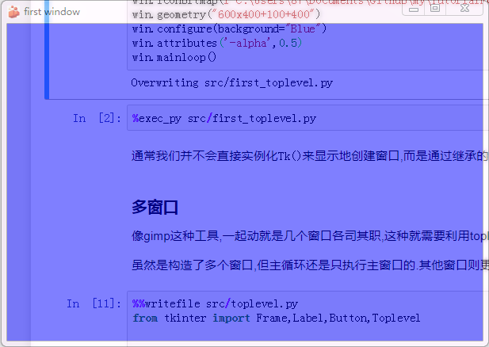
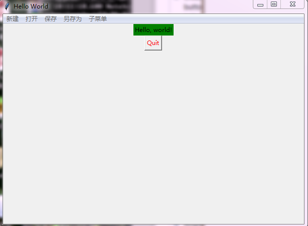
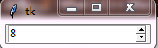

# Tkinter的标准组件介绍

上文中我们已经罗列过tk支持的所有组件,本文将详细介绍这些组件和常用的组合方式.


控件名类型|意义
---|---
Toplevel|顶层框架
Frame|框架
LabelFrame|标签框架
Menu|菜单栏
Menubutton|菜单按钮
OptionMenu|弹出菜单
Label|标签
Button|按钮
Entry|输入框
Radiobutton|单选框
Checkbutton|复选框
Scale|滑块
Text|文本框
Canvas|画板
Listbox|列表框
Message|信息栏
PanedWindow|中分栏窗口
Scrollbar|滚动条
Spinbox|指定输入范围值的输入框
Combobox|组合框,包含文本字段和一个包含可选值的下拉列表
Notebook|标签页,形式参见chrome中的标签页
Progressbar|进度条
Separator|分离器,显示一个水平或垂直分隔条
Sizegrip|控制TopLevel的窗口大小
Treeview|TreeView控件显示一个项目的树状分层集合

本文只是略微介绍标准库的组件,让大家对各个组件有个映像,对应接口还是要去<http://effbot.org/tkinterbook/>查看

## 窗口的构建,Toplevel和常用操作


使用`tkinter`中窗口是一个隐含的对象,最低一层实际上是toplevel.构建窗口就是实例化一个`Tk`对象,一个`Tk`对象,一个`Tk`对象会实例化一个`Toplevel`控件,也就是一个包含窗口的帧.

`Tk`实例可以有如下常用的属性和方法

+ title(str) 窗口的标题

+ iconbitmap(path_str) 设置窗口的标题图标

+ geometry 定义窗口的长宽和出现位置,单位是像素,使用形如`"600x400+100+400"`的字符串设定表示长x宽+左上角x像素位+左上角y像素位

+ wm_maxsize(width=800, height=600) 设置窗口最大长宽值
+ wm_minsize(width=400, height=300) 设置窗口最小长宽值
+ mainloop() 主循环,执行则相当于启动窗口
    
+ attributes()设置window,这个参数的调用方式略奇葩,使用的是形如`attributes('-alpha',0.5)`的键值对式的格式,可选的参数包括

字段|平台|意义
---|---|---
`alpha`|win,mac|透明度,范围是0~1之间,0代表完全透明年
`disabled`|win|如果设置,则禁用这个窗口
`modified`|mac|标记窗口为已修改
`titlepath`|mac|窗口代理图标的路径
`toolwindow`|win|设置窗口样式为工具窗口
`topmost`|win|设置窗口总是在其他窗口前

+ configure() 设置`Toplevel`控件,可以设置的内容主要包括

字段|意义
---|---
`bd/borderwidth`|边框宽,默认是`o`
`menu`|设置菜单`Menu`对象
`relief`|边框样式,可选的`FLAT,SUNKEN,RAISED,GROOVE,RIDGE`默认为`FLAT`
`background/bg`|背景色,可以是[这里](http://www.tcl.tk/man/tcl8.5/TkCmd/colors.htm)定义的字符串,也可以是`#FFFFFF`这样的RGB
`colormap`|设置需要是`Colormap`的实例,
`container`|设置需要是`Container`的实例
`cursor`|鼠标光标在其中的位置
`height`|高度
`width`|宽度
`highlightbackground`|要高亮的背景色
`highlightcolor`|要高亮的颜色
`highlightthickness`|高亮的宽度
`padx`|水平padding
`pady`|垂直padding
`takefocus`|指示用户可以使用tab键移动到这个部件





```python
%%writefile src/first_toplevel.py
from tkinter import Tk

win = Tk()
win.title("first window")
win.iconbitmap(r"C:\Users\87\Documents\GitHub\my\TutorialForPython\ipynbs\人机交互\GUI\src\myredis.ico")
win.geometry("600x400+100+400")
win.configure(background="Blue")
win.attributes('-alpha',0.5)
win.mainloop()
```

    Overwriting src/first_toplevel.py


```python
%exec_py src/first_toplevel.py
```

通常我们并不会直接实例化`Tk()`来显示地创建窗口,而是通过继承的方式来构建应用.

### 多窗口

像gimp这种工具,一起动就是几个窗口各司其职,这种就需要利用toplevel构造多窗口了.

虽然是构造了多个窗口,但主循环还是只执行主窗口的.其他窗口则更多的是作为辅助.


```python
%%writefile src/toplevel.py
from tkinter import Frame,Label,Button,Toplevel

    
class Application(Frame):
    def __init__(self, master=None):
        Frame.__init__(self, master)
        #窗口大小位置
        self.pack()
        self.createWidgets()

    def createWidgets(self):
        self.helloLabel = Label(self, text='Hello, world1!')

        self.helloLabel.pack()
class App2(Toplevel):
    def __init__(self, master=None):
        Toplevel.__init__(self, master)
        self.createWidgets()

    def createWidgets(self):
        self.helloLabel = Label(self, text='Hello, world2!')
        self.helloLabel.pack()

if __name__ =="__main__":
    app1 = Application()
    # 设置窗口标题:
    app1.master.title('Hello World1')
    app1.master.geometry("600x400+100+400")#长x宽+x+y
    # 主消息循环:
    app2 = App2()
    app2.title("helloword2")
    app2.geometry("200x200+0+0")#长x宽+x+y
    app1.mainloop()
```

    Overwriting src/toplevel.py


```python
%exec_py src/toplevel.py
```

## 框架的构建和常用操作

tk中的帧有两种:

+ Frame

    最基本的框架
    
+ LabelFrame

    基本的框架的变体,它在它的子窗口周围绘制一个边框，并且它也可以显示标题
    
    
    
而ttk中也有`Frame`对象.

框架可以设置的内容包括

字段|意义
---|---
background/bg|背景色
bd/borderwidth|边框宽,默认是o
colormap|调色板,设置需要是Colormap的实例,
container|设置需要是Container的实例
cursor|鼠标光标在其中的位置
highlightbackground|要高亮的背景色
highlightcolor|要高亮的颜色
highlightthickness|高亮的宽度
padx|水平padding
pady|垂直padding
relief|边框样式,可选的FLAT,SUNKEN,RAISED,GROOVE,RIDGE默认为FLAT
takefocus|指示用户可以使用tab键移动到这个部件
height|高度
width|宽度


Frame对象实例化需要传入一个`master`参数,这`master`可以是`None`或者一个它的父组件(通常是一个`Toplevel`对象).如果是空它则会自己实例化一个`Toplevel`作为其父组件.访问这个父组件可以使用`frame.master`.

通常我们的app主体会继承一个`Frame`并以其为基本容器构建应用.

### 框架的例子

我们来自己写个例子,体会下框架的用法.


```python
%%writefile src/firstGUI.py

#coding:utf-8
from tkinter import Frame,Label,Button


class Application(Frame):
    def __init__(self, master=None):
        super().__init__(master)
        #窗口大小位置
        self.master.geometry("600x400+100+400")#长x宽+x+y
        self.pack()
        self.createWidgets()

    def createWidgets(self):
        self.helloLabel = Label(self, text='Hello, world!')
    
        self.helloLabel.pack()
        self.quitButton = Button(self, text='Quit',fg="red", command=self.quit)
        self.quitButton.pack()

if __name__ =="__main__":
    app = Application()
    # 设置窗口标题:
    app.master.title('Hello World')

    app.master.geometry("600x400+100+400")#长x宽+x+y
    # 主消息循环:
    app.mainloop()
```

    Overwriting src/firstGUI.py


```python
%exec_py src/firstGUI.py
```

运行后出现如图小对话框


可以看出,应用类继承自Frame基类

每个Button、Label、输入框等，都是一个Widget.Frame则是可以容纳其他Widget的Widget,所有的Widget组合起来就是一棵树.

`pack()`方法把Widget加入到父容器中,并实现布局.`pack()`是最简单的布局,`grid()`可以实现更复杂的布局.

在`createWidgets()`方法中，我们创建一个`Label`和一个`Button`,当`Button`被点击时，触发`self.quit()`使程序退出

### ttk中的框架

使用ttk中的框架和在tk中差别不大


```python
%%writefile src/ttk_frame.py

#coding:utf-8
from tkinter.ttk import Frame,Label,Button,Style

style = Style()
style.configure("RW.TLabel", foreground="red", background="white")

class Application(Frame):
    def __init__(self, master=None):
        super().__init__(master)
        #窗口大小位置
        self.master.geometry("600x400+100+400")#长x宽+x+y
        self.pack()
        self.createWidgets()

    def createWidgets(self):
        self.helloLabel = Label(self, text='Hello, world!')
    
        self.helloLabel.pack()
        self.quitButton = Button(self,text='Quit',style="RW.TLabel",command=self.quit)
        self.quitButton.pack()

if __name__ =="__main__":
    app = Application()
    # 设置窗口标题:
    app.master.title('Hello World')

    app.master.geometry("600x400+100+400")#长x宽+x+y
    # 主消息循环:
    app.mainloop()
```

    Overwriting src/ttk_frame.py


```python
%exec_py src/ttk_frame.py
```

### LabelFrame

labelFrame是frame的子类,区别在于这个的意思似乎更加接近`框架`它提供的是一个有边界的框,并且这个框可以使用`text`设置付名,其他额外的设置还有:

字段|意义
---|---
background/bg|背景色
bd/borderwidth|边框宽,默认是o
colormap|调色板,设置需要是Colormap的实例,
container|设置需要是Container的实例
cursor|鼠标光标在其中的位置
highlightbackground|要高亮的背景色
highlightcolor|要高亮的颜色
highlightthickness|高亮的宽度
padx|水平padding
pady|垂直padding
relief|边框样式,可选的FLAT,SUNKEN,RAISED,GROOVE,RIDGE默认为FLAT
takefocus|指示用户可以使用tab键移动到这个部件
height|高度
width|宽度
foreground/fg|前景
font|字体
labelanchor|标签位置(e:右侧横置,en:右测偏上横置,es:右测偏下横置,n:,ne,nw,s,se,sw,w,wn,ws)
labelwidget|标签使用的组件,如果省略,框架使用`Text`文本组件
text|标签文本

labelanchor可选的参数为:

标志|说明
---|---
e|右侧
en|右侧偏上
es|右侧偏下
n|顶部
ne|顶部偏右
nw|顶部偏左
s|下侧
se|下侧偏右
sw|下侧偏左
w|左侧
wn|左侧偏上
ws|左侧偏下

文本要竖排只能通过插入回车了


```python
%%writefile src/tklf.py

#coding:utf-8
from tkinter import LabelFrame,Label,Button


class Application(LabelFrame):
    def __init__(self, master=None):
        super().__init__(master)
        #窗口大小位置
        self.master.geometry("600x400+100+400")#长x宽+x+y
        self.pack()
        self.createWidgets()
        self.config(text="test_text",labelanchor="w")

    def createWidgets(self):
        self.helloLabel = Label(self, text='Hello, world!')
    
        self.helloLabel.pack()
        self.quitButton = Button(self, text='Quit',fg="red", command=self.quit)
        self.quitButton.pack()

if __name__ =="__main__":
    app = Application()
    # 设置窗口标题:
    app.master.title('Hello World')

    app.master.geometry("600x400+100+400")#长x宽+x+y
    # 主消息循环:
    app.mainloop()
```

    Overwriting src/tklf.py


```python
%exec_py src/tklf.py
```

#### **ttk中的labelframe**

在ttk中labelframe的设置方式略有改变


```python
%%writefile src/ttklf.py

#coding:utf-8
from tkinter.ttk import LabelFrame,Label,Button,Style

style = Style()
style.configure("RW.TLabel", foreground="red", background="white")

class Application(LabelFrame):
    def __init__(self, master=None):
        super().__init__(master)
        #窗口大小位置
        self.master.geometry("600x400+100+400")#长x宽+x+y
        self.pack()
        self.createWidgets()
        self.config(text="test_text",labelanchor="w")

    def createWidgets(self):
        self.helloLabel = Label(self, text='Hello, world!')
    
        self.helloLabel.pack()
        self.quitButton = Button(self,text='Quit',style="RW.TLabel",command=self.quit)
        self.quitButton.pack()

if __name__ =="__main__":
    app = Application()
    # 设置窗口标题:
    app.master.title('Hello World')

    app.master.geometry("600x400+100+400")#长x宽+x+y
    # 主消息循环:
    app.mainloop()
```

    Overwriting src/ttklf.py


```python
%exec_py src/ttklf.py
```

## 菜单 Menu

Menu 和其他的组件一样,第一个是 parent,这里通常都是TopLevel,同时还需要给`win`对象设置`menu`.

然后我们可以用`add(type, **options)`或者`addxxxx`接口为其添加组件.支持的菜单类型有:

+ 菜单命令`commmand`
+ 子菜单`cascade`
+ 分割线`separator`
+ 复选菜单`checkbutton`
+ 单选菜单`radiobutton`

`options`则是对各个项进行的设置,包括

字段|意义
---|---
activebackground|激活状态的背景色
activeforeground|激活状态的前景色
accelerator|指定快捷键
background|背景色
bitmap|位图
columnbreak|分栏符
command|选中后执行的回调
font|字体
foreground|前景色
hidemargin|隐藏边缘
image|图片
indicatoron|指示器开启
label|标签
menu|菜单对象
offvalue|off状态下的值
onvalue|on状态下的值
selectcolor|选中后的颜色
selectimage|选中后的图片
state|状态
underline|下划线
value|值
variable|变量


这些设置可以在添加是加上,也可以使用`entryconfig(index, **options)`接口后设置.注意`index`是最开始设置的`label`

另一个菜单相关的对象`Menubutton`现在基本已经不再使用了,因为菜单相关的都可以使用menu实现.

### 菜单命令

`add_commmand`方法来为它添加菜单项.

如果该菜单是顶层菜单,则添加的菜单项依次向右添加;
如果该菜单是顶层菜单的一个子菜单项(配合`add_cascade`),则它添加的是子菜单的菜单项.

`add_command`中的参数常用的有:

+ label 属性,用来指定的是菜单项的名称
+ command 属性用来指定被点击的时候调用的方法
+ acceletor 属性指定的是快捷键 
+ underline 属性 是是否拥有下划线。

最后可以用窗口的`menu`属性指定我们使用哪一个作为它的顶层菜单.




```python
%%writefile src/menu_command.py

from tkinter import Frame,Label,Button,Menu

    
class Application(Frame):
    def __init__(self, master=None,):
        Frame.__init__(self, master)
        #窗口大小位置
        self.pack()
        self.createWidgets()
        menu = self.creatMenu()
        self.master.config(menu=menu)
        menu.entryconfig("新建",label=234)
        help(menu)


    def creatMenu(self):
        #主菜单
        menubar = Menu(self.master)
        #子菜单
        menufile = Menu(menubar)
        for item in ["新建","打开","保存","另存为"]:
            menubar.add_command(label = item)
        for item in ["1","2","3","4"]:
            menufile.add_command(label = item)
            menufile.add_separator()
        menubar.add_cascade(label = "子菜单",menu=menufile)
        return menubar


    def createWidgets(self):
        self.helloLabel = Label(self, text='Hello, world!')
        self.helloLabel["background"] ="green"
        self.helloLabel.pack()
        self.quitButton = Button(self, text='Quit',fg="red", command=self.quit)
        self.quitButton.pack()


if __name__ =="__main__":
    app = Application()
    # 设置窗口标题:
    app.master.title('Hello World')
    app.master.geometry("600x400+100+400")#长x宽+x+y
    # 主消息循环:
    app.mainloop()
```

    Overwriting src/menu_command.py


```python
%exec_py src/menu_command.py
```

### 子菜单

如果有子菜单,我们需则需要使用`add_cascade`

cascade 可以理解为“级联”,即它 的作用只是为了引出后面的菜单。

add_cascade属性:

+ menu 属性,它指明了要把那个菜单级联到该菜单项上
+ label 属性,用于指定该菜单项的名称。


### 分割线

本身没有什么功能,只是为了美观,使用`add_separator()`

### 单选菜单和复选菜单

单选菜单类型为`radiobutton`可以使用接口`add_radiobutton`;
复选菜单类型为`checkbutton`可以使用接口`add_checkbutton`

这两个的添加方式和`command`的添加方式一样,不同之处在于他们通常是作为顶层菜单的一个子菜单存在的.


```python
%%writefile src/menu_othercommand.py

from tkinter import Frame,Label,Button,Menu

    
class Application(Frame):
    def __init__(self, master=None,):
        Frame.__init__(self, master)
        #窗口大小位置
        self.pack()
        self.createWidgets()
        menu = self.creatMenu()
        self.master.config(menu=menu)


    def creatMenu(self):
        #主菜单
        menubar = Menu(self.master)
        #子菜单
        menufile = Menu(menubar)
        #多选菜单
        menuradio = Menu(menubar)
        #单选菜单
        menucheck = Menu(menubar)
        for item in ["1","2","3","4"]:
            menufile.add_command(label = item)
        menubar.add_cascade(label = "子菜单",menu=menufile)
        for i in ["a","b","c"]:
            menuradio.add_radiobutton(label = i)
        menubar.add_cascade(label = "多选菜单",menu=menuradio)
        for i in ["a1","b2","c3"]:
            menucheck.add_checkbutton(label = i)
        menubar.add_cascade(label = "单选菜单",menu=menucheck)
        return menubar


    def createWidgets(self):
        self.helloLabel = Label(self, text='Hello, world!')
        self.helloLabel["background"] ="green"
        self.helloLabel.pack()
        self.quitButton = Button(self, text='Quit',fg="red", command=self.quit)
        self.quitButton.pack()


if __name__ =="__main__":
    app = Application()
    # 设置窗口标题:
    app.master.title('Hello World')
    app.master.geometry("600x400+100+400")#长x宽+x+y
    # 主消息循环:
    app.mainloop()
```

    Overwriting src/menu_othercommand.py


```python
%exec_py src/menu_othercommand.py
```

### 右键弹出菜单

一般弹出菜单是右键点击后出现的菜单,tk中的弹出菜单比较原始的,具体思路是这样:

+ 我们先新建一个菜单,
+ 然后向菜单项中添加各种功能,
+ 最后我们监听鼠标右键消息,如果是鼠标 右键被单击,
+ 此时可以根据需要判断下鼠标位置来确定是哪个弹出菜单被弹出,
+ 然后使用 Menu 类的 pop 方法来弹出 菜单。

Menu 类里面有一个post方法,它接收两个参数,即 x 和 y 坐标,它会在相应的位置弹出菜单

例子: 一个菜单栏


```python
%%writefile src/menu.py

from tkinter import Frame,Label,Button,Menu

    
class Application(Frame):
    def __init__(self, master=None,):
        Frame.__init__(self, master)
        #窗口大小位置
        self.pack()
        self.createWidgets()
        menu = self.creatMenu()


    def creatMenu(self):
        #主菜单
        menubar = Menu(self.master)
        
        #子菜单
        menufile = Menu(menubar)
        for item in ["新建","打开","保存","另存为"]:
            menufile.add_radiobutton(label = item)
        
        menuedit = Menu(menubar)
        for item in ["复制","黏贴","剪切"]:
            menuedit.add_checkbutton(label = item)
        #子菜单与主菜单关联
        for name,submenu in zip(["文件","编辑"],[menufile,menuedit]):
            menubar.add_cascade(label=name,menu=submenu)
        #最关键的一步,主菜单与app关联
        self.master.config(menu=menubar)
        
        
        #右键菜单
        menu = Menu(self.master)
        for i in ('One', 'Two', 'Three'):
            menu.add_command(label=i)
        #插入分割线
        menu.add_separator()

        for i in ('1', '2', '3'):
            menu.add_command(label=i)
        #绑定鼠标右键呼出
        if (self.master.tk.call('tk', 'windowingsystem')=='aqua'):
            self.master.bind('<2>', lambda e: menu.post(e.x_root, e.y_root))
            self.master.bind('<Control-1>', lambda e: menu.post(e.x_root, e.y_root))
        else:
            self.master.bind('<3>', lambda e: menu.post(e.x_root, e.y_root))


    def createWidgets(self):
        self.helloLabel = Label(self, text='Hello, world!')
        self.helloLabel["background"] ="green"
        self.helloLabel.pack()
        self.quitButton = Button(self, text='Quit',fg="red", command=self.quit)
        self.quitButton.pack()


if __name__ =="__main__":
    app = Application()
    # 设置窗口标题:
    app.master.title('Hello World')
    app.master.geometry("600x400+100+400")#长x宽+x+y
    # 主消息循环:
    app.mainloop()
```

    Overwriting src/menu.py


```python
%exec_py src/menu.py
```

## OptionMenu

弹出菜单,通常用于点击某个对象后选择值


```python
%%writefile src/option_menu.py
from tkinter import *

master = Tk()

variable = StringVar(master)
variable.set("one") # default value

w = OptionMenu(master, variable, "one", "two", "three")
w.pack()

mainloop()
```

    Overwriting src/option_menu.py


```python
%exec_py src/option_menu.py
```

## 其他组件用法

tkinter的控件上文中已有介绍,下面详细介绍各个组件的功能和设置方式.

### 标签 Label

标签可以定义的属性主要有:

字段|意义
---|---
background/bg|背景色
bd/borderwidth|边框宽,默认是o
colormap|调色板,设置需要是Colormap的实例,
container|设置需要是Container的实例
cursor|鼠标光标在其中的位置
highlightbackground|要高亮的背景色
highlightcolor|要高亮的颜色
highlightthickness|高亮的宽度
padx|水平padding
pady|垂直padding
relief|边框样式,可选的FLAT,SUNKEN,RAISED,GROOVE,RIDGE默认为FLAT
takefocus|指示用户可以使用tab键移动到这个部件
height|高度
width|宽度
foreground/fg|前景
font|字体
text|标签文本
activebackground|激活状态的背景色
activeforeground|激活状态的前景色
anchor|文本的对齐位置,可选的有`N, NE, E, SE, S, SW, W, NW,CENTER`
image|是否使用图标
bitmap|按钮的图标
compound|图片和文字的围绕方式,可选的有`BOTTOM, LEFT, RIGHT, TOP,CENTER`
justify|多行文本如何排版,可选项包括`LEFT, RIGHT, CENTER`
state|按钮状态,可选的有`NORMAL, ACTIVE, DISABLED`.默认`NORMAL`.
textvariable|使用Tkinter variable设置按钮文本
underline|下划线
wraplength|确定按钮的文本应何时被包装成多行


### 按钮 Button

按钮算是最常用的控件之一了,它的属性主要有:


字段|意义
---|---
background/bg|背景色
bd/borderwidth|边框宽,默认是o
colormap|调色板,设置需要是Colormap的实例,
container|设置需要是Container的实例
cursor|鼠标光标在其中的位置
highlightbackground|要高亮的背景色
highlightcolor|要高亮的颜色
highlightthickness|高亮的宽度
padx|水平padding
pady|垂直padding
relief|边框样式,可选的FLAT,SUNKEN,RAISED,GROOVE,RIDGE默认为FLAT
takefocus|指示用户可以使用tab键移动到这个部件
height|高度
width|宽度
foreground/fg|前景
font|字体
text|标签文本
activebackground|激活状态的背景色
activeforeground|激活状态的前景色
anchor|文本的对齐位置,可选的有`N, NE, E, SE, S, SW, W, NW,CENTER`
image|是否使用图标
bitmap|按钮的图标
command|点击按钮的回调函数
compound|图片和文字的围绕方式,可选的有`BOTTOM, LEFT, RIGHT, TOP,CENTER`
disabledforeground|无效前景色
justify|多行文本如何排版,可选项包括`LEFT, RIGHT, CENTER`
overrelief|鼠标移动到上面时显示的内容
repeatdelay|重复延迟
repeatinterval|重复间隔
state|按钮状态,可选的有`NORMAL, ACTIVE, DISABLED`.默认`NORMAL`.
textvariable|使用Tkinter variable设置按钮文本
underline|下划线
wraplength|确定按钮的文本应何时被包装成多行


最值得注意的是`command`参数,注意它的回调函数没有参数


### 输入框 Entry


字段|意义
---|---
background/bg|背景色
bd/borderwidth|边框宽,默认是o
colormap|调色板,设置需要是Colormap的实例,
container|设置需要是Container的实例
cursor|鼠标光标在其中的位置
highlightbackground|要高亮的背景色
highlightcolor|要高亮的颜色
highlightthickness|高亮的宽度
padx|水平padding
pady|垂直padding
relief|边框样式,可选的FLAT,SUNKEN,RAISED,GROOVE,RIDGE默认为FLAT
takefocus|指示用户可以使用tab键移动到这个部件
height|高度
width|宽度
foreground/fg|前景
font|字体
text|标签文本
justify|多行文本如何排版,可选项包括`LEFT, RIGHT, CENTER`
state|按钮状态,可选的有`NORMAL, ACTIVE, DISABLED`.默认`NORMAL`.
textvariable|使用Tkinter variable设置按钮文本
wraplength|确定按钮的文本应何时被包装成多行
disabledbackground|无效背景
disabledforeground|无效前景
exportselection|选中的文本是否自动保存到剪切板
insertbackground|光标颜色
insertborderwidth|光标边框宽度
insertofftime|光标闪烁间隔
insertontime|光标闪烁单次亮起的时间
insertwidth|光标宽度
readonlybackground|当状态为`readonly`时的背景色
selectbackground|选中区域的背景色
selectborderwidth|选中区域的宽度
selectforeground|选中区域的前景色
show|常用在密码这种,覆盖显示文本
validate|指定validate
vcmd/validatecommand|validate时执行的回调
xscrollcommand|水平滚动条


属性:

+ get() 获取输入(返回一个str)

例:一个用户登录界面


```python
%%writefile src/entry.py

from tkinter import Frame,Label,Button,Entry


class Application(Frame):
    def __init__(self, master=None):
        Frame.__init__(self, master)
        self.pack()
        self.createWidgets()

    def createWidgets(self):
        self.userLabel = Label(self, text='用户名:')
        self.userLabel.grid(row = 0,column = 0,sticky="w")
        self.userEntry = Entry(self)
        self.userEntry.grid(row = 0,column = 1,sticky="e")
        self.pwLabel = Label(self, text='密码:')
        self.pwLabel.grid(row = 1,column = 0,sticky="w")
        self.pwEntry = Entry(self)
        self.pwEntry.grid(row = 1,column = 1,sticky="e")

        self.enterButton = Button(self,text = "登录",command = self.reg)
        self.enterButton.grid(row = 2,column = 1,sticky = "e")

        self.logLabel = Label(self, text='')
        self.logLabel.grid(row = 3)

    def reg(self):
        s1 = self.userEntry.get()
        s2 = self.pwEntry.get()
        if s1 == "www.google.com" and s2 == "www.bing.com":
            self.logLabel["text"]="登录成功"
        else:
            self.logLabel["text"]="用户名或密码错误"
            self.userEntry.delete(0,len(s1))
            self.pwEntry.delete(0,len(s1))

if __name__ =="__main__":
    app = Application()
    # 设置窗口标题:
    app.master.title('登录界面')
    #窗口大小位置
    #app.master.geometry("600x400+100+400")#长x宽+x+y
    # 主消息循环:
    app.mainloop()
```

    Overwriting src/entry.py


```python
%exec_py src/entry.py
```

### 单选按钮 Radiobutton

一般是几个里面选一个用

可选的设置有:

字段|意义
---|---
background/bg|背景色
bd/borderwidth|边框宽,默认是o
colormap|调色板,设置需要是Colormap的实例,
container|设置需要是Container的实例
cursor|鼠标光标在其中的位置
highlightbackground|要高亮的背景色
highlightcolor|要高亮的颜色
highlightthickness|高亮的宽度
padx|水平padding
pady|垂直padding
relief|边框样式,可选的FLAT,SUNKEN,RAISED,GROOVE,RIDGE默认为FLAT
takefocus|指示用户可以使用tab键移动到这个部件
height|高度
width|宽度
foreground/fg|前景
font|字体
text|标签文本
activebackground|激活状态的背景色
activeforeground|激活状态的前景色
anchor|文本的对齐位置,可选的有`N, NE, E, SE, S, SW, W, NW,CENTER`
image|是否使用图标
bitmap|按钮的图标
command|点击按钮的回调函数
compound|图片和文字的围绕方式,可选的有`BOTTOM, LEFT, RIGHT, TOP,CENTER`
disabledforeground|无效前景色
justify|多行文本如何排版,可选项包括`LEFT, RIGHT, CENTER`
overrelief|鼠标移动到上面时显示的内容
repeatdelay|重复延迟
repeatinterval|重复间隔
state|按钮状态,可选的有`NORMAL, ACTIVE, DISABLED`.默认`NORMAL`.
textvariable|使用Tkinter variable设置按钮文本
underline|下划线
wraplength|确定按钮的文本应何时被包装成多行
indicatoron|是否使用标准的单选样式,默认为Ture,否则样式为`SUNKEN`
offrelief|按钮默认是否被按下
value|选项对应的值
variable|与此按钮关联的变量

直接看代码:


单选框和复选框往往会需要用到一个变量用于保存选择的内容,一般的变量无法起到效果,需要使用tk提供的变量类型:

`BooleanVar, DoubleVar, IntVar, StringVar`

要使用的话`set`方法就是赋值,`get`方法就是取值.


```python
%%writefile src/radiobutton.py

from tkinter import Frame,Label,Button,Radiobutton, IntVar

    
class Application(Frame):
    def __init__(self, master=None):
        Frame.__init__(self, master)
        #窗口大小位置
        self.master.geometry("600x400+100+400")#长x宽+x+y
        self.pack()
        self.createWidgets()
    def createWidgets(self):
        self.var = IntVar()
        self.helloLabel = Label(self, text='Hello, world!\n')
        self.helloLabel.pack()
        self.rbframe=Frame(self)
        self.rbframe.pack()
        self.c1 = Radiobutton(
            self.rbframe,
            indicatoron=False,
            text = "1",
            value=1,
            variable=self.var,
            command = self._callback
        )
        self.c1.pack()
        self.c2 = Radiobutton(
            self.rbframe,
            indicatoron=False,
            text = "2",
            value=2,
            variable=self.var,
            command = self._callback
        )
        self.c2.pack()
        self.quitButton = Button(self, text='Quit',fg="red", command=self.quit)
        self.quitButton.pack()
        
    def _callback(self):
        self.helloLabel.config(text = "值为{}".format(self.var.get()))

if __name__ =="__main__":
    app = Application()
    # 设置窗口标题:
    app.master.title('Hello World')

    app.master.geometry("600x400+100+400")#长x宽+x+y
    # 主消息循环:
    app.mainloop()
```

    Overwriting src/radiobutton.py


```python
%exec_py src/radiobutton.py
```

### 复选框 Checkbutton 

复选框通常是用来选择信息的时候的一种选择,它前面 有个小正方形的方块,如果选中则有一个对号,也可以再 次点击以取消该对号来取消选中。


字段|意义
---|---
background/bg|背景色
bd/borderwidth|边框宽,默认是o
colormap|调色板,设置需要是Colormap的实例,
container|设置需要是Container的实例
cursor|鼠标光标在其中的位置
highlightbackground|要高亮的背景色
highlightcolor|要高亮的颜色
highlightthickness|高亮的宽度
padx|水平padding
pady|垂直padding
relief|边框样式,可选的FLAT,SUNKEN,RAISED,GROOVE,RIDGE默认为FLAT
takefocus|指示用户可以使用tab键移动到这个部件
height|高度
width|宽度
foreground/fg|前景
font|字体
text|标签文本
activebackground|激活状态的背景色
activeforeground|激活状态的前景色
anchor|文本的对齐位置,可选的有`N, NE, E, SE, S, SW, W, NW,CENTER`
image|是否使用图标
bitmap|按钮的图标
command|点击按钮的回调函数
compound|图片和文字的围绕方式,可选的有`BOTTOM, LEFT, RIGHT, TOP,CENTER`
disabledforeground|无效前景色
justify|多行文本如何排版,可选项包括`LEFT, RIGHT, CENTER`
overrelief|鼠标移动到上面时显示的内容
repeatdelay|重复延迟
repeatinterval|重复间隔
state|按钮状态,可选的有`NORMAL, ACTIVE, DISABLED`.默认`NORMAL`.
textvariable|使用Tkinter variable设置按钮文本
underline|下划线
wraplength|确定按钮的文本应何时被包装成多行
indicatoron|是否使用标准的单选样式,默认为Ture,否则样式为`SUNKEN`
offrelief|按钮默认是否被按下
value|选项对应的值
variable|与此按钮关联的变量
indicatoron|是否画上指示器,状态有`SUNKEN`和`RAISED`
offvalue|未被选中的值
onvalue|选中的值

看个例子:


```python
%%writefile src/checkbutton.py
from tkinter import Frame,Label,Button,Checkbutton
    
class Application(Frame):
    def __init__(self, master=None):
        Frame.__init__(self, master)
        #窗口大小位置
        self.master.geometry("600x400+100+400")#长x宽+x+y
        self.pack()
        self.createWidgets()
    def createWidgets(self):
        self.helloLabel = Label(self, text='Hello, world!\n')
        self.helloLabel.pack()

        self.c1 = Checkbutton(self,
                              text = "1",
                              command = lambda : self.helloLabel.config(
                                  text = self.helloLabel["text"]+"1被选中了奇数次\n"))
        self.c1.pack()
        self.c2 = Checkbutton(self,
                              text = "2",
                              command = lambda : self.helloLabel.config(
                                  text = self.helloLabel["text"]+"2被选中了奇数次\n"))
        self.c2.pack()
        self.quitButton = Button(self, text='Quit',fg="red", command=self.quit)
        self.quitButton.pack()

if __name__ =="__main__":
    app = Application()
    # 设置窗口标题:
    app.master.title('Hello World')

    app.master.geometry("600x400+100+400")#长x宽+x+y
    # 主消息循环:
    app.mainloop()
```

    Overwriting src/checkbutton.py


```python
%exec_py src/checkbutton.py
```

### 文本域 Text

也就是用来存放字符串的大空间

基本的定义也就是宽度width和高度height了,但由于有类编辑的需求,因此需要引入标签来定位光标.可以用的定位标签包括

+ "<line>,<column>" 行号,列号组成的坐标字符串
+ "<line>.end" 行号对应行的末尾
+ INSERT  光标的当前位置
+ CURRENT 光标最近的字符
+ END 文末

另外还有一些复杂的用法一般用不到


```python
%%writefile src/text.py

from tkinter import *

    
root = Tk()

text = Text(root)
text.pack()

# INSERT 索引表示插入光标当前的位置
text.insert(INSERT, "I love ")
text.insert(END, "Python!")

mainloop()
```

    Overwriting src/text.py


```python
%exec_py src/text.py
```

### 画布 Canvas

和html5中的画布一样,tk中的画布也是用来绘图的,直接看代码吧:


```python
%%writefile src/canvas.py

from tkinter import Frame,Canvas

    
class Application(Frame):
    def __init__(self, master=None):
        Frame.__init__(self, master)
        self.pack()
        self.createWidgets()

    def createWidgets(self):
        self.can = Canvas(self,width = 400,height=300,bg = "#233333")
        self.can.create_line((0,0),(200,200),width = 8)
        self.can.create_text(300,30,text = "一个画板")
        self.can.pack()
if __name__ =="__main__":
    app = Application()
    # 设置窗口标题:
    app.master.title('Hello World')
    # 主消息循环:
    app.mainloop()
```

    Overwriting src/canvas.py


```python
%exec_py src/canvas.py
```

### Listbox	列表框


文本按列表的形式排列,列表框是用来从一组文本项目选择。根据ListBox的配置，用户可以选择从列表中一个或多个项目,通常,这个任务可以由多选实现


```python
%%writefile src/listbox.py

from tkinter import Frame,Listbox,END

    
class Application(Frame):
    def __init__(self, master=None):
        Frame.__init__(self, master)
        self.pack()
        self.createWidgets()

    def createWidgets(self):
        self.list = Listbox(self)
        self.list.pack()
        self.list.insert(END, "a list entry")
        for item in ["one", "two", "three", "four"]:
            self.list.insert(END, item)
if __name__ =="__main__":
    app = Application()
    # 设置窗口标题:
    app.master.title('Hello World')
    # 主消息循环:
    app.mainloop()
```

    Overwriting src/listbox.py


```python
%exec_py src/listbox.py
```

### Message	信息栏

使用单字体显示短文本消息.通常可以使用普通标签代替.


```python
%%writefile src/message.py
from tkinter import Tk,Message

master = Tk()

w = Message(master, text="this is a message")
w.pack()

master.mainloop()
```

    Overwriting src/message.py


```python
%exec_py src/message.py
```

### PanedWindow	中分栏窗口

可用于实现2-pane和3-pane的布局


```python
%%writefile src/panewindow.py
from tkinter import Tk,Label,PanedWindow,BOTH,VERTICAL

master = Tk()
m1 = PanedWindow(master)
m1.pack(fill=BOTH, expand=1)

left = Label(m1, text="left pane")
m1.add(left)

m2 = PanedWindow(m1, orient=VERTICAL)
m1.add(m2)

top = Label(m2, text="top pane")
m2.add(top)

bottom = Label(m2, text="bottom pane")
m2.add(bottom)

master.mainloop()
```

    Overwriting src/panewindow.py


```python
%exec_py src/panewindow.py
```

### Scale 滑块

通常如果是有界输入,那么就可以使用滑块


```python
%%writefile src/scale.py
from tkinter import Tk,Scale,HORIZONTAL

master = Tk()

w = Scale(master, from_=0, to=100)
w.pack()

w = Scale(master, from_=0, to=200, orient=HORIZONTAL)
w.pack()

master.mainloop()
```

    Writing src/scale.py


```python
%exec_py src/scale.py
```

### Scrollbar	滚动条

滚动条通常不会单独使用,而是配合文本,列表框,画板使用.


```python
%%writefile src/scrollbar.py
from tkinter import Tk,Scrollbar,Listbox
master = Tk()
scrollbar = Scrollbar(master)
scrollbar.pack(side='right', fill='y')

listbox = Listbox(master, yscrollcommand=scrollbar.set)
for i in range(1000):
    listbox.insert('end', str(i))
listbox.pack(side='left', fill='both')

scrollbar.config(command=listbox.yview)

master.mainloop()
```

    Overwriting src/scrollbar.py


```python
%exec_py src/scrollbar.py
```

### Spinbox	指定输入范围值的输入框

Spinbox可以用来代替只有有限数量的命令值的输入框.




```python
%%writefile src/spinbox.py
from tkinter import Tk,Spinbox

master = Tk()

w = Spinbox(master, from_=0, to=10)
w.pack()
master.mainloop()
```

    Writing src/spinbox.py


```python
%exec_py src/spinbox.py
```

### Combobox	组合框

ttk提供的控件,包含文本字段和一个包含可选值的下拉列表<https://docs.python.org/3/library/tkinter.ttk.html#tkinter.ttk.Combobox>

这个控件和单选框功能类似,一般也会借助tk中的变量类型.


```python
%%writefile src/combobox.py
from tkinter import Tk,StringVar
from tkinter.ttk import Combobox
master = Tk()
number = StringVar()
w = Combobox(master,textvariable=number)
w['values'] = (1, 2, 4, 42, 100)     # 设置下拉列表的值
w.grid(column=1, row=1)      # 设置其在界面中出现的位置  column代表列   row 代表行
w.current(0) 
w.pack()
master.mainloop()
```

    Overwriting src/combobox.py


```python
%exec_py src/combobox.py
```

### Notebook标签页

标签页是ttk中的控件通常用在同时管理多个资源的情况下,形式参见chrome中的标签页.


```python
%%writefile src/notebook.py
from tkinter import Tk,PhotoImage
from tkinter.ttk import Notebook,Frame,Button


root = Tk()

scheduledimage=PhotoImage("source/canvas.png")
note = Notebook(root)

tab1 = Frame(note)
tab2 = Frame(note)
tab3 = Frame(note)
Button(tab1, text='Exit', command=root.destroy).pack(padx=100, pady=100)
note.add(tab1, text = "Tab One",image=scheduledimage, compound="top")
note.add(tab2, text = "Tab Two")
note.add(tab3, text = "Tab Three")
note.pack()
root.mainloop()
```

    Overwriting src/notebook.py


```python
%exec_py src/notebook.py
```

### Progressbar	进度条

ttk的独有控件显示,一个长期运行的操作状态指示.它可以在两种模式下运行:

1. 确定模式,显示完成的工作量与完成工作的总量;

2. 不确定模式,提供动画显示,让用户知道工作正在进行中


下面的例子中还用到了ttk中的`Separator`用于做分割,`Sizegrip`用于缩放窗口


```python
%%writefile src/progressbar.py
from tkinter import *  
from tkinter import ttk  
import time  
  
def manu_increment(*args):  
    for i in range(100):  
        p1["value"] = i+1  
        root.update()  
        time.sleep(0.1)
    
def auto_increment(*args):  
    global flag,value  
    flag = not flag  
  
    if flag:  
        btn2["text"] = "暂停动画"  
        p2.start(10)  
    else:  
        btn2["text"] = "开始动画"  
        value = p2["value"]  
        p2.stop()  
        p2["value"] = value
root = Tk()  
root.title("Progressbar组件")
sg = ttk.Sizegrip(root).grid(row=99,column=99,sticky="se")
# 定量进度条 
p1 = ttk.Progressbar(root, length=200, mode="determinate", orient=HORIZONTAL)  
p1.grid(row=1,column=1)  
p1["maximum"] = 100  
p1["value"] = 0  
  
# 通过指定变量，改变进度条位置  
# n = IntVar()  
# p1["variable"] = n  
  
# 通过指定步长，改变进度条位置  
# p1.step(2)  
  
btn = ttk.Button(root,text="开始动画",command=manu_increment)  
btn.grid(row=1,column=0)  
  
# 非定量进度条  
flag = False   # 标志位  
value = 0      # 进度条位置  

# 分隔
sep = ttk.Separator(root)
sep.grid(sticky = "ew")  

p2 = ttk.Progressbar(root, length=200,orient = HORIZONTAL)  
p2.grid(row=3,column=1)  
  
btn2 = ttk.Button(root,text="自动动画",command=auto_increment)  
btn2.grid(row=3,column=0)  
  
root.mainloop()
```

    Overwriting src/progressbar.py


```python
%exec_py src/progressbar.py
```

### Treeview	

TreeView控件显示一个项目的树状分层集合,通常这用来展示数据或者文件系统等结构.


```python
%%writefile src/treeview.py
from tkinter import *  
from tkinter import ttk  

root = Tk()

tree = ttk.Treeview(root)

tree["columns"]=("one","two")
tree.column("one", width=100 )
tree.column("two", width=100)
tree.heading("one", text="coulmn A")
tree.heading("two", text="column B")

tree.insert("" , 0,    text="Line 1", values=("1A","1b"))

id2 = tree.insert("", 1, "dir2", text="Dir 2")
tree.insert(id2, "end", "dir 2", text="sub dir 2", values=("2A","2B"))

##alternatively:
tree.insert("", 3, "dir3", text="Dir 3")
tree.insert("dir3", 3, text=" sub dir 3",values=("3A"," 3B"))

tree.pack()
root.mainloop()
```

    Writing src/treeview.py


```python
%exec_py src/treeview.py
```

### ScrolledText 

带滚动条的文本框,这个组件在`tkinter.scrolledtext`下


```python
%%writefile src/scrolled_text.py
from tkinter import Tk,END
from tkinter.scrolledtext import ScrolledText
root = Tk()
stext = ScrolledText(root,bg='white', height=10)
stext.pack(fill="both", side="left", expand=True)
stext.focus_set()
root.mainloop()
```

    Overwriting src/scrolled_text.py


```python
%exec_py src/scrolled_text.py
```

## 对话框 Dialog和消息弹窗 messagebox


对话框和消息弹窗也是常见的控件,在,但他们独立于其他控件,而是放在`tkinter.filedialog`,`tkinter.simpledialog`和`tkinter.messagebox`下.

在`tkinter`下提供了如下几种常见的对话框形式:

messagebox下的方法都是继承自`messagebox.dialog.Dialog`

只有一个按钮(确定)的消息弹窗
+ `tkinter.messagebox.showinfo(title,message)` 信息弹窗
+ `tkinter.messagebox.showwarning(title,message)` 警告弹窗
+ `tkinter.messagebox.showerror(title,message)` 错误弹窗

有两个按钮的消息弹窗
+ `tkinter.messagebox.askokcancel(title,message)`(确定,取消)点击确定返回`Ture`取消返回`False`
+ `tkinter.messagebox.askquestion(title,message)`(确定,取消)点击确定返回`"yes"`取消返回`"no"`
+ `tkinter.messagebox.askyesno(title,message)`(是,否)点击是返回`Ture`;否返回`False`
+ `tkinter.messagebox.askretrycancel(title,message)`(重试,取消)点击重试返回 `Ture`;取消返回`False`

有三个按钮的消息弹窗
+ `tkinter.messagebox.askyesnocancel(title,message)`是：`True`;否：`False`;取消：`None`


输入值的消息弹窗
+ `tkinter.simpledialog.askinteger(title, prompt)`问询整数的消息弹窗
+ `tkinter.simpledialog.askfloat(title, prompt)`问询浮点数的消息弹窗
+ `tkinter.simpledialog.askstring(title, prompt)`询问字符创的消息弹窗


选择文件弹窗
+ `tkinter.filedialog.askopenfilename()`打开一个文件的弹窗,返回文件名列表
+ `tkinter.filedialog.asksaveasfilename()`保存一个文件的弹窗
+ `tkinter.filedialog.askopenfile()`打开一个文件的弹窗,返回文件对象
+ `tkinter.filedialog.askopenfiles()`打开多个文件的弹窗,返回文件对象的列表
+ `tkinter.filedialog.asksaveasfile()`保存一个文件的弹窗,返回文件对象
+ `tkinter.filedialog.askdirectory()`打开一个文件夹的弹窗,返回文件地址


```python
%%writefile src/messagebox.py
from tkinter import Frame,Label,Button,Entry
from tkinter.messagebox import showinfo
    

class Application(Frame):
    def __init__(self, master=None):
        Frame.__init__(self, master)
        self.pack()
        self.createWidgets()

    def createWidgets(self):
        self.userLabel = Label(self, text='用户名:')
        self.userLabel.grid(row = 0,column = 0,sticky="w")
        self.userEntry = Entry(self)
        self.userEntry.grid(row = 0,column = 1,sticky="e")
        self.pwLabel = Label(self, text='密码:')
        self.pwLabel.grid(row = 1,column = 0,sticky="w")
        self.pwEntry = Entry(self)
        self.pwEntry.grid(row = 1,column = 1,sticky="e")

        self.enterButton = Button(self,text = "登录",command = self.reg)
        self.enterButton.grid(row = 2,column = 1,sticky = "e")

        self.logLabel = Label(self, text='')
        self.logLabel.grid(row = 3)

    def reg(self):
        s1 = self.userEntry.get()
        s2 = self.pwEntry.get()
        if s1 == "www.google.com" and s2 == "www.bing.com":
            self.logLabel["text"]="登录成功"
        else:
            self.logLabel["text"]="用户名或密码错误"
            self.userEntry.delete(0,len(s1))
            self.pwEntry.delete(0,len(s1))
            showinfo(title = "错误",message="用户名或密码错误")

if __name__ =="__main__":
    app = Application()
    # 设置窗口标题:
    app.master.title('登录界面')
    #窗口大小位置
    #app.master.geometry("600x400+100+400")#长x宽+x+y
    # 主消息循环:
    app.mainloop()
```

    Overwriting src/messagebox.py


```python
%exec_py src/messagebox.py
```


```python
%%writefile src/simpledialog.py

import tkinter
from tkinter import simpledialog

def inputStr():
    r = simpledialog.askstring('Python Tkinter', 'Input String', initialvalue = 'Python Tkinter')
    print(r)
def inputInt():
    r = simpledialog.askinteger('Python Tkinter', 'Input Integer')
    print(r)
def inputFloat():
    r = simpledialog.askfloat('Python Tkinter', 'Input Float')
    print(r)

root = tkinter.Tk()
btn1 = tkinter.Button(root, text='Input String', command=inputStr)
btn2 = tkinter.Button(root, text='Input Integer', command=inputInt)
btn3 = tkinter.Button(root, text='Input Float', command=inputFloat)

btn1.pack(side='left')
btn2.pack(side='left')
btn3.pack(side='left')

root.mainloop()
```

    Writing src/simpledialog.py


```python
%exec_py src/simpledialog.py
```


```python
%%writefile src/filedialog.py
import tkinter
from tkinter import filedialog

def openfile():
    r = filedialog.askopenfilename(title='打开文件', filetypes=[('Python', '*.py *.pyw'), ('All Files', '*')])
    print(r)
def savefile():
    r = filedialog.asksaveasfilename(title='保存文件', initialdir='d:\mywork', initialfile='hello.py')
    print(r)

root = tkinter.Tk()
btn1 = tkinter.Button(root, text='File Open', command=openfile)
btn2 = tkinter.Button(root, text='File Save', command=savefile)

btn1.pack(side='left')
btn2.pack(side='left')
root.mainloop()
```

    Overwriting src/filedialog.py


```python
%exec_py src/filedialog.py
```
