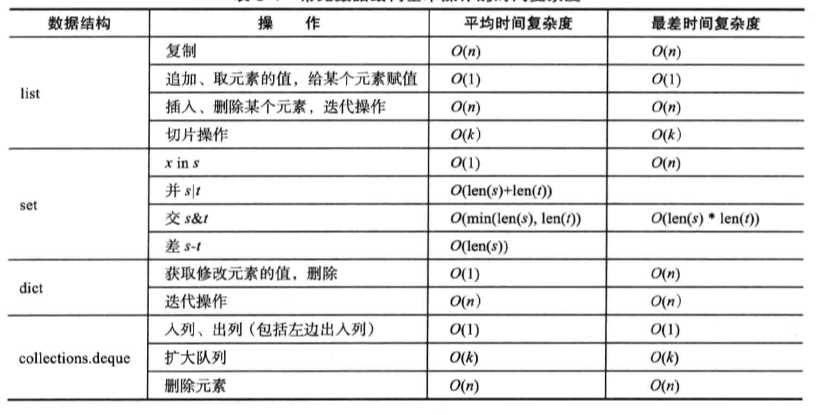

# 结语

## 不同的情况使用不同的数据结构和算法

下面是Python中最常用数据结构常用操作的时间复杂度表:

容器|使用环境
---|---
list|一般用用
tuple|当内部元素不需要改变的时候用
heapq|双端队列,当元素数量巨幅变动频繁的时候使用
bisect|当元素较多且需要频繁查找时使用
deque|堆,当需要排序时使用
array|数组,当类型相同时可以使用,可以减少内存占用
set|当需要去重的时候使用

## 相关扩展和模块

+ [pyrsistent](https://github.com/tobgu/pyrsistent)

    满足python内置相关协议的不可变类型扩展
