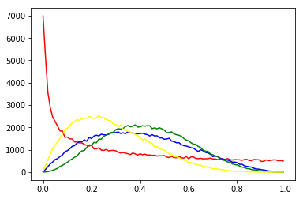
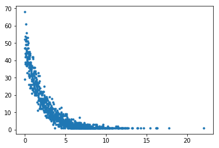

# 使用标准库处理基本数学问题

python内置了多数情况下足够用的数学工具用于做一些简单计算,主要包括几个部分:

+ 专用的数据类型
    
    包括有标准库中的理数,高精度数类型以及默认支持的复数类型
    
+ 常用计算算法

    包括针对自然数和复数的log,三角函数等计算

+ 统计学工具

    包括常用的统计计算算法和随机数模块

## 默认数的形式

python中的数分为

+ 整数

```python
0
```

+ 浮点数

```python
1.1
```

+ 复数,而且大数计算是内置的被优化的相当好.

```python
1+2j
```


### 数的进制

默认的数是10进制的,但python中也支持其他几种进制


+ 16进制


```python
0x10
```


    16


+ 8进制


```python
0O10
```


    8


+ 2进制


```python
0b10
```


    2


而十进制转换成别的进制就会麻烦一些,需要使用`bin(dec)`,`oct(dec)`,`hex(dec)`这样的内置函数


```python
bin(2)
```


    '0b10'


```python
oct(8)
```


    '0o10'


```python
hex(16)
```


    '0x10'


可以看到转换后得到的其实是字符串,这个需要注意.

### 大数的表示[3.6]

从python3.6起,大数可以使用每三位加一格下划线的表述方式输入了


```python
12_234
```


    12234


## 内置的计算操作

python内置的合法计算符号包括:


符号|操作名
---|---
`+`|加
`-`|减
`*`|乘
`/`|除
`//`|整除
`**`|求幂
`abs`|取绝对值

另外还有一个符号`@`表示矩阵乘法,这个官方的数据结构没有实现但numpy和pandas倒是实现了

## 高精度数(decimal)

高精度数模块(decimal)提供了一种可用于代替float的数据类型,这种数据类型并不适合常用计算,因为高精度意味着更耗时;但在需要高精度浮点运算时比较好用,适合用在财务上.

这种数据类型可以由整数,浮点数,数字字符串转化得来

### 获得当前精度环境


```python
from decimal import getcontext
```


```python
getcontext()
```


    Context(prec=28, rounding=ROUND_HALF_EVEN, Emin=-999999, Emax=999999, capitals=1, clamp=0, flags=[], traps=[InvalidOperation, DivisionByZero, Overflow])


### 设定精度


```python
getcontext().prec = 10
```

### 转化为`decimal`数据类型


```python
from decimal import Decimal
Decimal(1) / Decimal(7)
```


    Decimal('0.1428571429')


## 有理数(fractions)

有理数(fractions)模块提供了一种用来表示有理数的数据类型,它可以用整数,浮点数,高精度数或者数字和除号字符串创建


```python
from fractions import Fraction
Fraction(16, -10)
```


    Fraction(-8, 5)


```python
Fraction(123)
```


    Fraction(123, 1)


```python
Fraction()
```


    Fraction(0, 1)


```python
Fraction('3/7')
```


    Fraction(3, 7)


```python
Fraction('1.414213 \t\n')
```


    Fraction(1414213, 1000000)


```python
Fraction('-.125')
```


    Fraction(-1, 8)


```python
Fraction('7e-6')
```


    Fraction(7, 1000000)


```python
Fraction(2.25)
```


    Fraction(9, 4)


```python
Fraction(1.1)
```


    Fraction(2476979795053773, 2251799813685248)


```python
from decimal import Decimal
Fraction(Decimal('1.1'))
```


    Fraction(11, 10)


## 数学运算模块math
python自带的math模块提供了一些常用的数学运算和常数

### 常数

常数|说明
---|---
`math.e`|  自然常数e
`math.pi`| 圆周率pi
`math.tau`[Python3.6]|数学常数$τ = 6.283185...$,精确到可用精度.Tau 是一个圆周常数,等于 2π,圆的周长与半径之比
`math.inf`[Python3.5]|浮点正无穷大,相当于`float('inf')`
`math.nan`[Python3.5]|浮点"非数字"(NaN)值,相当于`float('nan')`

### 数值计算

函数|说明|例子
---|---|---
`math.ceil(x)`|返回大于x的整数上限的浮点数,x为整数则返回自己的浮点形式|`math.ceil(1)->1.0,</br>math.ceil(1.1)->2.0,</br>math.ceil(-1.5)->-1.0`
`math.copysign(x, y)|返回绝对值为x,符号为y的符号的数|`math.copysign(1.0, -0.0)->-1.0`
`math.fabs(x)`|相当于`abs(x)`,返回绝对值|`math.fabs(-3.4)->3.4`
`math.factorial(x)`|数学上的x!,阶乘|`math.factorial(3)->6`
`math.floor(x)`|与ceil相反,得到上限|`math.floor(-0.5)->-1.0`
`math.fmod(x, y)`|求模运算,适合用在浮点数,注意和`%`的不同|`math.fmod(3.5, -2)->1.5</br>3.5%-2->-0.5`
`math.frexp(x)`|将x拆成分`(m,e)`,$ x = m \cdot 2^e $|`math.frexp(2.43)->(0.6075, 2)`
`math.fsum(iterable)`|求序列中所有数的和的精确值|`fsum([.1, .1, .1, .1, .1, .1, .1, .1, .1, .1])->1.0`
`math.isinf(x)`|判断x是不是`float("inf")`|---
`math.isfinite(x)`|如果 x 既不是无穷大也不是`NaN`,则返回`True`,否则返回`False`
`math.isclose(a, b, rel_tol=1e-09, abs_tol=0.0)`[Python3.5]|用于测试近似相等的函数,`rel_tol`为相对容差,`abs_tol`为最小绝对容差|---
`math.isnan(x)`|判断x是不是`float("NaN")`|---
`math.ldexp(m,e)`|求$m \cdot 2^e$|`math.ldexp(3, 1)->6.0`
`math.modf(x)`|拆分整数小数部分|`math.modf(-3.5)->(-0.5, -3.0)`
`math.trunc(x)`|返回整数部分|`math.trunc(3.5)->3`
`math.gcd(a, b)`[Python3.5]|返回两个数的最大公约数|`math.gcd(12,15)->3`
`math.remainder(x, y)`[Python3.7]|返回`IEEE 754`风格的`x`相对于`y`的余数|---


### 平方和对数


函数|说明|例子
---|---|---
`math.exp(x)`|自然数的幂$e^x$|`math.exp(2)->7.38905609893065`
`math.expm1(x)`|返回e的x次方减1|`math.expm1(2)->6.38905609893065`
`math.log(x[, base])`| 返回x的以base为底的对数,base默认为`e`|`math.log(math.e)->1.0</br>math.log(10,2)->3.3219280948873626`
`math.log10(x)`|返回x的以10为底的对数|`math.log10(2)->0.30102999566398114`
`math.log1p(x)`|返回1+x的自然对数（以e为底)|`math.log1p(math.e-1)->1.0`
`math.pow(x, y)`|返回x的y次方|`math.pow(5,3)->125.0`
`math.sqrt(x)`|返回x的平方根|`math.sqrt(3)->1.7320508075688772`


### 三角函数

+ 弧度

函数|说明
---|---
`math.acos(x)`|`acos(x)`
`math.asin(x)`|`asin(x)`
`math.atan(x)`|`atan(x)`
`math.atan2(y, x)`|`atan(y / x)`
`math.cos(x)`|`cos(x)`
`math.hypot(x, y)`|`sqrt(x*x + y*y)`
`math.sin(x)`|`sin(x)`
`math.tan(x)`|`tan(x)`

+ 角度,弧度转换

函数|说明
---|---
`math.degrees(x)`|弧度转度
`math.radians(x)`|度转弧度


### 双曲函数

函数|说明
---|---
`math.sinh(x)`|双曲正弦 $ \sinh x = {\frac {e^x  - e^{ - x} } 2} $
`math.cosh(x)`|双曲余弦 $ \cosh x = {\frac {e^x  + e^{ - x} }  2} $
`math.tanh(x)`|双曲正切 $ \tanh x = {\frac {\sinh x} {\cosh x}} $
`math.acosh(x)`|反双曲余弦
`math.asinh(x)`|反双曲正弦
`math.atanh(x)`|反双曲正切

### 特殊函数:


函数|说明
---|---
`math.erf(x)`|误差函数: $\operatorname{erf}(x) = \frac{2}{\sqrt{\pi}}\int_0^x e^{-t^2}\,\mathrm dt.$
`math.erfc(x)`|互补误差函数:$\operatorname{erfc}(x) = 1-\operatorname{erf}(x) = \frac{2}{\sqrt{\pi}} \int_x^{\infty} e^{-t^2}\,\mathrm dt\,.$
`math.gamma(x)`|伽玛函数 $\Gamma(z) = \int_{0}^{\infty} \frac{t^{z-1}}{\mathrm{e}^t} \,{\rm{d}}t$
`math.lgamma(x)`|伽马函数绝对值的自然对数


```python
import math
math.gcd(12,15)
```


    3


## 复数运算(cmath)

这个模块和math很像,只是面向的操作对象是复数.它独有的接口有


```python
from cmath import phase,polar,rect
```

### 极坐标转换

+ `phase()`求相(相当于求`atan2(x.imag, x.real)`)


```python
phase(-1.0+0.0j)
```


    3.141592653589793


```python
phase(complex(-1.0,-0.0))
```


    -3.141592653589793


+ `polar(x)`转换为极坐标

polar(x) 相当于 (abs(x), phase(x)).


```python
polar(complex(-1.0,-0.0))
```


    (1.0, -3.141592653589793)


+ `rect(r,phi)`已知半径和度数求以两边长为值的复数

$$ r * (math.cos(phi) + math.sin(phi)*1j) $$


```python
from math import pi
rect(1,pi/4)
```


    (0.7071067811865476+0.7071067811865475j)


## 统计模块(statistics)

该模块是3.4后新增的模块,这个模块提供一些统计学方法

### 均值中心性

函数|说明
---|---
mean()|	均值
harmonic_mean()|计算调和平均,比如求a,b,c三个数的调和平均就是计算$ \frac3 {(\frac 1 a + \frac 1 b + \frac 1 c)}$
median()|中位数
median_low()|	Low median of data.
median_high()|	High median of data.
median_grouped()|	Median, or 50th percentile, of grouped data.
mode()|众数	Mode (most common value) of discrete data.


```python
L = range(10000)
from statistics import mean,median,median_low,median_high,median_grouped,mode
mean(L)
```


    4999.5


```python
median(L)
```


    4999.5


```python
median_low(L)
```


    4999


```python
median_low(L)
```


    4999


```python
median_high(L)
```


    5000


```python
median_high(L)
```


    5000


```python
median_grouped(L)
```


    4999.5


```python
median_grouped(L, interval=2)
```


    4999.0


```python
from random import randint
XL = [randint(1,10) for i in range(10000)]
mode(XL)
```


    3


### 分布统计

函数|说明
---|---
pstdev()| 总体标准差
pvariance()|总体方差
stdev()|样本标准差
variance()|样本方差


```python
from statistics import pstdev,pvariance,stdev,variance
pstdev(L)
```


    2886.751331514372


```python
pvariance(L)
```


    8333333.25


```python
stdev(L)
```


    2886.8956799071675


```python
variance(L)
```


    8334166.666666667


## 随机模块random

### 常规用法

无论在做测试中还是在做模拟中,随机都是必须的模块,具体这样用:


```python
import random
```


```python
random.random()        # [0,1)内随机浮点数
```


    0.25415523691401276


```python
random.uniform(1, 10)  # [1,10)内随机浮点数
```


    5.470078932858412


```python
random.randint(1, 10)  # [1,10]范围内的随机整数
```


    4


```python
random.randrange(0, 101, 2)  # 从等差数列中随机挑一个数
```


    54


```python
random.choice('abcdefghij')  # 随机选一个
```


    'e'


```python
items = [1, 2, 3, 4, 5, 6, 7]
random.shuffle(items)#随机排序
```


```python
random.sample([1, 2, 3, 4, 5],  3)  # 随机选3个元素
```


    [5, 2, 1]


### 随机种子

学过C的都知道[伪随机](http://baike.baidu.com/link?url=jnG_iX8HCXPxH-bsD2_HH2Z7XvX-o_6AfQvmNPMq9d2PaFv34aCoS33yJ7n94XOrt2I0EhZGjttpOEYPIR8cHK),python也是伪随机,所以可以通过设定`seed`值来改变随机状态


```python
from matplotlib import pyplot as plt
```


```python
%matplotlib inline
```

### 数学上的一些特殊随机

+ **三角分布**

三角分布式是连续概率分布,可以看做是在一个范围中有一个数(众数)它附近有最高的概率密度即最有可能出现在该众数上
```python
random.triangular(low, high, mode)#三角形分布,默认众数(mode)是中值
```


```python
hight,low,mode = 0,2,0.5
random.triangular(hight,low,mode)
```


    1.1251317155398355


```python
from collections import Counter
```


```python
c = Counter()
for nbr in [round(random.triangular(0,2,0.5),2) for i in range(10000)]:
    c[nbr] = c[nbr] + 1
```


```python
plt.plot([float(i) for i in c.keys()],[float(i) for i in c.values()],".")
plt.show()
```


+ **β分布**

β分布是在0到1上的特殊分布,

做硬币试验的假定分布，即做伯努利试验的假定分布在确定伯努利试验的分布之前，我们利用试验的少量数据来估计试验的概率（作为先验概率）beta分布涉及两个参数：1、试验成功的次数2、试验失败的次数.

概率密度函数为:

$$
\begin{align}
f(x)=&
x^{\alpha-1}(1-x)^{\beta-1}
\over
\int_0^1 u^{\alpha-1}(1-u)^{\beta-1}du\\
=&{\frac {\Gamma(\alpha+\beta)} {\Gamma(\alpha)\Gamma(\beta)}}x^{\alpha-1}(1-x)^{\beta-1}\\
=&{\frac {1} {B(\alpha-\beta)}}x^{\alpha-1}(1-x)^{\beta-1}
\end{align}
$$

累积分布函数:

$$
\begin{align}
F(x;\alpha,\beta)=& \frac {B_x(\alpha,\beta)} {B(\alpha,\beta)}&=I_x(\alpha,\beta)
\end{align}
$$

其中$${B_x(\alpha,\beta)}$$是不完全Β函数,$${I_x(\alpha,\beta)}$$ 是正则不完全贝塔函数


是不完全Β函数，$$I_x (\alpha,\beta)$$ 是正则不完全贝塔函数

```python
random.betavariate(alpha, beta)#beta分布
```


```python
l0=[random.betavariate(0.5,1) for i in range(100000)]
l1=[random.betavariate(2,3) for i in range(100000)]
l2=[random.betavariate(3,4) for i in range(100000)]
l3=[random.betavariate(2,5) for i in range(100000)]

r0=[len([1 for j in l0 if i+0.005>j>i-0.005]) 
    for i in map(lambda x:round(x*0.01,3),range(0,100,1))]
r1=[len([1 for j in l1 if i+0.005>j>i-0.005]) 
    for i in map(lambda x:round(x*0.01,3),range(0,100,1))]
r2=[len([1 for j in l2 if i+0.005>j>i-0.005]) 
    for i in map(lambda x:round(x*0.01,3),range(0,100,1))]
r3=[len([1 for j in l3 if i+0.005>j>i-0.005]) 
    for i in map(lambda x:round(x*0.01,3),range(0,100,1))]

plt.plot(list(map(lambda x:round(x*0.01,3),
                  range(0,100,1))),r0,color="red")
plt.plot(list(map(lambda x:round(x*0.01,3),
                  range(0,100,1))),r1,color="blue")
plt.plot(list(map(lambda x:round(x*0.01,3),
                  range(0,100,1))),r2,color="green")
plt.plot(list(map(lambda x:round(x*0.01,3),
                  range(0,100,1))),r3,color="yellow")
plt.show()
```





+ **指数分布**

概率密度函数:

指数分布可以用来表示独立随机事件发生的时间间隔，比如旅客进机场的时间间隔、中文维基百科新条目出现的时间间隔等等。
许多电子产品的寿命分布一般服从指数分布。有的系统的寿命分布也可用指数分布来近似。它在可靠性研究中是最常用的一种分布形式。指数分布是伽玛分布和威布尔分布的特殊情况，产品的失效是偶然失效时，其寿命服从指数分布。
指数分布可以看作当威布尔分布中的形状系数等于1的特殊分布，指数分布的失效率是与时间t无关的常数，所以分布函数简单。

概率密度函数:

$$
f(x)=\begin{cases}
    \lambda e^{-\lambda x}&x>0,\\
    0&x\le0.
\end{cases} 
$$
累积分布函数:

$$
F(x;\lambda)=\begin{cases}
    1- e^{-\lambda x}&x\ge0,\\
    0&x<0.
\end{cases} 
$$

期望值:

$$ EX=\lambda^{-1} $$

方差:
$$D(X)=Var(X)=\lambda ^{-2}$$

```python
random.expovariate(lambd)
```


```python
random.expovariate(3)
```


    0.00044025063564512545


```python
c_e3 = Counter()
for nbr in [round(random.expovariate(3),2 )
            for i in range(10000)]:
    c_e3[nbr] = c_e3[nbr] + 1
plt.plot([float(i) for i in c_e3.keys()],
         [float(i) for i in c_e3.values()],".")
plt.show()
```


+ **伽玛分布**

概率密度函数:

令  $$X\sim  \Gamma(\alpha,\beta)$$ ;
则有:
$$
f(x)={\frac {x^{(\alpha-1)} e^{(-\lambda x)}} {\Gamma(\alpha)\beta^\alpha}} ,x>0
$$
    
```python
random.gammavariate(alpha, beta)
```


```python
c_gamma = Counter()
for nbr in [round(random.gammavariate(5,0.5),2 )
            for i in range(10000)]:
    c_gamma [nbr] = c_gamma [nbr] + 1
plt.plot([float(i) for i in c_gamma.keys()],
         [float(i) for i in c_gamma.values()],".")
plt.show()
```


+ **高斯分布(正态分布)**

概率密度函数:

$$
f(x)={\frac 1 {\sqrt {2\pi}\sigma}} e^{-{\frac {(x-\mu)^2} {2\sigma^2}}}
$$
其中 $$\mu$$ 与 $$\sigma$$ 分别是变量对数的平均值与标准差

```python
random.gauss(mu, sigma)#略快于下面的方法

random.normalvariate(mu, sigma)
```


```python
c_gauss = Counter()
for nbr in [round(random.gauss(0,1),2 )
            for i in range(10000)]:
    c_gauss[nbr] = c_gauss[nbr] + 1
plt.plot([float(i) for i in c_gauss.keys()],
         [float(i) for i in c_gauss.values()],".")
plt.show()
```


+ **对数正态分布**

如果 X 是正态分布的随机变量，则 exp(X) 为对数正态分布；同样，如果 Y 是对数正态分布，则 ln(Y) 为正态分布。 如果一个变量可以看作是许多很小独立因子的乘积，则这个变量可以看作是对数正态分布。

概率密度函数:
$$
f(x;\mu,\sigma) = \frac{1}{ \sigma \sqrt{2 \pi}} e^{-(\ln x - \mu)^2/2\sigma^2}
$$

其中 $$\mu$$ 与 $$\sigma$$ 分别是变量对数的平均值与标准差

```python
random.lognormvariate(mu, sigma)
```


```python
c_log = Counter()
for nbr in [round(random.lognormvariate(0.5,0.5),2 )
            for i in range(10000)]:
    c_log[nbr] = c_log[nbr] + 1
plt.plot([float(i) for i in c_log.keys()],[float(i) 
                                           for i in c_log.values()],".")
plt.show()
```


+ **冯·米塞斯分布**

冯·米塞斯分布（von Mises distribution）指一种圆上连续概率分布模型，它也被称作循环正态分布

概率密度函数:
$$
f(x|\mu,\kappa)=\frac{e^{\kappa\cos(x-\mu)}}{2\pi I_0(\kappa)}
$$

参数μ和1/κ是μ和σ^2（对应正态分布中的均值和方差）的模拟量
+ μ是位置的度量（分布将围绕μ成簇）
+ κ是集中度的度量（分散度的倒数，所以1/κ是σ^2的模拟量）
+ + 如果κ为0，分布是均匀分布，对于κ很小的情形，分布近似均匀分布
+ + 如果κ很大，分布紧紧围绕μ集中分布。实际上，随着κ增加，分布将趋于x以μ为均值1/κ为方差的正态分布


```python
random.vonmisesvariate(mu, kappa)
```


```python
c_von = Counter()
for nbr in [round(random.vonmisesvariate(10,1),2 )
            for i in range(10000)]:
    c_von[nbr] = c_von[nbr] + 1
plt.plot([float(i) for i in c_von.keys()], 
         [float(i) for i in c_von.values()],".")
plt.show()
```


+ **帕累托分布**

帕累托法则(2,8定律)
帕累托分布是以意大利经济学家维弗雷多·帕雷托命名的。 是从大量真实世界的现象中发现的幂定律分布。这个分布在经济学以外，也被称为布拉德福分布。

概率密度函数:
$$
p(x) = \left \{ \begin{matrix} 0, & x < x_{\min}; \\  \\ {\frac{k \; x_{\min}^k} {x^{k+1}}}, &x > x_{\min}. \end{matrix} \right.
$$

k是形状参数(shape parameter)

```python
random.paretovariate(k)
```


```python
c_par = Counter()
for nbr in [round(random.paretovariate(10),2 )
            for i in range(10000)]:
    c_par[nbr] = c_par[nbr] + 1
plt.plot([float(i) for i in c_par.keys()],
         [float(i) for i in c_par.values()],".")
plt.show()
```


+ **韦伯分布**

韦伯分布（Weibull distribution），又称韦氏分布或威布尔分布，是可靠性分析和寿命检验的理论基础。

概率密度函数:

$$
f(x;\lambda,k) =  \begin{cases}
\frac{k}{\lambda}\left(\frac{x}{\lambda}\right)^{k-1}e^{-(x/\lambda)^{k}} & x\geq0\\
0 & x<0\end{cases}
$$

λ＞0是比例参数（scale parameter），k＞0是形状参数（shape parameter）
```python
random.weibullvariate(lambda, k)
```


```python
c_wei = Counter()
for nbr in [round(random.weibullvariate(2,1),2 ) 
            for i in range(10000)]:
    c_wei[nbr] = c_wei[nbr] + 1
plt.plot([float(i) for i in c_wei.keys()], 
         [float(i) for i in c_wei.values()],".")
plt.show()
```




