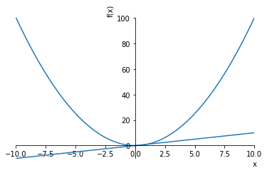
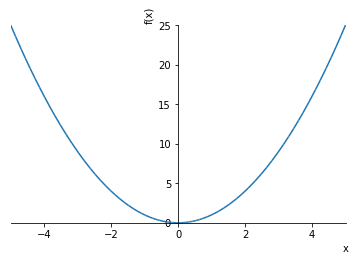
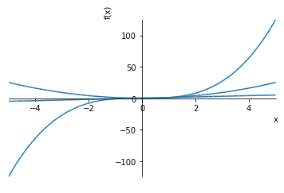
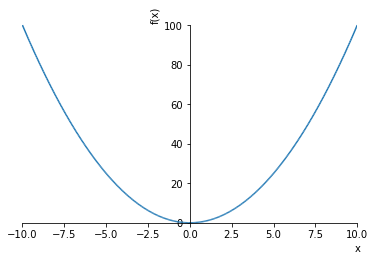
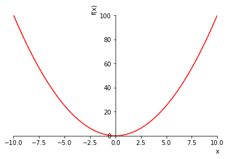
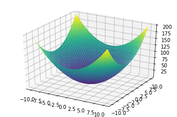

# 画图

sympy可以方便的绘制图形,如果有安装matplotlib,那么它将会使用matplotlib绘制图形

可以通过 `plot()`函数来实例化一个绘图类,实现绘图他可以带如下参数:

+ adaptive: Boolean. 
    默认值设置为True。将自适应设置为False，如果需要均匀采样，请指定nb_of_points。

+ depth: int 
    自适应算法的递归深度。值n的深度最多取样$2^n$个点。
    
+ nb_of_points: int. 
    当自适应设置为False时使用。
    该函数在nb_of_points点数处统一采样。

+ line_color: float. 指定绘图的颜色。

每个plot对象又有如下参数可以设置

+ title : str 标题
+ xlabel : str x轴标签
+ ylabel : str y轴标签
+ legend : bool 是否使用图例
+ xscale : {‘linear’, ‘log’} x轴坐标按线性还是指数扩展
+ yscale : {‘linear’, ‘log’} y轴坐标按线性还是指数扩展
+ axis : bool 是否画出坐标轴
+ axis_center : tuple of two floats or {‘center’, ‘auto’} 坐标轴中心位置
+ xlim : tuple of two floats 
+ ylim : tuple of two floats
+ aspect_ratio : tuple of two floats or {‘auto’} 
+ autoscale : bool 是否自动扩展
+ margin : float in [0, 1] 边的比例


```python
%matplotlib inline
```

## 2维图形

+ ### 画单一函数

`plot(expr, range, **kwargs)`


```python
from sympy import symbols
from sympy.plotting import plot
x,y = symbols('x y')
p1 = plot(x*x)
```


```python
p2 = plot(x)
```


+ ### 多图合并

plot对象可以将多张图合并到一起,单独一张合并使用`append()`,多个可以使用`extend`


```python
p1.append(p2[0])
p1.axis=True
p1.show()
```





+ ### 参数范围

plot也可以指定参数范围


```python
plot(x**2,(x,-5,5,))
```





    <sympy.plotting.plot.Plot at 0x11e4055f8>


+ ### 同时画多个

`plot(expr1, expr2, ..., range, **kwargs)`


```python
plot(x,x**2,x**3,(x,-5,5,))
```





    <sympy.plotting.plot.Plot at 0x11e521518>


+ ### 多个但不同取值范围

`plot((expr1, range), (expr2, range), ..., **kwargs)`


```python
plot((x**2, (x, -6, 6)), (x, (x, -5, 5)))
```


    <sympy.plotting.plot.Plot at 0x11e5ef630>


+ ### 自适应采样


```python
plot(x**2, adaptive=False, nb_of_points=400)
```





    <sympy.plotting.plot.Plot at 0x11e739048>


+ ### 设定颜色

sympy的颜色设定有点类似matplotlib的,可以指定特定字符作为标记,比如红色就是"r"


```python
y = symbols("y")
fz = x**2-y**2
```


```python
plot(x**2,line_color='r')
```





    <sympy.plotting.plot.Plot at 0x11e851b70>


## 绘制3d图形

同时,sympy也可以绘制3d图形,与2d图形形式差不多

+ `plot3d(expr, range_x, range_y, **kwargs)` 绘制一个算式的图形

+ `plot3d(expr1, expr2, range_x, range_y, **kwargs)` 绘制一个取值范围中的多个图形

+ `plot3d((expr1, range_x, range_y), (expr2, range_x, range_y), ..., **kwargs)`绘制多取值范围内的多图形


```python
from sympy.plotting import plot3d
```


```python
p3d = plot3d(x**2+y**2)
```




