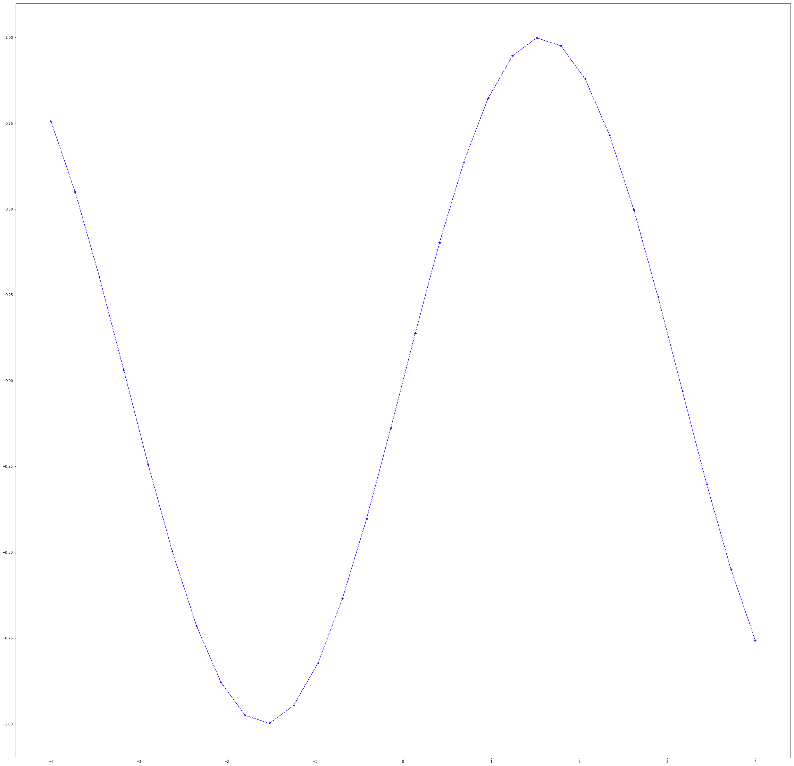

# 保存图片

保存图片可以使用`matplotlib.pyplot.savefig`来实现


```python
from matplotlib import pyplot as plt
import numpy as np  
```


```python
%matplotlib inline
```


```python
fig = plt.figure(figsize=(40,40))
x=np.linspace(-4,4,30)  
y=np.sin(x)
plt.plot(x,y,'--*b') 
fig.savefig("./source/sin_ex.png", dpi=15)
```




