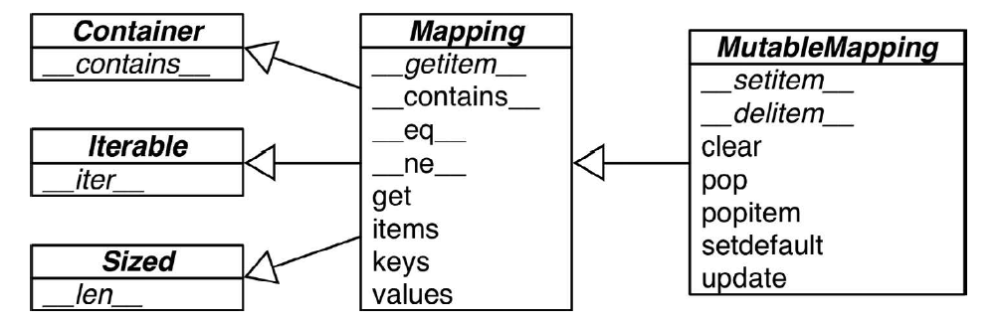

# 映射对象

python的实现中映射对象被大量使用,对象中元素的自省默认就是用映射实现的.由于有内置的映射对象,python的表现力高于许多其他语言.


本节的先验知识有:

+ [协议与接口与抽象基类](/语法篇/面向对象惯用法/协议与接口与抽象基类.html)

## 映射和集合对象的范畴

python中的映射类型分为两类:

+ 可变映射

+ 不可变映射



python目前的内建映射包括`dict`,`defaultdict` ,`OrderedDict`,集合包括`set`和`frozenset`,其中都是可变映射

字典类型不但在各种程序里广泛使用,它也是`Python`语言的基石.模块的命名空间、实例的属性和函数的关键字参数中都可以看到字典的身影.跟它有关的内置函数都在`__builtins__.__dict__`模块中.

正是因为字典至关重要,`Python`对它的实现做了高度优化,而散列表则是字典类型性能出众的根本原因.

集合(`set`)的实现其实也依赖于散列表,因此映射类型的关键就在于理解散列表的原理.

## dict的实现的优缺点

下面的内容会讨论使用散列表给dict带来的优势和限制都有哪些

+ 键必须是可散列的

    一个可散列的对象必须满足以下要求
    1. 支持`hash()`函数，并且通过`__hash__()`方法所得到的散列值是不变的
    2. 支持通过`__eq__()`方法来检测相等性
    3. 若`a == b`为真，则`hash(a) == hash(b)`也为真.
    
+ 键的次序取决于添加顺序

    当往dict里添加新键而又发生散列冲突的时候,新键可能会被安排存放到另一个位置.于是下面这种情况就会发生:由`dict([key1, value1)`, `(key2, value2)]` 和`dict([key2,value2], [key1, value1])`得到的两个字典,在进行比较的时候它们是相等的;但是如果在`key1` 和`key2`被添加到字典里的过程中有冲突发生的话,这两个键出现在字典里的顺序是不一样的.
    
+ 往字典里添加新键可能会改变已有键的顺序

    无论何时往字典里添加新的键,Python解释器都可能做出为字典扩容的决定.扩容导致的结果就是要新建一个更大的散列表,并把字典里已有的元素添加到新表里.这个过程中可能会发生新的散列冲突,导致新散列表中键的次序变化.要注意的是上面提到的这些变化是否会发生以及如何发生都依赖于字典背后的具体实现,因此你不能很自信地说自己知道背后发生了什么.如果你在迭代一个字典的所有键的过程中同时对字典进行修改,那么这个循环很有可能会跳过一些键——甚至是跳过那些字典中已经有的键.由此可知不要对字典同时进行迭代和修改.如果想扫描并修改一个字典,最好分成两步来进行:首先对字典迭代,以得出需要添加的内容,把这些内容放在一个新字典里;迭代结束之后再对原有字典进行更新.
    
+ 键查询很快

    dict 的实现是典型的空间换时间:字典类型有着巨大的内存开销,但它们提供了无视数据量大小的快速访问——只要字典能被装在内存里
    
+ 字典在内存上的开销巨大

    由于字典使用了散列表,而散列表又必须是稀疏的,这导致它在空间上的效率低下.举例而言,如果你需要存放数量巨大的记录,那么放在由元组或是具名元组构成的列表中会是比较好的选择;最好不要根据JSON的风格,用由字典组成的列表来存放这些记录.用元组取代字典就能节省空间的原因有两个:
    
    1. 避免了散列表所耗费的空间
    2. 无需把记录中字段的名字在每个元素里都存一遍
    
    在用户自定义的类型中,`__slots__`属性可以改变实例属性的存储方式,由`dict`变成`tuple`
    
    
集合和字典使用的实现类似,因此字典的特点也可以套用在集合中.

从UML图中可以看出,与序列对象也是`Contaner`,也是`Sized`也是`Iterable`,而不同之处就是在于`Mapping`和`MutableMapping`.

这些接口为字典对象带来了很多实用接口

## 字典

### 字典的方法:

+ `adict.clear()` 删除字典中的所有项或元素;
+ `adict.copy()` 返回一个字典浅拷贝的副本;
+ `adict.fromkeys(seq, val=None)` 创建并返回一个新字典,以seq中的元素做该字典的键,val做该字典中所有键对应的初始值(默认为None);
+ `adict.get(key, default = None)` 返回字典中key对应的值,若key不存在字典中,则返回default的值(default默认为None);
+ `adict.has_key(key)` 如果key在字典中,返回True,否则返回False.现在用in 、 not in;
+ `adict.items()` 返回一个包含所有(键,值)元祖的列表;
+ `adict.keys()` 返回所有的keys形成的列表;
+ `adict.pop(key[,default])` 和get方法相似.如果字典中存在key,删除并返回key对应的vuale;如果key不存在,且没有给出default的值,则引发keyerror异常;
+ `adict.popitem()` 和pop类似,只是返回一个(key,value)的元组;
+ `adict.setdefault(key, default=None)` 和set()方法相似,但如果字典中不存在Key键，由`adict[key] = default`为它赋值;
+ `adict.update(bdict)` 将字典bdict的键值对添加到字典adict中;
+ `adict.values()` 返回一个包含字典所有value的列表;

而`defaultdict`的额外接口为:

+ `adict.default_factory()`在`__missing__ `函数中被调用的函数,用以给未找到的元素设置值
+ `d.__missing__(k)`  当`__getitem__ `找不到对应键的时候,这个方法会被调用.所有的映射类型在处理找不到的键的时候,都会牵扯到`__missing__`方法.这也是这个方法称作"missing"的原因.虽然基类`dict`并没有定义这个方法,但是`dict`是知道有这么个东西存在的.也就是说,如果有一个类继承了`dict`,然后这个继承类提供了`__missing__`方法,那么在`__getitem__`碰到找不到的键的时候,Python 就会自动调用它,而不是抛出一个`KeyError `异常

而`OrderedDict`与一般字典一样,只是它内部的元素有顺序


### 字典推导

字典也可以通过字典推导来构建,它需要一个可迭代对象来创建,同样也支持if语句做筛选


```python
{i[0]:i[1] for i in (("a",1),("b",2),("c",3),("d",3))}
```


    {'a': 1, 'b': 2, 'c': 3, 'd': 3}


### 字典的变种

`collections`标准库中包含两种字典变种

+ `collections.ChainMap`

该类型可以容纳数个不同的映射对象,然后在进行键查找操作的时候,这些对象会被当作一个整体被逐个查找,直到键被找到为止.这个功能在给有嵌套作用域的语言做解释器的时候很有用,可以用一个映射对象来代表一个作用域的上下文.


```python
from collections import ChainMap
```


```python
a = {"a":1,"b":2,"c":3}
b= {"q":1,"w":2,"e":3}
```


```python
c = ChainMap(a,b)
```


```python
c
```


    ChainMap({'a': 1, 'b': 2, 'c': 3}, {'q': 1, 'w': 2, 'e': 3})


```python
for i,k in c.items():
    print(i,k)
```

    a 1
    b 2
    w 2
    c 3
    q 1
    e 3


+ `collections.Counter`

这个映射类型会给键准备一个整数计数器.每次更新一个键的时候都会增加这个计数器.所以这个类型可以用来给可散列表对象计数,或者是当成多重集来用——多重集合就是集合里的元素可以出现不止一次.`Counter`实现了`+` 和`-` 运算符用来合并记录,还有像`most_common([n])`这类很有用的方法`most_common([n])` 会按照次序返回映射里最常见的`n`个键和它们的计数


```python
from collections import Counter
```


```python
a_count = Counter('abracadabra')
```


```python
a_count
```


    Counter({'a': 5, 'b': 2, 'c': 1, 'd': 1, 'r': 2})


```python
b_count = Counter('abracadabra')
```


```python
b_count
```


    Counter({'a': 5, 'b': 2, 'c': 1, 'd': 1, 'r': 2})


```python
a_count+b_count
```


    Counter({'a': 10, 'b': 4, 'c': 2, 'd': 2, 'r': 4})


## 映射的弹性建查询

有时候为了方便起见,就算某个键在映射里不存在,我们也希望在通过这个键读取值的时候能得到一个默认值.有两个途径能帮我们达到这个目的,一个是通过`defaultdict`这个类型而不是普通的dict,另一个是给自己定义一个dict 的子类,然后在子类中实现`__missing__ `方法.下面将介绍这两种方法

### defaultdict

在用户创建defaultdict对象的时候,就需要给它配置一个为找不到的键创造默认值的方法.

具体而言，在实例化一个`defaultdict`的时候,需要给构造方法提供一个可调用对象,这个可调用对象会在`__getitem__ `碰到找不到的键的时候被调用,让`__getitem__` 返回某种默认值.

比如，我们新建了这样一个字典:dd = defaultdict(list),如果键'new-key'在dd中还不存在的话,表达式dd['new-key']会按照以下的步骤来行事.

1. 调用list() 来建立一个新列表
2. 把这个新列表作为值,'new-key'作为它的键,放到dd 中
3. 返回这个列表的引用

而这个用来生成默认值的可调用对象存放在名为default_factory 的实例属性里.

创建一个从单词到其出现情况的映射


```python
from collections import defaultdict
import re
```


```python
WORD_RE = re.compile(r'\w+')
# 把list 构造方法作为default_factory 来创建一个defaultdict
# 如果index 并没有word 的记录，那么default_factory 会被调用，为查询不到的键创造
#一个值。这个值在这里是一个空的列表，然后这个空列表被赋值给index[word]，继而
# 被当作返回值返回，因此.append(location) 操作总能成功。
index = defaultdict(list)
line = input("输入一句话:")
for match in WORD_RE.finditer(line):
    word = match.group()
    column_no = match.start()+1
    location = column_no
    index[word].append(location)
for word in sorted(index, key=str.upper):
    print(word, index[word])
```

    输入一句话:


如果在创建defaultdict 的时候没有指定default_factory,查询不存在的键会触发`KeyError`

`defaultdict` 里的`default_factory`只会在`__getitem__` 里被调用,在其他的方法里完全不会发挥作用.比如,`dd` 是个`defaultdict`,`k` 是个找不到的键,`dd[k]`这个表达式会调用`default_factory` 创造某个默认值,而`dd.get(k)`则会返回`None`

所有这一切背后的功臣其实是特殊方法`__missing__`.它会在`defaultdict`遇到找不到的键的时候调用`default_factory`,而实际上这个特性是所有映射类型都可以选择去支持的.

### 特殊方法`__missing__`

所有的映射类型在处理找不到的键的时候,都会牵扯到`__missing__` 方法.这也是这个方法称作"missing"的原因.虽然基类dict并没有定义这个方法,但是`dict` 是知道有这么个东西存在的.也就是说如果有一个类继承了`dict`,然后这个继承类提供了`__missing__` 方法,那么在`__getitem__`碰到找不到的键的时候,`Python` 就会自动调用它,而不是抛出一个`KeyError` 异常.

## 自定义映射类型

如果要自定义一个映射类型,更合适的策略其实是继承`collections.UserDict`类.这里我们从dict继承.下面一个例子我们自定义一个在查询的时候把非字符串的键转换为字符串的字典子类


```python
from collections import UserDict 
```


```python
class StrKeyDict(UserDict):
    def __missing__(self, key):
        if isinstance(key, str):
            raise KeyError(key)
        return self[str(key)]
    
    def __setitem__(self, key, item):
        self.data[str(key)] = item
    
    def __contains__(self, key):
        return str(key) in self.data
```

## 不可变映射类型`MappingProxyType`

标准库里所有的映射类型都是可变的,但有时候你会有这样的需求,比如不能让用户错误地修改某个映射.

从Python 3.3开始,types 模块中引入了一个封装类名叫MappingProxyType.如果给这个类一个映射,它会返回一个只读的映射视图.虽然是个只读视图,但是它是动态的.这意味着如果对原映射做出了改动,我们通过这个视图可以观察到,但是无法通过这个视图对原映射做出修改.下面的简短地对这个类的用法做了个演示.


```python
from types import MappingProxyType
```


```python
d = {1:'A'}
```


```python
d_proxy = MappingProxyType(d)
```


```python
d_proxy
```


    mappingproxy({1: 'A'})


```python
d_proxy[1]
```


    'A'


```python
d_proxy[2] = 'x'
```


    ---------------------------------------------------------------------------

    TypeError                                 Traceback (most recent call last)

    <ipython-input-22-bc17a9a62754> in <module>()
    ----> 1 d_proxy[2] = 'x'
    

    TypeError: 'mappingproxy' object does not support item assignment


```python
d[2] = 'B'
```


```python
d_proxy
```


    mappingproxy({1: 'A'})


```python
d_proxy[2]
```


    ---------------------------------------------------------------------------

    KeyError                                  Traceback (most recent call last)

    <ipython-input-24-6f9dce4cd735> in <module>()
    ----> 1 d_proxy[2]
    

    KeyError: 2


## 集合

python中的集合有两种类型:

+ set

    标准集合

+ frozenset

    可散列集合


集合的本质是许多唯一对象的聚集.因此,集合可以用于去重.

集合中的元素必须是可散列的,`set`类型本身是不可散列的,但是`frozenset`可以.因此可以创建一个包含不同`frozenset` 的`set`.


```python
l = ['spam', 'spam', 'eggs', 'spam']
```


```python
set(l)
```


    {'eggs', 'spam'}


```python
frozenset(l)
```


    frozenset({'eggs', 'spam'})


除了保证唯一性,集合还实现了很多基础的中缀运算符.给定两个集合a和b:

+ `a | b` ,`a |= b`,`a.union(b,c,d...)` 返回的是它们的合集
+ `a & b`,`a &= b`,`a.intersection(b,c,d...)`,`a.intersection_update(b,c,d...)` 得到的是交集
+ `a - b` ,`a -= b`,`a.difference(b,c,d...)`,`a.difference_update(b,c,d...)`得到的是差集
+ `a ^ b`,`s ^= z`,`a.symmetric_difference_update(b,c,d...)`得到的是对称差集
+ `s.__contains__(e)` 元素e 是否属于s
+ `s <= z`s 是否为z 的子集
+ s.issubset(it) 把可迭代的it 转化为集合，然后查看s 是否为它的子集
+ `s < z`s 是否为z 的真子集
+ `s >= z` s 是否为z 的父集
+ `s.issuperset(it)` 把可迭代的it 转化为集合，然后查看s 是否为它的父集
+ `s > z`  s 是否为z 的真父集


合理地利用这些操作,不仅能够让代码的行数变少,还能减少Python程序的运行时间.这样做同时也是为了让代码更易读,从而更容易判断程序的正确性,因为利用这些运算符可以省去不必要的循环和逻辑操作.

例如:我们有一个电子邮件地址的集合`haystack`,还要维护一个较小的电子邮件地址集合`needles`,然后求出`needles`中有多少地址同时也出现在了`heystack` 里.借助集合操作,我们只需要一行代码就可以了

```python
found = len(needles & haystack)
```

### 集合字面量

除空集之外,集合的字面量——{1}、{1, 2},等等——看起来跟它的数学形式一模一样

如果是空集,那么必须写成set()的形式.

在Python 3里面,除了空集，集合的字符串表示形式总是以`{...}`的形式出现


```python
s = {1}
```


```python
type(s)
```


    set


```python
s
```


    {1}


```python
s.pop()
```


    1


```python
s
```


    set()


像`{1, 2, 3}`这种字面量句法相比于构造方法`(set([1, 2, 3]))`要更快且更易读.后者的速度要慢一些,因为Python 必须先从set这个名字来查询构造方法,然后新建一个列表,最后再把这个列表传入到构造方法里.但是如果是像`{1, 2, 3}`这样的字面量,Python 会利用一个专门的叫作BUILD_SET的字节码来创建集合.

由于Python里没有针对frozenset 的特殊字面量句法,我们只能采用构造方法.

### 集合推导

`Python 2.7`带来了集合推导`(setcomps)`和之前在3.2 节里讲到过的字典推导类似

例子:把编码在32~255 之间的字符的名字里有"SIGN"单词的挑出来,放到一个集合里.


```python
from unicodedata import name
```


```python
{chr(i) for i in range(32, 256) if 'SIGN' in name(chr(i),'')}
```


    {'#',
     '$',
     '%',
     '+',
     '<',
     '=',
     '>',
     '¢',
     '£',
     '¤',
     '¥',
     '§',
     '©',
     '¬',
     '®',
     '°',
     '±',
     'µ',
     '¶',
     '×',
     '÷'}


## `*`可散列对象

在[Python 词汇表](https://docs.python.org/3/glossary.html#term-hashable)中,关于可散列类型的定义有这样一段话:

如果一个对象是可散列的,那么在这个对象的生命周期中,它的散列值是不变的,而且这个对象需要实现`__hash__()`方法.另外可散列对象还要有`__qe__()`
方法,这样才能跟其他键做比较.如果两个可散列对象是相等的,那么它们的散列值一定是一样的.

原子不可变数据类型(`str`、`bytes` 和数值类型)都是可散列类型,`frozenset`也是可散列的,因为根据其定义,`frozenset`里只能容纳可散列类型.元组的话,只有当一个元组包含的所有元素都是可散列类型的情况下,它才是可散列的.

一般来讲用户自定义的类型的对象都是可散列的,散列值就是它们的`id()`函数的返回值,所以所有这些对象在比较的时候都是不相等的.如果一个对象实现了`__eq__`方法,并且在方法中用到了这个对象的内部状态的话,那么只有当所有这些内部状态都是不可变的情况下,这个对象才是可散列的.

## `*`散列表

散列表其实是一个稀疏数组(总是有空白元素的数组称为稀疏数组).在一般的数据结构教材中,散列表里的单元通常叫作表元(bucket).在dict的散列表当中,每个键值对都占用一个表元,每个表元都有两个部分,一个是对键的引用,另一个是对值的引用.因为所有表元的大小一致,所以可以通过偏移量来读取某个表元.

因为Python会设法保证大概还有三分之一的表元是空的,所以在快要达到这个阈值的时候,原有的散列表会被复制到一个更大的空间里面.如果要把一个对象放入散列表,那么首先要计算这个元素键的散列值.Python中可以用`hash()`方法来做这件事情,接下来会介绍这一点.


### 散列值和相等性

内置的`hash()`方法可以用于所有的内置类型对象.如果是自定义对象调用`hash()`的话,实际上运行的是自定义的`__hash__`.如果两个对象在比较的时候是相等的,那它们的散列值必须相等,否则散列表就不能正常运行了.例如,如果`1 == 1.0` 为真,那么`hash(1) ==hash(1.0)`也必须为真,但其实这两个数(整型和浮点)的内部结构是完全不一样的.为了让散列值能够胜任散列表索引这一角色,它们必须在索引空间中尽量分散开来.这意味着在最理想的状况下,越是相似但不相等的对象,它们散列值的差别应该越大.

从Python 3.3开始,`str`、`bytes` 和`datetime`对象的散列值计算过程中多了随机的"加盐"这一步.所加盐值是`Python`进程内的一个常量,但是每次启动Python解释器都会生成一个不同的盐值.随机盐值的加入是为了防止DOS攻击而采取的一种安全措施.

## `*`散列表算法

在映射中,为了获取`my_dict[search_key]` 背后的值,Python首先会调用`hash(search_key)`来计算`search_key`的散列值,把这个值最低的几位数字当作偏移量,在散列表里查找表元(具体取几位,得看当前散列表的大小).若找到的表元是空的,则抛出`KeyError`异常.若不是空的,则表元里会有一对`found_key:found_value`.这时候Python会检验`search_key ==found_key`是否为真,如果它们相等的话,就会返回`found_value`.如果`search_key`和`found_key`不匹配的话,这种情况称为散列冲突.发生这种情况是因为,散列表所做的其实是把随机的元素映射到只有几位的数字上,而散列表本身的索引又只依赖于这个数字的一部分.为了解决散列冲突,算法会在散列值中另外再取几位,然后用特殊的方法处理一下,把新得到的数字再当作索引来寻找表元.

+ 若这次找到的表元是空的,则同样抛出`KeyError`;
+ 若非空,或者键匹配,则返回这个值;
+ 或者又发现了散列冲突,则重复以上的步骤.


添加新元素和更新现有键值的操作几乎跟上面一样.只不过对于前者,在发现空表元的时候会放入一个新元素,对于后者在找到相对应的表元后,原表里的值对象会被替换成新值.另外在插入新值时Python可能会按照散列表的拥挤程度来决定是否要重新分配内存为它扩容.如果增加了散列表的大小,那散列值所占的位数和用作索引的位数都会随之增加,这样做的目的是为了减少发生散列冲突的概率.
