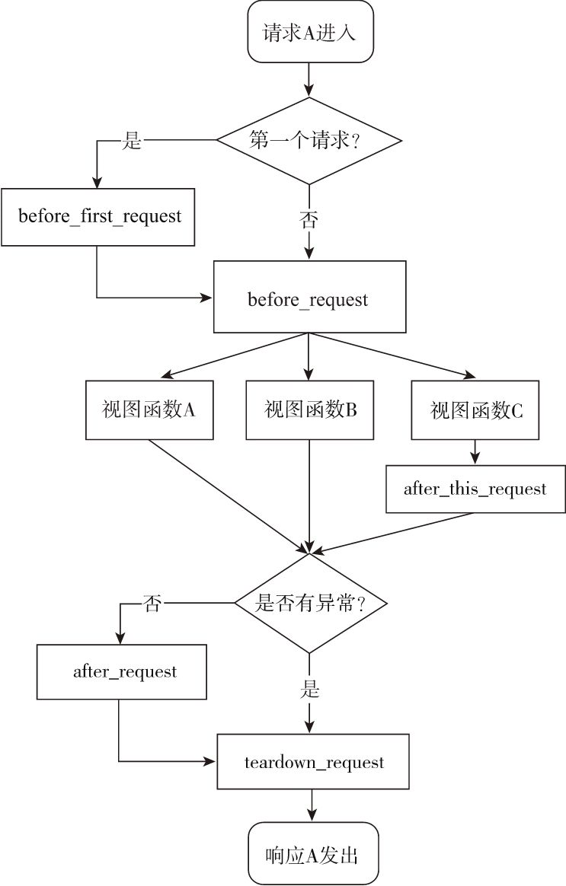

# 使用Flask快速构建RESTful接口服务

python有很多优秀的web框架,其中最知名的一般认为是Django,但最适合写RESTful接口服务的是Flask.Flask给自己的定位是"微框架"--尽量的只做核心功能,其他东西通过插件的形式扩展,这种思想在很大程度上影响了后来的各种框架.当然以现在的眼光看Flask远谈不上"微",不过它依然是目前最完善的"微框架",也是多数python项目服务器代码的首选框架.比如开源的BI可视化工具redash,Superset都是基于Flask的.

## helloworld

首先是一个[helloworld](https://github.com/TutorialForPython/python-io/tree/master/%E6%8E%A5%E5%8F%A3%E6%9C%8D%E5%8A%A1/Http%E6%8E%A5%E5%8F%A3%E6%9C%8D%E5%8A%A1/code/flask-server/C0)项目,我们来看看用flask构造Restful接口的惯用方法.

RESTful接口基于HTTP的METHOD,因此我们也常用`MethodView`构造基于METHOD的接口

这种应用构造的过程就是:
1. 使用`Flask(__name__)`创建一个`应用实例`
2. 继承`MethodView`构造一个对应`RESTful`概念中`RESOURCE`的`视图类`
3. 通过调用`视图类`的方法`.as_view(view_name:str)`将`视图类`转化为一个`视图对象`
4. 调用`应用实例`的`.add_url_rule(url:str, view_func=视图对象)`方法将`视图对象`注册到`应用实例`对应的url下


+ app.py

```python
from flask import Flask, jsonify, request
from flask.views import MethodView
from jsonschema import validate
app = Flask(__name__)
app.config['JSON_AS_ASCII'] = False

User = []

User_Schema = {
    "title": "User",
    "description": "用户",
    "type": "object",
    "properties": {
        "name": {
            "description": "user name",
            "type": "string"
        }, "age": {
            "description": "user age",
            "type": "integer",
            "minimum": 0,
            "maximum": 140,
            "exclusiveMaximum": True
        }
    },
    "required": ["name", "age"]
}


class UserIndexAPI(MethodView):

    def get(self):
        count = len(User)
        result = {
            "description": "测试api,User总览",
            "user-count": count,
            "links": [
                {
                    "uri": "/user",
                    "method": "POST",
                    "description": "创建一个新用户"
                },
                {
                    "uri": "/user/<int:uid>",
                    "method": "GET",
                    "description": "用户号为<id>的用户信息"
                },
                {
                    "uri": "/user/<int:uid>",
                    "method": "PUT",
                    "description": "更新用户号为<id>用户信息"
                },
                {
                    "uri": "/user/<int:uid>",
                    "method": "DELETE",
                    "description": "删除用户号为<id>用户"
                },
            ]
        }

        return jsonify(result)

    def post(self):
        insert = request.json

        try:
            validate(instance=insert, schema=User_Schema)
        except Exception as e:
            return jsonify({
                "msg": "参数错误",
                "error": str(e)
            }), 401
        else:
            uid = User.append(insert)
            return jsonify({
                "msg": "插入成功",
                "uid": uid
            })


class UserAPI(MethodView):

    def get(self, uid):
        try:
            u = User[uid]
        except IndexError as dn:
            return jsonify({
                "msg": "未找到用户",
            }), 401

        except Exception as e:
            return jsonify({
                "msg": "执行错误",
            }), 500
        else:
            if u:
                return jsonify(u)
            else:
                return jsonify({
                    "msg": "未找到用户",
                }), 401

    def put(self, uid):
        try:
            u = User[uid]
        except IndexError as dn:
            return jsonify({
                "msg": "未找到用户",
            }), 401

        except Exception as e:
            return jsonify({
                "msg": "执行错误",
            }), 500
        else:
            if u:
                insert = request.json
                u.update(insert)
                return jsonify({
                    "msg": "更新成功"
                })
            else:
                return jsonify({
                    "msg": "未找到用户",
                }), 401

    def delete(self, uid):
        try:
            u = User[uid]
        except IndexError as dn:
            return jsonify({
                "msg": "未找到用户",
            }), 401

        except Exception as e:
            return jsonify({
                "msg": "执行错误",
            }), 500
        else:
            if u:
                User[uid] = None
                return jsonify({
                    "msg": "删除成功",
                })
            else:
                return jsonify({
                    "msg": "未找到用户",
                }), 401


user_index_view = UserIndexAPI.as_view('user_index_api')
user_view = UserAPI.as_view('user_api')


app.add_url_rule('/user', view_func=user_index_view)
app.add_url_rule('/user/<int:uid>', view_func=user_view)

if __name__ == "__main__":
    app.run()
```

这是一个最简单的RESTful接口,描述了用户.设置`app.config['JSON_AS_ASCII'] = False`是为了返回的数据支持utf-8.我们通过定义`MethodView`的子类来定义基于http方法的接口,然后使用`app.add_url_rule`将其注册到url上.


这个方式可以直接使用命令

```bash
python app.py
```

启动,但这个启动的只是一个多线程的测试服务器,测试接口还行上线就无力了.

## 为接口写测试

RESTful接口最大的优势是可以方便的写测试,我们使用项目[C1](https://github.com/TutorialForPython/python-io/tree/master/%E6%8E%A5%E5%8F%A3%E6%9C%8D%E5%8A%A1/Http%E6%8E%A5%E5%8F%A3%E6%9C%8D%E5%8A%A1/code/flask-server/C1)来演示如何为flask写接口测试

+ test.py

```python
import json
import unittest
import app
class FlaskrTestCase(unittest.TestCase):

    def setUp(self):
        print("测试开始")
        self.app = app.app.test_client()
    def tearDown(self):
        print("测试结束")

    def test_user(self):
        rv = self.app.get('/user')
        assert "user-count" in json.loads(rv.data).keys()
```

flask的app对象有一个`test_client()`方法可以创建一个测试客户端

## 使用蓝图为接口分组

上面的用户接口相对是比较简单的,如果碰到更多的接口需要组织,或者需要区分版本,或者由的url要复用视图,那这种在app下直接挂载就会失去灵活性,我们希望将视图模块化来解决上面的问题.flask提供了蓝图模式来做这个功能.其基本用法是:


1. 使用`Flask(__name__)`创建一个`应用实例`
2. 使用`Blueprint()`创建`蓝图对象`并定义蓝图对象的一级url
3. 继承`MethodView`构造一个对应`RESTful`概念中`RESOURCE`的`视图类`
4. 通过调用`视图类`的方法`.as_view(view_name:str)`将`视图类`转化为一个`视图对象`
5. 调用`蓝图对象`的`.add_url_rule(url:str, view_func=视图对象)`方法将`视图对象`注册到`蓝图对象`对应的二级url下
6. 使用`app.register_blueprint(蓝图对象,url_prefix='/{first_url}')`将蓝图注册到`应用实例`上

我们将原来的`user`接口挂载到一级url`v1`上,项目在[C2](https://github.com/TutorialForPython/python-io/tree/master/%E6%8E%A5%E5%8F%A3%E6%9C%8D%E5%8A%A1/Http%E6%8E%A5%E5%8F%A3%E6%9C%8D%E5%8A%A1/code/flask-server/C2)上

+ `app.py`

```python
from flask import Flask, Blueprint, jsonify, request
from flask.views import MethodView
from jsonschema import validate
app = Flask(__name__)
app.config['JSON_AS_ASCII'] = False
api_v1 = Blueprint('v1', __name__)


User = []

User_Schema = {
    "title": "User",
    "description": "用户",
    "type": "object",
    "properties": {
        "name": {
            "description": "user name",
            "type": "string"
        }, "age": {
            "description": "user age",
            "type": "integer",
            "minimum": 0,
            "maximum": 140,
            "exclusiveMaximum": True
        }
    },
    "required": ["name", "age"]
}


class UserIndexAPI(MethodView):

    def get(self):
        count = len(User)
        result = {
            "description": "测试api,User总览",
            "user-count": count,
            "links": [
                {
                    "uri": "/user",
                    "method": "POST",
                    "description": "创建一个新用户"
                },
                {
                    "uri": "/user/<int:uid>",
                    "method": "GET",
                    "description": "用户号为<id>的用户信息"
                },
                {
                    "uri": "/user/<int:uid>",
                    "method": "PUT",
                    "description": "更新用户号为<id>用户信息"
                },
                {
                    "uri": "/user/<int:uid>",
                    "method": "DELETE",
                    "description": "删除用户号为<id>用户"
                },
            ]
        }

        return jsonify(result)

    def post(self):
        insert = request.json

        try:
            validate(instance=insert, schema=User_Schema)
        except Exception as e:
            return jsonify({
                "msg": "参数错误",
                "error": str(e)
            }), 401
        else:
            uid = User.append(insert)
            return jsonify({
                "msg": "插入成功",
                "uid": uid
            })


class UserAPI(MethodView):

    def get(self, uid):
        try:
            u = User[uid]
        except IndexError as dn:
            return jsonify({
                "msg": "未找到用户",
            }), 401

        except Exception as e:
            return jsonify({
                "msg": "执行错误",
            }), 500
        else:
            if u:
                return jsonify(u)
            else:
                return jsonify({
                    "msg": "未找到用户",
                }), 401

    def put(self, uid):
        try:
            u = User[uid]
        except IndexError as dn:
            return jsonify({
                "msg": "未找到用户",
            }), 401

        except Exception as e:
            return jsonify({
                "msg": "执行错误",
            }), 500
        else:
            if u:
                insert = request.json
                u.update(insert)
                return jsonify({
                    "msg": "更新成功"
                })
            else:
                return jsonify({
                    "msg": "未找到用户",
                }), 401

    def delete(self, uid):
        try:
            u = User[uid]
        except IndexError as dn:
            return jsonify({
                "msg": "未找到用户",
            }), 401

        except Exception as e:
            return jsonify({
                "msg": "执行错误",
            }), 500
        else:
            if u:
                User[uid] = None
                return jsonify({
                    "msg": "删除成功",
                })
            else:
                return jsonify({
                    "msg": "未找到用户",
                }), 401


user_index_view = UserIndexAPI.as_view('user_index_api')
user_view = UserAPI.as_view('user_api')


api_v1.add_url_rule('/user', view_func=user_index_view)
api_v1.add_url_rule('/user/<int:uid>', view_func=user_view)

app.register_blueprint(api_v1, url_prefix='/v1')

if __name__ == "__main__":
    app.run()
```

### 使用钩子控制服务行为

flask程序中每一次的请求需要先通过钩子,因此我们也可以将一些常规的操作放在钩子中这样就省得每个接口都定义一遍相同的行为,下面是所有钩子的行为顺序:


+ `before_request()`
+ `after_request()`
+ `teardown_request()`
+ `after_this_request()`
+ `before_first_request()`



蓝图也有类似的钩子,其执行顺序也和上面类似.

如果需要精细化到具体的view,我们则可以使用装饰器,在`MethodView`的子类中,我们可以在其中声明`decorators = [xxx]`来调用装饰器,一个典型的装饰器是:

```python

from functools import wraps
import time

def print_time(f):
    @wraps(f)
    def decorated_function(*args, **kwargs):
        start = time.time()
        response = f(*args, **kwargs)
        end = time.time()
        spend = end-start
        print(f"spend {spend} s")
        return response
    return decorated_function

```

我们用例子[C3](https://github.com/TutorialForPython/python-io/tree/master/%E6%8E%A5%E5%8F%A3%E6%9C%8D%E5%8A%A1/Http%E6%8E%A5%E5%8F%A3%E6%9C%8D%E5%8A%A1/code/flask-server/C3)来展示下


+ app.py

```python
...

@app.before_first_request
def _before_first_request():
    print("before_first_request")


@app.before_request
def _before_request():
    print("before_request")


@app.after_request
def _after_request(response):
    print(f"after_request:{response}")
    return response


@app.teardown_request
def _teardown_request(response):
    print(f"teardown_request:{response}")
    return response


@api_v1.before_request
def _bp_before_request():
    print("bp_before_request")


@api_v1.teardown_request
def _bp_teardown_request(response):
    print(f"bp_teardown_request:{response}")
    return response


@api_v1.after_request
def _bp_after_request(response):
    print(f"bp_after_request:{response}")
    return response

user_index_view = UserIndexAPI.as_view('user_index_api')
user_view = UserAPI.as_view('user_api')


api_v1.add_url_rule('/user', view_func=user_index_view)
api_v1.add_url_rule('/user/<int:uid>', view_func=user_view)

app.register_blueprint(api_v1, url_prefix='/v1')
...
```

需要注意,蓝图的钩子要在蓝图注册到app之前注册进去,否则不会生效

## 使用全局变量传递上下文数据

flask定义了如下几种上下文全局变量:

|变量名|上下文类别|说明|
|---|---|---|
|current_app|程序上下文|指向处理请求的当前程序实例|
|g|程序上下文|替代Python的全局变量用法，确保仅在当前请求可用，用于存储全局数据，每次请求都会重设|
|request|请求上下文|封装客户端发出的请求报文数据|
|session|请求上下文|用于记住请求之间的数据，通过签名的Cookie实现|

比较常用于传递中间数据的是全局变量g,我们利用例子[C4](https://github.com/TutorialForPython/python-io/tree/master/%E6%8E%A5%E5%8F%A3%E6%9C%8D%E5%8A%A1/Http%E6%8E%A5%E5%8F%A3%E6%9C%8D%E5%8A%A1/code/flask-server/C4)来演示下,在例子C4中我们会使用`before_request`为全局变量g创建一个uuid字段,再在`after_request`中将其读出重新构造response

+ app.py

```python
...
@app.before_request
def _before_request():
    g.uuid = str(uuid4())
    print(f"{g.uuid}")

@app.after_request
def _after_request(response):
    data = response.get_json()
    data.update({
        "uuid": g.uuid
    })
    print(f"after_request: uuid{g.uuid}")
    return jsonify(data)
...
```


### 修改flask的log

flask默认的log在`app.logger`,它是一个`扁平的文本`,而现在的趋势是使用json格式化log以便于后续分析,为了满足这个需求,我们可以像下面这样设置,代码在[C5](https://github.com/TutorialForPython/python-io/tree/master/%E6%8E%A5%E5%8F%A3%E6%9C%8D%E5%8A%A1/Http%E6%8E%A5%E5%8F%A3%E6%9C%8D%E5%8A%A1/code/flask-server/C5)

flask默认的logger名字为`flask.app`,如果使用默认的`werkzeug`启动服务,那它的logger名为`werkzeug`,我们需要将他们内容的格式都改为json.

+ logger.py

```python
import sys
import time
import logging
import structlog
from flask import request
from flask.logging import default_handler
import werkzeug._internal as _internal
logging.Formatter.converter = time.gmtime
class RequestFormatter(logging.Formatter):
    def format(self, record):
        record.request = '{0} {1}'.format(request.method, request.url)
        record.host = request.host
        return super().format(record)
access_formatter=RequestFormatter(** {
    "fmt": '''{"timestamp":"%(asctime)s","logger":"app.access", "level":"%(levelname)s","host":"%(host)s","request":"%(request)s",%(message)s}''',
    "datefmt": "%Y-%m-%dT%H:%M:%S Z"
})

werkzeug_formatter = logging.Formatter(**{
    "fmt": '''{"timestamp":"%(asctime)s","logger":"werkzeug.server", "level":"%(levelname)s","msg":"%(message)s"}''',
    "datefmt": "%Y-%m-%dT%H:%M:%S Z"
})
def init_app(app,flask_log_level=logging.INFO,werkzeug_log_level=logging.INFO):
    default_handler.setFormatter(access_formatter)

    handler = logging.StreamHandler(sys.stdout)
    flask_app_logger = logging.getLogger("flask.app")
    flask_app_logger.addHandler(handler)
    flask_app_logger.setLevel(flask_log_level)  # 设置最低log等级
    werkzeug_handler = logging.StreamHandler()
    werkzeug_handler.setFormatter(werkzeug_formatter)
    werkzeug_logger = logging.getLogger("werkzeug")
    werkzeug_logger.handlers = []
    werkzeug_logger.addHandler(werkzeug_handler)
    werkzeug_logger.setLevel(werkzeug_log_level)  # 设置最低log等级
    structlog.configure(
        processors=[
            structlog.stdlib.filter_by_level,  # 判断是否接受某个level的log消息
            structlog.stdlib.add_logger_name,  # 增加字段logger
            structlog.stdlib.add_log_level,  # 增加字段level
            structlog.stdlib.PositionalArgumentsFormatter(),
            structlog.processors.TimeStamper(fmt="iso"),  # 增加字段timestamp且使用iso格式输出
            structlog.processors.StackInfoRenderer(),
            structlog.processors.format_exc_info,  # 捕获异常的栈信息
            structlog.processors.StackInfoRenderer(),  # 详细栈信息
            structlog.processors.JSONRenderer()  # json格式输出,第一个参数会被放入event字段
        ],
        context_class=dict,
        logger_factory=structlog.stdlib.LoggerFactory(),
        wrapper_class=structlog.stdlib.BoundLogger,
        cache_logger_on_first_use=True,
    )
    log = structlog.get_logger("flask.app")
    app.logger = log
    return app
```

上面的代码我们将`app.logger`替换成了`structlog`的log,这样我们的log就是结构化数据了.

## 为app构造插件

Flask插件是为特定目的封装好的组件组合,它必须满足接口`init_app(app,*args,**kwargs)`,我们可以定义一个Flask插件来专门封装flask的json格式的log.[C6](https://github.com/TutorialForPython/python-io/tree/master/%E6%8E%A5%E5%8F%A3%E6%9C%8D%E5%8A%A1/Http%E6%8E%A5%E5%8F%A3%E6%9C%8D%E5%8A%A1/code/flask-server/C6)就演示了如何将`logger.py`改造为一个Flask插件.

+ flask_jsonifylog.py

```python
...

class JsonLogger:

    def __init__(self,app=None):
        self.app = app
        if app is not None:
            self.init_app(app=app)
        
    def init_app(self,app):
        app.config.setdefault('FLASK_LOG_LEVEL', 'INFO')
        app.config.setdefault('WERKZEUG_LOG_LEVEL', 'INFO')
        default_handler.setFormatter(access_formatter)
        handler = logging.StreamHandler(sys.stdout)
        flask_app_logger = logging.getLogger("flask.app")
        flask_app_logger.addHandler(handler)

        flask_log_level = app.config.get("FLASK_LOG_LEVEL")
        flask_app_logger.setLevel(getattr(logging,flask_log_level)) # 设置最低log等级
        werkzeug_handler = logging.StreamHandler()
        werkzeug_handler.setFormatter(werkzeug_formatter)
        werkzeug_logger = logging.getLogger("werkzeug")
        werkzeug_logger.handlers = []
        werkzeug_logger.addHandler(werkzeug_handler)

        werkzeug_log_level = app.config.get("WERKZEUG_LOG_LEVEL")
        werkzeug_logger.setLevel(getattr(logging,werkzeug_log_level))# 设置最低log等级
        structlog.configure(
            processors=[
                structlog.stdlib.filter_by_level,  # 判断是否接受某个level的log消息
                structlog.stdlib.add_logger_name,  # 增加字段logger
                structlog.stdlib.add_log_level,  # 增加字段level
                structlog.stdlib.PositionalArgumentsFormatter(),
                structlog.processors.TimeStamper(fmt="iso"),  # 增加字段timestamp且使用iso格式输出
                structlog.processors.StackInfoRenderer(),
                structlog.processors.format_exc_info,  # 捕获异常的栈信息
                structlog.processors.StackInfoRenderer(),  # 详细栈信息
                structlog.processors.JSONRenderer()  # json格式输出,第一个参数会被放入event字段
            ],
            context_class=dict,
            logger_factory=structlog.stdlib.LoggerFactory(),
            wrapper_class=structlog.stdlib.BoundLogger,
            cache_logger_on_first_use=True,
        )
        log = structlog.get_logger("flask.app")
        app.logger = log
```

其他部分都一样,只是我们需要将其使用一个类封装起来.调用的时候如下:

+ app.py

```python
...
from flask_jsonifylog import JsonLogger
...

JsonLogger(app)
```

## 错误处理

另一个常见的需要是错误处理,通常RESTful接口会复用http状态,比如500表示服务器错误,404表示找不到资源.我们使用`app.errorhandler`来定义错误的处理方式[C7](https://github.com/TutorialForPython/python-io/tree/master/%E6%8E%A5%E5%8F%A3%E6%9C%8D%E5%8A%A1/Http%E6%8E%A5%E5%8F%A3%E6%9C%8D%E5%8A%A1/code/flask-server/C7)

```python
...

@app.errorhandler(werkzeug.exceptions.NotFound)
def handle_bad_request(e):
    return jsonify({
        "message": "Not Found"
    }), 404
...
```


## 部署flask接口服务

python的服务部署例子在[C8](https://github.com/TutorialForPython/python-io/tree/master/%E6%8E%A5%E5%8F%A3%E6%9C%8D%E5%8A%A1/Http%E6%8E%A5%E5%8F%A3%E6%9C%8D%E5%8A%A1/code/flask-server/C8)

python受限于gil只能利用一个核,为了提高负载充分利用多核,常见的策略是使用多进程,这就会用到工具[gunicorn](https://gunicorn.org/).它的用法非常简单:

```bash
gunicorn -w 4 -k gevent -b 127.0.0.1:4000 app:app
```

使用`-w`指定起多少进程,`-b`指定绑定的host和port,然后再指定flask的app对象即可,如果需要使用gevent将线程改为协程,也可以使用`-k`指名使用gevent

但在容器化的现在,我们往往更多的时候使用swarm或者k8s通过多容器做负载均衡,那使用gunicorn就太重了,这种时候我们常使用gevent构造服务.


+ gevent_server.py

```python
from gevent import monkey; monkey.patch_all()
from gevent.pywsgi import WSGIServer
from app import app
import logging

http_server = WSGIServer(('', 5000), app, log=logging.getLogger("werkzeug"))
http_server.serve_forever()
```

这里要注意import的顺序,因为我们使用gevent启动Flask往往性能瓶颈不在flask框架而在数据库,这种时候我们就需要使用gevent的猴子补丁将其他数据库连接的部分也异步化.
