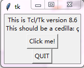
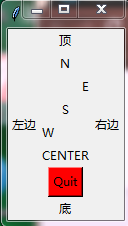
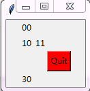
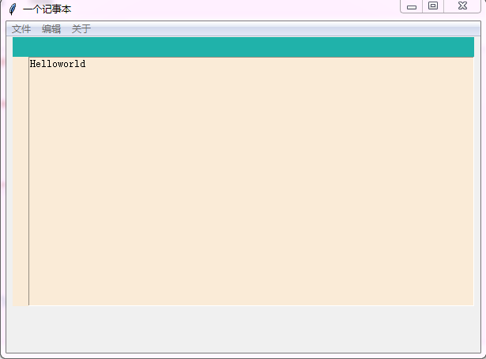

# TK框架GUI编程的基本思路


首先我们来明确几个单词以明确Gui编程语境下的基本上下文环境.

+ `窗口(window)`
    
    就是在屏幕上打开一个窗口,GUI的最上层单元,实际上GUI程序就是一个循环,平时一直空转等待`事件`,当发生事件后就由`回调函数`执行对应操作.
    窗口打开程序执行,窗口关闭程序退出.

+ `框架(Frame)`
    
    就是屏幕上的一块矩形区域,多是用来作为容器(container)来布局窗口

+ `控件(widget)`

    就是具体的可操作可交互块,比如按钮,文本框,包括窗口,帧等都是.
    
+ `事件(event)`

    指的是一个用于改变控件/帧/窗口等对象状态的触发信号
    
+ `回调函数(callback)`

    指的是在外部定义好的控件/帧/窗口等在接收到事件后处理事件的方法.
    
+ `网格(grid)`
    
    指的是堆放控件的一种常用方式,控件可摆放的位置按从上到下,从左到右的顺序获得一个二维的编号,组件按照编号放置在网格对应的位置上.
    
+ `像素(pixel)`
    
    显示设备上用于显示图像的最小单位,每个像素就是一个发光点,GUI的图形本质上就是这些点的组合.
    

## GUI编程的基本架构模式

通常gui编程就是将模块的接口使用gui组合包装起来,在不同的情况下调用不同的接口从而达到方便用户使用的目的.因此GUI编程基本可以使用`mvc`结构进行分解,即:

+ Model 模型,也就是业务模型,实际业务的内容
+ View 视图,也就是GUI中的图形组合
+ Controller 控制器,也就是连接视图与模型的组件,通常使用事件模型传递控制信息.

这3层相互独立,同常通过接口进行交互,但通常使用Tk的时候Controller作为application的住体,model和view则是作为主体的嵌入.model部分本文不会多做描述,而gui编程更加关心的是视图和控制器部分.


对MVC结构更多的理解可以看一些其他的书籍,推荐[阮一峰先生的这篇博客](http://www.ruanyifeng.com/blog/2007/11/mvc.html),讲的浅显易懂,每次看都可以有新的收获.

## 视图部分

视图部分主要是管用户实际看到的内容,因此除了堆砌组件外,设计也是一门技术活.视图也就基本可以分为组件和布局两个部分.

像`C#`,`QT`这种库一个最方便的地方是可以通过工具所见即所得的组织组件,python自带的Tkinter并没有提供这个工具.但其实是有一个类似工具的<http://page.sourceforge.net/#Download>,

它的安装需要先安装了`TCL`环境(需翻墙)[activetcl](https://www.activestate.com/activetcl/downloads),不过使用工具生成的代码会比较难以维护,还是更加推荐手动编写,毕竟很简单.

### 视图的组件

在python标准库中有3个库提供了tk的控件,分别是

+ tkinter

tk的基本库,提供的控件包括:
   
控件名类型|意义
---|---
Toplevel|顶层帧
Frame|框架
LabelFrame|标签框架
Button|按钮
Canvas|画板
Checkbutton|复选框
Entry|输入框
Label|标签
Listbox|列表框
Menu|菜单栏
Menubutton|菜单按钮
Message|信息栏
OptionMenu|选项菜单
PanedWindow|中分栏窗口
Radiobutton|单选框
Scale|滑块
Scrollbar|滚动条
Spinbox|指定输入范围值的输入框
Text|文本框

    
+ tkinter.ttk

一个tk的扩展库,提供了更多的样式和控件以及一些控件的美化版本.
优化控件包括:
    
控件名|说明
---|---
Button|按钮
Checkbutton|复选框
Entry|输入框
Frame|框架
Label|标签
LabelFrame|标签框架
Menubutton|菜单按钮
PanedWindow|中分栏窗口
Radiobutton|单选框
Scale|滑块
Scrollbar|滚动条

新增的控件包括:

控件名|说明
---|---
Combobox|组合框,包含文本字段和一个包含可选值的下拉列表
Notebook|标签页,形式参见chrome中的标签页
Progressbar|进度条
Separator|分离器,显示一个水平或垂直分隔条
Sizegrip|控制TopLevel的窗口大小
Treeview|TreeView控件显示一个项目的树状分层集合

+ tkinter.scrolledtext

单独的带滚动条的文本框,集成了文本框和滚动条,调用更加方便些


另外还有两个第三方库可以使用,不过由于tk模块年深日久,第三方扩展也历史久远,现在只能直接下载源码使用`python setup.py install`安装.

+ [Python megawidgets](https://sourceforge.net/projects/pmw/)提供了更多组件的第三方库
+ [pandastable](https://github.com/dmnfarrell/pandastable)提供了对表格的支持.


各个控件的接口可以查看[这份文档](http://effbot.org/tkinterbook/)

#### **控件的基本设置方式**

在tkinter中每个控件都有一个`configure()`方法用于设置,设置`configure`的参数可能各不相同,但其设置方式都是一致的,就是

1. 使用关键字在初始化控件时设置
2. 调用控件对象的`configure()`方法设置

ttk的控件使用方式和tkinter一致,但设置方式使用`ttk.Style()`进行全局设置,而非直接在单独的控件中设置.

比如同样是设置label,`tkinter`中设置方式如下:

```python
l1 = tkinter.Label(text="Test", fg="black", bg="white")
l2 = tkinter.Label(text="Test", fg="black", bg="white")
```
而ttk中如下:

```python
style = ttk.Style()
style.configure("BW.TLabel", foreground="black", background="white")

l1 = ttk.Label(text="Test", style="BW.TLabel")
l2 = ttk.Label(text="Test", style="BW.TLabel")
```

#### **控件的组合方式**

用过图像编辑软件的读者一定知道`图层`这一概念,图片是一个一个的图层堆叠组合而成.我们的GUI也是一层一层堆叠而成,最底层必须是`TopLevel`这个有点类似于画板,通常在其上我们会放上一个帧,这有点像刷个底色图层,之后就是在这个帧上放置其他组件了.最终的gui就是由所有这些组件构成的一颗组件树.

每个组件初始化的第一参数都是它的父级组件,我们可以使用

#### **第一个tkinter程序**




```python
%%writefile src/first.py
import tkinter

tkinter._test()
```

    Overwriting src/first.py


```python
%exec_py src/first.py
```

### 布局思路

有3种方式可以为控件布局:

+ pack()
+ grid()
+ place()


#### **pack()**
pack()默认会一个一个从上往下堆叠,但同样也可以接受几个参数

+ side (left,top,right,bottom)
+ fill ( X,Y,BOTH 和 NONE)水平方向填充,竖直方向填充,水平和竖直方向填充和不填充。
+ expand 参数可以是 YES 和 NO
+ anchor (n, ne, e, se, s, sw, w, nw, or center)NESW 表示上右下左以及他们的组合或者是 CENTER(表示中 间)。
+ ipadx 表示的是内边距的 x 方向
+ ipady 表示 的是内边距的 y 方向
+ padx 表示的是外边距的 x 方向
+ pady 表示的是外边距的 y 方向




```python
%%writefile src/pack.py

from tkinter import Frame,Label,Button


class Application(Frame):
    def __init__(self, master=None):
        Frame.__init__(self, master)
        self.pack()
        self.createWidgets()

    def createWidgets(self):
        self.LabelL = Label(self, text='左边')
        self.LabelL.pack(side="left")
        self.LabelR = Label(self, text='右边')
        self.LabelR.pack(side="right")
        self.LabelT = Label(self, text='顶')
        self.LabelT.pack(side="top")
        self.LabelB = Label(self, text='底')
        self.LabelB.pack(side="bottom")

        self.LabelN = Label(self, text='N')
        self.LabelN.pack(anchor="n")
        self.LabelE = Label(self, text='E')
        self.LabelE.pack(anchor="e")
        self.LabelS = Label(self, text='S')
        self.LabelS.pack(anchor="s")
        self.LabelW= Label(self, text='W')
        self.LabelW.pack(anchor="w")
        self.LabelCENTER= Label(self, text='CENTER')
        self.LabelCENTER.pack(anchor="center")


        self.quitButton = Button(self, text='Quit',background="red", command=self.quit)
        self.quitButton.pack(side="bottom")

if __name__ =="__main__":
    app = Application()
    # 设置窗口标题:
    app.master.title('pack布局测试')
    #窗口大小位置
    #app.master.geometry("600x400+100+400")#长x宽+x+y
    # 主消息循环:
    app.mainloop()
```

    Overwriting src/pack.py


```python
%exec_py src/pack.py
```

#### **grid() 最常用布局**

grid()里的参数:

+ row 表示行(从0开始)
+ column 表示列(从0开始)
+ sticky  (N,E,S,W) 表 示上右下左,它决定了这个组件是从哪个方向开始的
+ ipadx,ipady,padx,pady,它们 的意思和 pack 函数是一样的,默认边距是 0。
+ rowspan 表示跨越的行数 columnspan 表示跨越的列数。




```python
%%writefile src/grid.py

from tkinter import Frame,Label,Button


    
class Application(Frame):
    def __init__(self, master=None):
        Frame.__init__(self, master)
        self.pack()
        self.createWidgets()

    def createWidgets(self):
        self.Label00 = Label(self, text='00')
        self.Label00.grid(row=0,column=0)
        self.Label10 = Label(self, text='10')
        self.Label10.grid(row=1,column=0)
        self.Label11 = Label(self, text='11')
        self.Label11.grid(row=1,column=1)
        self.Label30 = Label(self, text='30')
        self.Label30.grid(row=3,column=0)


        self.quitButton = Button(self, text='Quit',background="red", command=self.quit)
        self.quitButton.grid(row=2,column=2)

if __name__ =="__main__":
    app = Application()
    # 设置窗口标题:
    app.master.title('grid布局测试')
    #窗口大小位置
    #app.master.geometry("600x400+100+400")#长x宽+x+y
    # 主消息循环:
    app.mainloop()
```

    Overwriting src/grid.py


```python
%exec_py src/grid.py
```

## 控制部分

Tkinter的控制部分是依靠为控件绑定事件和回调函数来实现的

### 事件

> 事件绑定和解绑 bind() unbind()
>>绑定bind()

bind 函数的调用规则: 

    控件对象.bind(事件类型,回调函数)

事件类型:

事件类型是一组字符串,它采用的描述方式是这样的:

    <MODIFIER-MODIFIER-TYPE-DETAIL>
    
+ MODIFIER 即修饰符,它的全部取值如下:

Control|Mod1, M1, Command
---|---
Alt|Mod2, M2, Option
Shift|Mod3, M3
Lock|Mod4, M4
Extended|Mod5, M5
Button1, B1|Meta, M
Button2, B2|Double
Button3, B3|Triple
Button4, B4|Quadruple
Button5, B5|---


+ TYPE 表示类型,它的全部取值如下:

Activate|Destroy|Map
---|---|---
ButtonPress, Button|Enter|MapRequest
ButtonRelease|Expose|Motion
Circulate|FocusIn|MouseWheel
CirculateRequest|FocusOut|Property
Colormap|Gravity|Reparent
Configure|KeyPress, Key|ResizeRequest
ConfigureRequest|KeyRelease|Unmap
Create|Leave|Visibility
Deactivate|---|---


+ DETAIL 表示细节,其实也就是对第二个参数的一些辅助说明。
    
常用事件类型:

+ `<Button-1>` 表示鼠标左键单击,其中的 1 换成 3 表示右 键被单击,为 2 的时候表示鼠标中键
+ `<KeyPress-A>` 表示 A 键被按下,其中的 A 可以换成其他的键位。
+ `<Control-V>` 表示按下的是 Ctrl 和 V 键,V 可以换成其他 键位。
+ `<F1>`表示按下的是 F1 键,对于 Fn 系列的,都可以随便 换。

更加具体的可以看<http://www.tcl.tk/man/tcl8.5/TkCmd/bind.htm#M23>

bind()可以绑定所有继承自Misc类的组件,也就是说即便是标签也可以绑定动作.

bind()有两个扩展


+ 窗体对象.bind_all(事件类型,回调函数)全程序级别绑定事件

+ 窗体对象.bind_class(类名,事件类型,回调函数)类级别绑定事件,比如所有标签这样


解绑 unbind()

窗体对象.unbind(事件类型)

我们看一个相对全面一些的例子:记事本




```python
%%writefile src/editer.py
import os

from tkinter import *
from tkinter.messagebox import *
from tkinter.filedialog import *


    
class Application(Frame):
    def __init__(self, master=None):
        Frame.__init__(self, master)
        #窗口大小位置
        self.master.geometry("600x400+100+400")#长x宽+x+y
        self.pack()
        self.filename = ""
        self.creatMenu()
        self.createWidgets()

    def creatMenu(self):
        #主菜单
        menubar = Menu(self)
        #子菜单
        menufile = Menu(menubar)
        menufile.add_command(label = "打开",accelerator = "Ctrl + O",command = self.myopen)
        menufile.add_command(label = "新建",accelerator = "Ctrl + N",command = self.new)
        menufile.add_command(label = "保存",accelerator = "Ctrl + S",command = self.save)
        menufile.add_command(label = "另存为",accelerator = "Ctrl + Shift + S",command = self.saveas)

        menuedit = Menu(menubar)
        menuedit.add_command(label = "剪切",accelerator = "Ctrl + X",command = self.cut)
        menuedit.add_command(label = "复制",accelerator = "Ctrl + C",command = self.copy)
        menuedit.add_command(label = "黏贴",accelerator = "Ctrl + V",command = self.paste)
        menuedit.add_separator()
        menuedit.add_command(label = "全选",accelerator = "Ctrl + A",
                             command = lambda :self.textPad.tag_add('sel',1.0,"end"))

        menuaboutme = Menu(menubar)
        menuaboutme.add_command(label = "作者",command = self.author)
        menuaboutme.add_command(label = "版权",command = self.power)

        #子菜单与主菜单关联
        for name,submenu in zip(["文件","编辑","关于"],[menufile,menuedit,menuaboutme]):
            menubar.add_cascade(label=name,menu=submenu)
        #最关键的一步,主菜单与app关联
        self.master.config(menu=menubar)
        #右键菜单
        menu = Menu(self.master)
        menu.add_command(label = "剪切",command = self.cut)
        menu.add_command(label = "复制",command = self.copy)
        menu.add_command(label = "黏贴",command = self.paste)
        #绑定鼠标右键呼出
        if (self.master.tk.call('tk', 'windowingsystem')=='aqua'):
            self.master.bind('<2>', lambda e: menu.post(e.x_root, e.y_root))
            self.master.bind('<Control-1>', lambda e: menu.post(e.x_root, e.y_root))
        else:
            self.master.bind('<3>', lambda e: menu.post(e.x_root, e.y_root))

    def createWidgets(self):

        self.shortcutbar = Frame(self,height = 25,bg = "light sea green")
        self.shortcutbar.pack(expand = NO,fill =X)

        self.lnlabel = Label(self,width = 2,bg = "antique white")
        self.lnlabel.pack(side = LEFT,anchor = 'nw',fill = Y)

        self.textPad = Text(self,bg = "antique white")
        self.textPad.pack()
        self.textPad.insert(INSERT,"Hello")
        self.textPad.insert(END,"world")


        self.textPad.bind("<Control-N>",self.new)
        self.textPad.bind("<Control-n>",self.new)
        self.textPad.bind("<Control-O>",self.myopen)
        self.textPad.bind("<Control-o>",self.myopen)
        self.textPad.bind("<Control-S>",self.save)
        self.textPad.bind("<Control-s>",self.save)
        self.textPad.bind("<Control-A>",lambda : self.textPad.tag_add('sel',1.0,"end"))
        self.textPad.bind("<Control-a>",lambda : self.textPad.tag_add('sel',1.0,"end"))

    def  myopen(self):
        self.filename = askopenfilename(defaultextension = ".txt")
        if self.filename == "":
            self.filename = None
        else:
            self.master.title("一个记事本"+os.path.basename(self.filename))
            self.textPad.delete("1.0","end")
            with open(self.filename,"r") as f:
                s = f.read()
                self.textPad.insert("1.0",s)

    def new(self):
        self.master.title("未命名文件")
        self.filename = None
        self.textPad.delete("1.0",END)

    def save(self):
        try:
            with open(self.filename,"w") as f:
                msg = self.textPad.get(1.0,"end")
                f.write(msg)
        except :
            self.saveas()

    def saveas(self):
        f = asksaveasfilename(initialfile = "未命名. txt",defaultextension = ".txt")
        self.filename = f
        with open(f,"w") as fh:
            msg = self.textPad.get(1.0,"end")
            fh.write(msg)
        self.master.title("一个记事本"+os.path.basename(f))

    def cut(self):
        self.textPad.event_generate("<<Cut>>")

    def copy(self):
        self.textPad.event_generate("<<Copy>>")

    def paste(self):
        self.textPad.event_generate("<<Paste>>")

    def author(self):
        self.shouinfo("作者黄思喆")

    def power(self):
        self.showinfo("本软件使用BSD许可证")


if __name__ =="__main__":
    app = Application()
    # 设置窗口标题:
    app.master.title('一个记事本')

    #app.master.geometry("300x300+100+100")#长x宽+x+y
    # 主消息循环:
    app.mainloop()
```

    Overwriting src/editer.py


```python
%exec_py src/editer.py
```

### 使用`xxxcommand`设置绑定默认事件的回调


另一种方式是使用`xxxcommand`绑定默认事件,这个可以看作是官方给的语法糖,多数时候不同的控件会用到的事件也就一两种,官方为其提供了通过简单设置`config`就可以绑定好回调的方法.比如`按钮`就可以直接设置`Button(self, text='Quit',fg="red", command=self.quit)`绑定退出方法.

## 事件循环

从tk的执行方式上就可以很容易的看出,TK使用的是事件循环来执行GUI行为.在前文中我们介绍过事件循环的原理,TK太老了,到现在依然还没有支持异步协程的写法,倒是有个第三方演示项目[asyncio-tkinter](https://github.com/fluentpython/asyncio-tkinter).但无论怎么样,事件循环不可以被阻塞,因此通常gui会结合多线程/多进程来执行model部分的逻辑.

在前文中我们也已经介绍过python的多进程/多线程工具,本人还是更加推荐使用`concurrent.futures`中的执行器,通过池来执行,由于`submit`后返回的是`Future`对象,可以使用这个对象的各种接口获取其状态,在执行出结果后有两种方式刷新gui

+ 使用`Future`对象的`add_done_callback(fn)`接口在执行完后直接进行更新
+ 通过`root.after(time,callback)`接口每隔一段时间检测下`Future`的状态.
