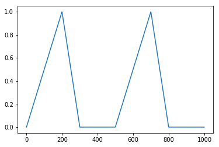

# universal function

除了通用的序列操作外,还支持`ufunc`
`ufunc`是`universal function`的简写,它是一种对数组中每个元素做相同操作的函数,概念上类似原生python的`map`,但在实际的运算中又不同.
原生map实际上是运行迭代器一个一个操作,而`universal function`则是向量化的执行函数,即一个函数不同的数据一起运行,这样就大大提高了效率.

我们可以实际测试下python自带的迭代和universal function的性能差距


```python
import numpy as np
import matplotlib.pyplot as plt
%matplotlib inline
```


```python
test = np.arange(int(1e5))
print(test)
```

    [    0     1     2 ... 99997 99998 99999]


```python
%timeit -n 3 map(lambda x:x**2,test)
```

    517 ns ± 303 ns per loop (mean ± std. dev. of 7 runs, 3 loops each)


```python
%timeit -n 3 test**2
```

    The slowest run took 29.67 times longer than the fastest. This could mean that an intermediate result is being cached.
    548 µs ± 967 µs per loop (mean ± std. dev. of 7 runs, 3 loops each)


## 广播

可见universal function的高效.universal function的另一个特性是两个ndarray对象可以对应项计算,这一特性被称作广播

当俩数组形状不同的时候,那就会进行广播处理

1. 让所有数组向其中维数最多的数组看齐,shape不足的部分通过在前面加1补齐
2. 输出数组的shape属性是输入数组shape属性在各轴上的最大值
3. 如果输入数组的某个轴长度是1或输出数组对应数组对应轴的长度相同,这个数组就够用来计算,否则出错
4. 当输入数组的某个轴长度为1时,沿着该轴运算时都用此轴上的额第一组值

看例子:

### 相同shape


```python
a = np.arange(12).reshape(3,4)
a
```


    array([[ 0,  1,  2,  3],
           [ 4,  5,  6,  7],
           [ 8,  9, 10, 11]])


```python
b = np.arange(3,15).reshape(3,4)
b
```


    array([[ 3,  4,  5,  6],
           [ 7,  8,  9, 10],
           [11, 12, 13, 14]])


```python
a+b
```


    array([[ 3,  5,  7,  9],
           [11, 13, 15, 17],
           [19, 21, 23, 25]])


### 不同shape在对应轴上广播


```python
a = np.arange(0,60,10).reshape(-1,1)
print(a)
a.shape
```

    [[ 0]
     [10]
     [20]
     [30]
     [40]
     [50]]


    (6, 1)


```python
b = np.arange(0,5)
print(b)
b.shape
```

    [0 1 2 3 4]


    (5,)


```python
c = a+b
print(c)
c.shape
```

    [[ 0  1  2  3  4]
     [10 11 12 13 14]
     [20 21 22 23 24]
     [30 31 32 33 34]
     [40 41 42 43 44]
     [50 51 52 53 54]]


    (6, 5)


## 与常量做四则运算

ndarray对象支持python支持的四则运算接口,包括幂运算,而且都是universal function


```python
X = np.arange(10).reshape(2,5)
print(X)
```

    [[0 1 2 3 4]
     [5 6 7 8 9]]


```python
X+2
```


    array([[ 2,  3,  4,  5,  6],
           [ 7,  8,  9, 10, 11]])


```python
X-2
```


    array([[-2, -1,  0,  1,  2],
           [ 3,  4,  5,  6,  7]])


```python
X*2
```


    array([[ 0,  2,  4,  6,  8],
           [10, 12, 14, 16, 18]])


```python
X/2
```


    array([[0. , 0.5, 1. , 1.5, 2. ],
           [2.5, 3. , 3.5, 4. , 4.5]])


```python
X**2
```


    array([[ 0,  1,  4,  9, 16],
           [25, 36, 49, 64, 81]])


```python
Y = np.arange(2,12).reshape(2,5)
Y
```


    array([[ 2,  3,  4,  5,  6],
           [ 7,  8,  9, 10, 11]])


```python
X+Y
```


    array([[ 2,  4,  6,  8, 10],
           [12, 14, 16, 18, 20]])


```python
X-Y
```


    array([[-2, -2, -2, -2, -2],
           [-2, -2, -2, -2, -2]])


```python
X*Y
```


    array([[ 0,  3,  8, 15, 24],
           [35, 48, 63, 80, 99]])


```python
X/Y
```


    array([[0.        , 0.33333333, 0.5       , 0.6       , 0.66666667],
           [0.71428571, 0.75      , 0.77777778, 0.8       , 0.81818182]])


```python
X**Y
```


    array([[          0,           1,          16,         243,        4096],
           [      78125,     1679616,    40353607,  1073741824, 31381059609]])


## 比较运算

python的比较操作也都是universal function,只是返回的结果是bool值


```python
X>5
```


    array([[False, False, False, False, False],
           [False,  True,  True,  True,  True]])


```python
X<5
```


    array([[ True,  True,  True,  True,  True],
           [False, False, False, False, False]])


```python
X==5
```


    array([[False, False, False, False, False],
           [ True, False, False, False, False]])


```python
X>=5
```


    array([[False, False, False, False, False],
           [ True,  True,  True,  True,  True]])


```python
X<=5
```


    array([[ True,  True,  True,  True,  True],
           [ True, False, False, False, False]])


```python
2<=X<=6
```


    ---------------------------------------------------------------------------

    ValueError                                Traceback (most recent call last)

    <ipython-input-28-be825cd5effc> in <module>
    ----> 1 2<=X<=6
    

    ValueError: The truth value of an array with more than one element is ambiguous. Use a.any() or a.all()


## 其他的函数

numpy中还定义了其他的常用universal function具体可以看官方<https://docs.scipy.org/doc/numpy/reference/ufuncs.html#available-ufuncs>

## 自定义ufunc


有的时候自带的ufunc不能满足需要,numpy允许自定义ufunc

### 使用接口`np.frompyfunc(func, nin, nout)`

例:用一个分段函数描述三角波


```python
def triangle_wave(x,c,c0,hc):
    """三角波"""
    x = x - int(x)
    if x >= c: r = 0.0
    elif x < c0: r = x / c0*hc
    else: r = (c-x) / (c-c0) * hc
    return r
```


```python
x = np.linspace(0,2,1000)
y1 = np.array([triangle_wave(t,0.6,0.4,1.0) for t in x])
triangl_ufunc1 = np.frompyfunc(triangle_wave,4,1)
```


```python
y2 = triangl_ufunc1(x,0.6,0.4,1.0)
plt.plot(range(len(y2)),y2)
plt.show()
```





### 使用接口`np.vectorize(pyfunc, otypes=None, doc=None, excluded=None, cache=False, signature=None)`直接将python函数转化为ufunc


```python
triangl_ufunc2 = np.vectorize(triangle_wave)
triangl_ufunc2.__doc__
```


    '三角波'


```python
y3 = triangl_ufunc2(x,0.6,0.4,1.0)
plt.plot(range(len(y3)),y3)
plt.show()
```


## ufunc的泛函

简单的可以理解为函数的函数就是泛函.numpy支持针对ufunc的泛函操作,具体的有如下几种:

### `at(a, indices, b=None)`

at用于指定下标执行函数,未被指定的就不会执行函数,注意其返回值为None,但它会改变第一个参数数组中对应元素的值.


```python
a = np.array([1, 2, 3, 4])
np.negative.at(a, [0, 1])
print(a)
```

    [-1 -2  3  4]


```python
a = np.array([1, 2, 3, 4])
np.add.at(a,[0,1],1)
print(a)
```

    [2 3 3 4]


### `reduce`

reduce和原生python中的reduce差不多,就是rfold,折叠操作的特化


```python
np.add.reduce([1,2,3]) # 相当于sum
```


    6


```python
np.add.reduce([[1,2,3],[6,7,8]],axis=1) #可以指定延哪条轴折叠
```


    array([ 6, 21])


### accumulate

accumulate和python3中functiontools新增的累积函数accumulate一样


```python
np.add.accumulate([1,2,3])
```


    array([1, 3, 6])


### outer

outer,会对俩数组中每两对元素组合进行运算.


```python
np.add.outer([1,2,3,4,5],[2,3,4])
```


    array([[3, 4, 5],
           [4, 5, 6],
           [5, 6, 7],
           [6, 7, 8],
           [7, 8, 9]])


### reduceat(a, indices, axis=0, dtype=None, out=None)

    指定范围执行reduce操作.相当于 ufunc.reduce(a[indices[i]:indices[i+1]]).

    特殊情况是--
    1. 如果i+1<i,那么直接去a的第i位即a[i]
    2. 最后一位时i+1 = a.shape[axis].

    在一维的情况下可以每两位组成一个范围对,然后通过切片操作隔位取值以过滤掉中间没有计算的部分


```python
x=np.arange(8)
print(x)
```

    [0 1 2 3 4 5 6 7]


```python
x.shape
```


    (8,)


```python
np.add.reduceat(x,[0,4, 1,5, 2,6, 3,7])
```


    array([ 6,  4, 10,  5, 14,  6, 18,  7])


在多维的情况下,可以用`axis`指定延哪条轴计算


```python
x = np.linspace(0, 15, 16).reshape(4,4)
print(x)
x.shape
```

    [[ 0.  1.  2.  3.]
     [ 4.  5.  6.  7.]
     [ 8.  9. 10. 11.]
     [12. 13. 14. 15.]]


    (4, 4)


```python
np.add.reduceat(x, [0, 3, 1, 2, 0])
```


    array([[12., 15., 18., 21.],
           [12., 13., 14., 15.],
           [ 4.,  5.,  6.,  7.],
           [ 8.,  9., 10., 11.],
           [24., 28., 32., 36.]])


## 指定轴执行函数

ufunc会在所有的元素上进行执行,但很多时候我们只希望指定轴执行函数.这时候就可以使用如下接口

### `np.apply_along_axis(func1d, axis, arr, *args, **kwargs)`

沿给定轴对一维切片应用函数,函数的第一个参数必须为一维数组.其他参数可以在后面放入


```python
def my_func(a,n):
    return (a[0] + a[-1]) * n
b = np.array([[1,2,3], [4,5,6], [7,8,9]])
np.apply_along_axis(my_func, 0, b,n=0.25)
```


    array([2. , 2.5, 3. ])


### `np.apply_over_axes(func, a, axes)`

在多个轴上重复应用一个函数,函数的值为`res = func(a, axis)`


```python
a = np.arange(24).reshape(2,3,4)
print(a)
print(a.shape)
```

    [[[ 0  1  2  3]
      [ 4  5  6  7]
      [ 8  9 10 11]]
    
     [[12 13 14 15]
      [16 17 18 19]
      [20 21 22 23]]]
    (2, 3, 4)


```python
np.apply_over_axes(np.sum, a, [0,2])
```


    array([[[ 60],
            [ 92],
            [124]]])


```python
np.sum(a,axis=0)
```


    array([[12, 14, 16, 18],
           [20, 22, 24, 26],
           [28, 30, 32, 34]])


### [*]使用numba声明ufunc

