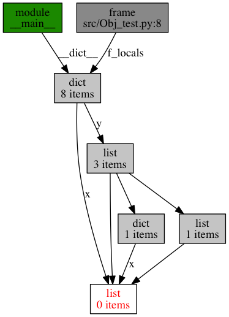

# 代码调试

代码调试主要是debug,也就是确保程序不出错误.基本可以分为如下几个方面:

+ 单步调试,一步一步的查看代码的运行状态
+ 调用追踪,查看函数报错在堆栈中的状况
+ 段错误追踪,一般用于C写扩展的模块追踪内存泄漏等错误

## 单步调试模块

pdb是python自带的调试模块,它可以在交互环境中使用,也可以在terminal中作为python的一个模式使用

> 要调试的脚本:

```python
#!/usr/bin/env python3
class Counter(object):
    """一个计数器
    用法:
    >>> counter1 = Counter()
    >>> counter1()
    1
    >>> counter1()
    2
    >>> counter2 = Counter(lambda : 2,-3)
    >>> counter2()
    -1
    >>> counter2()
    1
    """
    def __str__(self):
        return "state:"+str(self.value)
    def __repr__(self):
        return self.__str__
    def __call__(self):
        def count():
            self.value += self.func()
            return self.value
        return count()

    def __init__(self,func=lambda : 1,start=0):
        self.value = start
        self.func = func
test = Counter()
test()
test()
print(test)
if __name__=="__main__":
    counter1 = Counter()
    counter2 = Counter()
    for i in range(10):
        counter1()
    for i in range(8):
        counter2()
    if counter1.value == counter2.value:
        print("not success")
    else:
        print("don't known")


    import doctest
    doctest.testmod(verbose=True)
```

> 命令行调试

```shell
python -m pdb counter.py
```

> 在交互shell中调试

```python
import pdb
import counter
pdb.run('counter.test()')
```

常用的调试命令可以在调试模式下用help命令来查看

## 调用追踪

调试的时候我们除了想知道哪条代码错了,也会想知道是谁调用了这条错误的代码,,又或者希望知道运行时的堆栈信息.这个时候调用追踪模块就有用了

>一个简单的例子


```python
import traceback
def func():
    s =  traceback.extract_stack()
    print('%s Invoked me!'%s[-2][2])

def a():
    func()
b = lambda :func()
```


```python
a()
```

    a Invoked me!


```python
b()
```

    <lambda> Invoked me!


traceback的api是这些，我将它翻译出来，英文不好的同学也可以对照着使用:

+ `traceback.print_tb(tb, limit=None, file=None)`

    如果`limit`参数是正数,则打印limit条数的(从调用者这一帧开始的)traceback对象的堆栈跟踪条目,否则打印最后的abs(limit)条目,如果`limit`被省略或为None，则打印所有条目
    如果省略`file`或者`None`，则输出到`sys.stderr`,否则它应该是一个打开的文件或类似文件的对象来接收输出。


    打印，以限制堆栈跟踪条目从traceback对象(从调用者这帧开始)，如果限制是积极的。否则，打印最后的ABS（限制）条目。如果限制被省略或没有，所有条目打印。如果文件被省略或没有，输出到`sys.stderr`；否则应打开的文件或类似文件的对象来接收输出。


+ `traceback.print_exception(etype, value, tb, limit=None, file=None, chain=True)`

    将异常信息和堆栈跟踪条目从traceback对象tb打印到文件。这与`print_tb()`有以下不同:

    + 如果tb不是None，它会打印一个 header Traceback（通常是最近一次调用）：
    + 它在堆栈跟踪之后打印异常etype和值
    + 如果etype是SyntaxError，并且value具有相应的格式，则会打印出语法错误发生的行，并带有指示错误大致位置的插入符号。


    可选的limit参数与`print_tb()`的含义相同.如果chain为true（默认值），那么也会打印异常链（`__cause__`或`__context__`异常的属性），就像解释器本身在打印未处理的异常时一样。


+ `traceback.print_exc(limit=None, file=None, chain=True)`

    `print_exception(*sys.exc_info(), limit, file, chain)`的缩写

+ `traceback.print_last(limit=None, file=None, chain=True)`

    这是`print_exception(sys.last_type，sys.last_value，sys.last_traceback，limit，file，chain)`的缩写。一般来说，只有在异常已经达到交互式提示之后才会有效


+ `traceback.print_stack(f=None, limit=None, file=None)`

    如果limit为正值则以limit参数为条数打印堆栈跟踪条目(从调用点开始)否则，打印最后一个abs(limit)条目。如果省略limit或None，则打印所有条目。可选的f参数可用于指定要启动的备用堆栈帧。可选file参数与`print_tb()`具有相同的含义。

+ `traceback.extract_tb(tb, limit=None)`

    返回从traceback对象tb提取的“预处理”堆栈跟踪条目列表。它对于堆栈跟踪的替代格式很有用。可选的limit参数与print_tb()的含义相同。 “预处理”堆栈跟踪条目是表示通常为堆栈跟踪打印的信息的4元组(文件名，行号，函数名称，文本)。文本是带有前导和尾随空格的字符串;如果源不可用，则为None。

+ `traceback.extract_stack(f=None, limit=None)`

    从当前堆栈帧中提取原始的追溯。返回值的格式与`extract_tb()`的格式相同。可选的f和limit参数与`print_stack()`具有相同的含义。

+ `traceback.format_list(extracted_list)`

    给定一个由`extract_tb()`或`extract_stack()`返回的元组列表，返回一个准备打印的字符串列表。结果列表中的每个字符串对应于参数列表中具有相同索引的项。每个字符串以换行符结尾.对于源文本行不为None的项目，字符串也可能包含内部换行符。


+ `traceback.format_exception_only(etype, value)`

    格式化traceback的异常部分。参数是异常类型和值，例如由`sys.last_type`和`sys.last_value`给出的。返回值是一个字符串列表，每个都以换行符结尾。通常，列表包含单个字符串;但是，对于`SyntaxError`异常，它包含几行(打印时)显示有关发生语法错误的详细信息。指示发生哪个异常的消息是列表中始终最后一个字符串。


+ `traceback.format_exception(etype, value, tb, limit=None, chain=True)`

    格式化堆栈跟踪和异常信息。参数与`print_exception()`的相应参数具有相同的含义。返回值是字符串列表，每个都以换行符结尾，一些包含内部换行符。当这些行连接并打印时，打印与`print_exception()`完全相同的文本。


+ `traceback.format_exc(limit=None, chain=True)`

    类似`print_exc(limit)`，但是返回一个字符串而不是打印到一个文件


+ `traceback.format_tb(tb, limit=None)`

    `format_list(extract_tb(tb，limit))`的缩写

+ `traceback.format_stack(f=None, limit=None)`

    `format_list(extract_stack(f, limit))`的缩写

+ `traceback.clear_frames(tb)`

    通过调用每个帧对象的`clear()`方法来清除traceback对象tb中所有堆栈帧的局部变量。

+ `traceback.walk_stack(f)`

    从给定帧中的`f.f_back`后面移动一个堆栈，产生每个帧的帧和行号。如果f为None，则使用当前堆栈。它常用于和`StackSummary.extract()`一起使用。

+ `traceback.walk_tb(tb)`

    在tb_next之后走一个回溯，产生每个帧的帧和行号。此帮助程序与`StackSummary.extract()`一起使用。


+ `class traceback.StackSummary`

    StackSummary对象表示可以进行格式化的调用堆栈,它的静态方法`extract` 常与`traceback.walk_stack`或者`traceback.walk_tb`配合使用

    + `classmethod extract(frame_gen, *, limit=None, lookup_lines=True, capture_locals=False)`

        从帧生成器构造一个`StackSummary`对象(例如由walk_stack()或walk_tb()的返回).如果有`limit`参数，则只有这么多帧是从frame_gen中获取的。如果`lookup_lines`为False，则返回的FrameSummary对象将不会读取它们的行，从而使得创建StackSummary的成本更低(如果实际上可能没有格式化，则可能是有价值的).如果`capture_locals`为True，则每个FrameSummary中的局部变量被捕获为对象表示。

## 段错误追踪

所谓的段错误就是指访问的内存超出了系统所给这个程序的内存空间，通常这个值是由gd tr来保存的，他是一个48位的寄存器，其中的32位是保存由它指向的 gdt表，后13位保存 相应于gdt的下标，最后3位包括了程序是否在内存中以及程序的在cpu中的运行级别，指向 的gdt是由以64位为一个单位的表，在这张表中就保存着程序运行的代码段以及数据段的起 始地址以及与此相应的段限和页面交换还有程序运行级别还有内存粒度等等的信息。

在编程中以下几类做法容易导致段错误,基本上是错误地使用指针引起的。

1. 访问系统数据区，尤其是往系统保护的内存地址写数据最常见就是给一个指针以0地址。
2. 内存越界(数组越界，变量类型不一致等)： 访问到不属于你的内存区域。

python由于与C有着千丝万缕的联系,所以使用ctypes这类模块的时候也很容易出段错误这种问题.python3.5+提供了`faulthandler`工具来做段错误追踪.


```python
%%writefile src/C3/faulthandler_test.py

import ctypes
ctypes.string_at(0)

```

    Overwriting src/C1/faulthandler_test.py


```python
!python3 src/C3/faulthandler_test.py
```


```python
!python3 -q -X faulthandler faulthandler_test.py
```

    /usr/local/Cellar/python3/3.5.2_3/Frameworks/Python.framework/Versions/3.5/Resources/Python.app/Contents/MacOS/Python: can't open file 'faulthandler_test.py': [Errno 2] No such file or directory


另一中用法是在文件内写入faulthandler.enable()


```python
%%writefile src/C3/faulthandler_test2.py

import ctypes
import faulthandler
faulthandler.enable()
ctypes.string_at(0)
```

    Overwriting src/C1/faulthandler_test2.py


```python
!python3 src/C3/faulthandler_test2.py
```

    Fatal Python error: Segmentation fault

    Current thread 0x00007fff7c6a6000 (most recent call first):
      File "/usr/local/Cellar/python3/3.5.2_3/Frameworks/Python.framework/Versions/3.5/lib/python3.5/ctypes/__init__.py", line 491 in string_at
      File "src/C1/faulthandler_test2.py", line 5 in <module>


# 性能调优

在代码可以实现功能且健壮不出错的前提下,我们往往会有优化性能的需求

性能调优大约可以在运行时间和运行内存占用两方面来考量,下面介绍的工具定位精度由粗到细,也分为这两个方面

## 测试整体运行时间

Python中的timeit是测试代码执行效率的工具.可以用命令行直接测试脚本,也可以测试代码字符串的效率,当然最简单的还是直接用ipython的内置timeit魔法命令测某段代码的效率


```python
import timeit
t = timeit.Timer('map(lambda x: x**2,range(1000))')
t.timeit()
```


    0.8133840359951137


```python
!python -m timeit -s "map(lambda x: x**2,range(1000))"
```

    10000000 loops, best of 3: 0.065 usec per loop


## 函数级性能瓶颈定位

python的标准库中有一个可以实现性能瓶颈定位的模块叫cprofile,他是一个开销极小的C扩展.用它可以实现函数级的性能分析,配合`pstats`模块还可以输出分析报告


> 使用单独模块分析


```python
%%writefile src/C3/profile_test.py
def foo():
    sum = 0
    for i in range(10000):
        sum += i
    return sum
if __name__=="__main__":
    foo()
```

    Overwriting src/C1/profile_test.py


```python
%%writefile src/C3/profile_test.py
def foo():
    sum = 0
    for i in range(10000):
        sum += i
    return sum
if __name__=="__main__":
    try :
        import profile
    except:
        import cProfile as profile

    profile.run("foo()")
```

    Overwriting src/C1/profile_test.py


```python
!python src/C3/profile_test.py
```

             5 function calls in 0.004 seconds

       Ordered by: standard name

       ncalls  tottime  percall  cumtime  percall filename:lineno(function)
            1    0.000    0.000    0.000    0.000 :0(range)
            1    0.001    0.001    0.001    0.001 :0(setprofile)
            1    0.000    0.000    0.003    0.003 <string>:1(<module>)
            1    0.000    0.000    0.004    0.004 profile:0(foo())
            0    0.000             0.000          profile:0(profiler)
            1    0.002    0.002    0.003    0.003 profile_test.py:1(foo)


>使用命令行分析


```python
%%writefile src/C3/profile_test_foo.py
#coding:utf-8
def foo():
    sum = 0
    for i in range(10000):
        sum += i
    return sum
if __name__=="__main__":
    foo()
```

    Overwriting src/C1/profile_test_foo.py


```python
!python -m cProfile src/C3/profile_test_foo.py
```

             4 function calls in 0.002 seconds

       Ordered by: standard name

       ncalls  tottime  percall  cumtime  percall filename:lineno(function)
            1    0.000    0.000    0.002    0.002 profile_test_foo.py:2(<module>)
            1    0.002    0.002    0.002    0.002 profile_test_foo.py:2(foo)
            1    0.000    0.000    0.000    0.000 {method 'disable' of '_lsprof.Profiler' objects}
            1    0.000    0.000    0.000    0.000 {range}


> 统计项说明

统计项|说明
---|---
ncalls| 函数被调用次数
tottime|函数总计运行时间,不含调用函数运行时间
cumtime|函数总计运行时间,含调用的函数运行时间
percall|函数运行一次平均时间,等于tottime(cumtime)/ncalls
`filename:lineno`|函数所在文件名,函数的行号,函数名

> 与pstats结合提供多种形式的报表


```python
%%writefile src/C3/profile_test_pstats.py
def foo():
    sum = 0
    for i in range(10000):
        sum += i
    return sum
if __name__=="__main__":
    try :
        import profile
    except:
        import cProfile as profile

    profile.run("foo()","foo.txt")
    import pstats
    p = pstats.Stats("foo.txt")
    p.sort_stats("time").print_stats()
```

    Overwriting src/C1/profile_test_pstats.py


```python
!python src/C3/profile_test_pstats.py
```

    Fri May 12 00:12:23 2017    foo.txt

             5 function calls in 0.002 seconds

       Ordered by: internal time

       ncalls  tottime  percall  cumtime  percall filename:lineno(function)
            1    0.002    0.002    0.002    0.002 src/C1/profile_test_pstats.py:1(foo)
            1    0.000    0.000    0.000    0.000 :0(range)
            1    0.000    0.000    0.002    0.002 profile:0(foo())
            1    0.000    0.000    0.000    0.000 :0(setprofile)
            1    0.000    0.000    0.002    0.002 <string>:1(<module>)
            0    0.000             0.000          profile:0(profiler)


stats有许多函数,可以提供不同的报表

+ stats函数说明

函数|说明
---|---
strip_dirs()|除去文件名前名的路径信息
add(filename,[...])|把profile输出的文件加入stats实例中统计
dump_stats(filename)|把stats统计结果保存到文件
sort_stats(key,[...])|最重要的,可以给profile统计结果排序
reverse_order()|数据反排序
print_stats([restriction,...])|把报表输出到stdout
print_callers([restriction,...])|输出调用指定函数的相关信息
print_callees([restriction,...])|输出指定函数调用过的函数的相关信息

+ sort_stats可接受的参数

参数|说明
---|---
ncalls|被调次数
cumulative|函数运行总时间
file|文件名
module|模块名
pcalls|简单统计
line|行号
name|函数名
nfl|name,file,line
stdname|标准函数名
time|函数内部运行时间

## 语句级性能瓶颈定位

cprofiler只能追踪到哪个函数是性能瓶颈,而函数中哪条语句是性能瓶颈就追踪不到了,对于语句级性能瓶颈定位,python并没有官方工具,但github上有位大神制作了[line_profiler](https://github.com/rkern/line_profiler),这个工具可以实现这一功能,它也几乎可以说是python的半标准工具之一了.

因为不是标准库中的内容,所以需要pip安装.

使用方法十分简单,在需要分析的函数上面加上装饰器`@profile`即可(注意不用import任何东西,这条装饰器在定位好后应该删除以保证代码可以运行)


```python
%%writefile src/C3/line_profile_test.py

@profile
def foo():
    sum = 0
    for i in range(10000):
        sum += i
    return sum
if __name__=="__main__":
    foo()
```

    Overwriting src/C1/line_profile_test.py


```python
!python3 -m kernprof -l -v src/C3/line_profile_test.py
```

    Wrote profile results to line_profile_test.py.lprof
    Timer unit: 1e-06 s

    Total time: 0.01045 s
    File: src/C1/line_profile_test.py
    Function: foo at line 2

    Line #      Hits         Time  Per Hit   % Time  Line Contents
    ==============================================================
         2                                           @profile
         3                                           def foo():
         4         1            3      3.0      0.0      sum = 0
         5     10001         4928      0.5     47.2      for i in range(10000):
         6     10000         5518      0.6     52.8          sum += i
         7         1            1      1.0      0.0      return sum


## 内存分析

[memory_profiler](https://pypi.python.org/pypi/memory_profiler/)是用来分析内存使用情况和追踪内存泄露的工具.它用法比较接近`line_profiler`

由于不是标准库中的模块,它需要pip安装.


需要注意的是windows下需要在script文件夹下将`mprof`文件改名为`mprof.py`并在同一目录下创建一个`mprof.bat`文件编辑为如下内容

```shell
@echo off
python "%~dpn0.py" %*
```

它的使用及其简单:


```python
%%writefile src/C3/memory_test.py
from memory_profiler import profile
@profile
def foo():
    sum = 0
    for i in range(10000):
        sum += i
    return sum
if __name__=="__main__":
    try :
        import profile as cProfile
    except:
        import cProfile

    cProfile.run("foo()","foo.txt")
    import pstats
    p = pstats.Stats("foo.txt")
    p.sort_stats("time").print_stats()
```

    Overwriting src/C1/memory_test.py


之后使用
```shell
python src/C3/memory_test.py
```
就可以看到详细结果了

指定精度可以在profile装饰器后面加上参数 如: @profile(precision=4)


mprof工具类似`kernprof`,用它可以输出更加友好的统计分析页面


```python
%%writefile src/C3/memory_test_round.py
from memory_profiler import profile
@profile
def foo():
    sum = 0
    for i in range(10000):
        sum += i
    return sum
if __name__=="__main__":
    foo()
```

    Overwriting src/C1/memory_test_round.py


```python
!mprof run src/C3/memory_test_round.py
```

    /bin/sh: mprof: command not found


```python
!mprof plot
```

    /bin/sh: mprof: command not found


## 对象分析及追踪(windows下不能用)

[Objgraph](http://mg.pov.lt/objgraph/)可以实现对象分析和追踪,它也是用pip安装,不过它依赖xdot(pip 安装)
和[graphviz](http://www.graphviz.org/)(brew安装)

它可以实现的功能有:

+ 统计
+ 定义过滤对象
+ 遍历和显示对象图


```python
%%writefile src/C3/Obj_test.py
#encoding=utf-8  
import objgraph  

if __name__ == '__main__':  
    x = []  
    y = [x, [x], dict(x=x)]  
    objgraph.show_refs([y], filename='sample-graph.png') #把[y]里面所有对象的引用画出来  
    objgraph.show_backrefs([x], filename='sample-backref-graph.png') #把对x对象的引用全部画出来  
    #objgraph.show_most_common_types() #所有常用类型对象的统计，数据量太大，意义不大  
    objgraph.show_growth(limit=4) #打印从程序开始或者上次show_growth到现在增加的对象（按照增加量的大小排序）  
```

    Overwriting src/C1/Obj_test.py


```python
!python src/C3/Obj_test.py
```

    Traceback (most recent call last):
      File "src/C1/Obj_test.py", line 2, in <module>
        import objgraph  
    ImportError: No module named objgraph


于是你可以看到图了




# 异常处理

代码难免会出错,尤其是python这样的动态语言.对于可以预知的异常可能,python可以通过自带的异常处理语句解决.

python有完善的异常处理解决方案

## 异常

异常即是一个事件，该事件会在程序执行过程中发生，影响了程序的正常执行。 一般情况下，在Python无法正常处理程序时就会发生一个异常。 异常是Python对象，表示一个错误。 当Python脚本发生异常时我们需要捕获处理它，否则程序会终止执行。
python的标准异常可以在[官网文档](https://docs.python.org/3/library/exceptions.html?highlight=exception)中查看,常用的如下:

异常名称|描述
---|---
SystemExit|	解释器请求退出
KeyboardInterrupt|	用户中断执行(通常是输入^C)
Exception|	常规错误的基类
StopIteration|	迭代器没有更多的值
GeneratorExit|	生成器(generator)发生异常来通知退出
StandardError|	所有的内建标准异常的基类
ArithmeticError|	所有数值计算错误的基类
FloatingPointError	|浮点计算错误
OverflowError	|数值运算超出最大限制
ZeroDivisionError	|除(或取模)零 (所有数据类型)
AssertionError	|断言语句失败
AttributeError	|对象没有这个属性
EOFError	|没有内建输入,到达EOF 标记
EnvironmentError	|操作系统错误的基类
IOError	|输入/输出操作失败
OSError|	操作系统错误
WindowsError	|系统调用失败
ImportError|	导入模块/对象失败
LookupError|	无效数据查询的基类
IndexError	|序列中没有此索引(index)
KeyError	|映射中没有这个键
MemoryError	|内存溢出错误(对于Python 解释器不是致命的)
NameError	|未声明/初始化对象 (没有属性)
UnboundLocalError|	访问未初始化的本地变量
ReferenceError	|弱引用(Weak reference)试图访问已经垃圾回收了的对象
RuntimeError	|一般的运行时错误
NotImplementedError	|尚未实现的方法
SyntaxError	|Python 语法错误
IndentationError	|缩进错误
TabError|	Tab 和空格混用
SystemError	|一般的解释器系统错误
TypeError|	对类型无效的操作
ValueError|	传入无效的参数
UnicodeError	|Unicode 相关的错误
UnicodeDecodeError	|Unicode 解码时的错误
UnicodeEncodeError|Unicode 编码时错误
UnicodeTranslateError	|Unicode 转换时错误
Warning	|警告的基类
DeprecationWarning	|关于被弃用的特征的警告
FutureWarning	|关于构造将来语义会有改变的警告
OverflowWarning	|旧的关于自动提升为长整型(long)的警告
PendingDeprecationWarning	|关于特性将会被废弃的警告
RuntimeWarning|	可疑的运行时行为(runtime behavior)的警告
SyntaxWarning|可疑的语法的警告
UserWarning	|用户代码生成的警告

## 异常捕获处理

`try/except`语句用来检测`try`语句块中的错误，从而让`except`语句捕获异常信息并处理。 如果你不想在异常发生时结束你的程序，只需在`try`里捕获它

```python
try:
    <语句>        #运行别的代码
except <名字>：
    <语句>        #如果在try部份引发了'name'异常
except <名字>，<数据>:
    <语句>        #如果引发了'name'异常，获得附加的数据
else:
    <语句>        #如果没有异常发生
finally:
    <语句>    #退出try时总会执行
```

try的工作原理是，当开始一个try语句后，python就在当前程序的上下文中作标记，这样当异常出现时就可以回到这里，try子句先执行，接下来会发生什么依赖于执行时是否出现异常。

如果当try后的语句执行时发生异常，python就跳回到try并执行第一个匹配该异常的except子句，异常处理完毕，控制流就通过整个try语句（除非在处理异常时又引发新的异常）。

如果在try后的语句里发生了异常，却没有匹配的except子句，异常将被递交到上层的try，或者到程序的最上层（这样将结束程序，并打印缺省的出错信息）。

如果在try子句执行时没有发生异常，python将执行else语句后的语句（如果有else的话），然后控制流通过整个try语句。

无论是否有异常,finally都将被执行,它一般作为存放收尾动作的地方,但是注意,finally有陷阱: 如果主干上的错误分支中没有对应的捕捉,那么他将被保存在一个临时的位置,而如果同时finally中有错误,则这个临时的错误会被finally中的错误给替代.


使用异常捕获处理语句应该尽量精准地包裹可能有错误的代码.

Python遵守`尽早失败`原则,认为程序应该尽早报告错误。例如,Python中没有“未定义”的值:在初始化之前引用变量会报错;如果`k`不存在,`my_dict[k]` 会抛出异常(JavaScript 则不然)。还有一例:在 Python 中通过元组 拆包做并行赋值,必须显式处理元组的每一个元素才行;而在 Ruby 中,如果 = 两边的元 素数量不一致,右边未用到的元素会被忽略,或者把 nil 赋给左边多余的变量。

因为`尽早失败`原则,python代码中try语句会比较多,但即便如此,我们的单个`try`结构应该尽量精准的包裹可能出错的代码.


## 抛出异常

我们可以使用raise语句自己触发异常 raise语法格式如下

```python
raise [Exception [, args [, traceback]]]
```

## 自定义异常

如果自己写模块,最好自定义模块的异常,一方面可以更好的分析代码,另一方面也让用模块的用户更容易追踪错误.


```python
class Networkerror(RuntimeError):
    def __init__(self, arg):
        self.args = arg
```


```python
try:
    raise Networkerror("Bad hostname")
except Networkerror as e:
    print(e.args)
```

    ('B', 'a', 'd', ' ', 'h', 'o', 's', 't', 'n', 'a', 'm', 'e')


# 项目测试

项目写完后应该写测试以确保代码稳定可靠.经过测试稳定可靠的代码才能经得住时间的考验.但即便有测试,如果代码覆盖不够,测试用例不能覆盖全部情况,这样也并不能保准项目就一定稳健.因此条件允许的话也最好将类型注释写好,利用mypy做好静态类型检验.


## 单元测试

将代码分解为独立不耦合的小部件,针对这些小部件的测试就是单元测试.测试单元应该集中于小部分的功能，并且证明在各种情况下它的行为正确(包括错误行为).

常常将测试代码和运行代码一起写是一种非常好的习惯。聪明地使用这种方法将会帮助你更加精确地定义代码的含义，并且代码的耦合性更低。

一般来说,更加推崇的方法是先写测试用例确定代码行为,再写代码,也就是所谓的测试驱动编程.

**测试的通用规则**：

+ 测试单元应该集中于小部分的功能，并且证明它是对的。
+ 每个测试单元应该完全独立。每个都能够单独运行，除了调用的命令，都需在测试套件中。要想实现这个规则，测试单元应该加载最新的数据集，之后再做一些清理。
+ 尽量使测试单元快速运行。如果一个单独的测试单元需要较长的时间去运行，开发进度将会延迟，测试单元将不能如期常态性运行。有时候，因为测试单元需要复杂的数据结构，并且当它运行时每次都要加载，所以其运行时间较长。把运行吃力的测试单元放在单独的测试组件中，并且按照需要运行其它测试单元。
+ 学习使用工具，学习如何运行一个单独的测试用例。然后，当在一个模块中开发了一个功能时，经常运行这个功能的测试用例，理想情况下，一切都将自动。
+ 在编码会话前后，要常常运行完整的测试组件。只有这样，你才会坚信剩余的代码不会中断。
+ 实现钩子（hook）是一个非常好的主意。因为一旦把代码放入分享仓库中，这个钩子可以运行所有的测试单元。
+ 如果你在开发期间不得不打断自己的工作，写一个被打断的单元测试，它关于下一步要开发的东西。当回到工作时，你将更快地回到原先被打断的地方，并且步入正轨。
+ 当你调试代码的时候，首先需要写一个精确定位bug的测试单元。尽管这样做很难，但是捕捉bug的单元测试在项目中很重要。
+ 测试函数使用长且描述性的名字。这边的样式指导与运行代码有点不一样，运行代码更倾向于使用短的名字，而测试函数不会直接被调用。在运行代码中，`square()`或者甚至`sqr()`这样的命名都是可以的，但是在测试代码中，你应该这样取名`test_square_of_number_2()`，`test_square_negative_number()`。当测试单元失败时，函数名应该显示，而且尽可能具有描述性。
+ 当发生了一些问题，或者不得不改变时，如果代码中有一套不错的测试单元，维护将很大一部分依靠测试组件解决问题，或者修改确定的行为。因此测试代码应该尽可能多读，甚至多于运行代码。目的不明确的测试单元在这种情况下没有多少用处。
+ 测试代码的另外一个用处是作为新开发人员的入门。当工作基于代码，运行并且阅读相关的测试代码是一个非常好的做法。开发人员将会或者应该发现热点，而这将引起困难和其它情况，如果他们一定要加一些功能，第一步应该是要增加一个测试单元，通过这种方法，确保新功能不再是一个没有被嵌入到接口中的工作路径。


### unittest

python标准库中自带了unittest框架以用来做单元测试.unittest已经可以满足一般的测试需求了.它包含了所有测试框架需要的部件.相比较使用第三方测试框架,unittest相对来说更加稳定可靠,而且作为标准库,也避免了额外的依赖安装.


使用 unittest 的标准流程为：

+ 从 unittest.TestCase 派生一个子类
+ 在类中定义各种以 `"test_"` 打头的方法
+ 通过 unittest.main() 函数来启动测试

unittest可以指定测试**模块**使用

`unittest test.py`或者`unittest test`或者`unittest test.test`

它可以带上以下参数

+ -v 测试的详细信息
+ -f 出错就停
+ -c 可以用ctrol+c停止,并出结果
+ -b 运行时结果存到stderr和stdout里

unittest 支持自动搜索,这需要在后面加上子选项`discover`,
`discover`可以有这些参数:


+ -s 指定文件夹
+ -t 指定模块
+ -p 模式匹配要测试的文件

unittest 的一个很有用的特性是 TestCase 的 setUp() 和 tearDown() 方法，这种方法统称"钩子"它们提供了为测试进行准备和扫尾工作的功能，听起来就像上下文管理器一样。这种功能很适合用在测试对象需要复杂执行环境的情况下。

## 基本用法

我们将测试如下这个模块


```python
%%writefile src/C3/func_oper_unitest.py
#!/usr/bin/env python

"""\
这里可以写用到多个函数的

"""
from functools import reduce
from operator import mul,add

def multiply(*args):
    """\
    这里可以写单元测试
    >>> multiply(2,3)
    6
    >>> multiply('baka~',3)
    'baka~baka~baka~'
    """
    return reduce(mul,args)

def summing(*args):
    """\
    这里可以写单元测试
    >>> summing(2,3)
    5
    >>> summing(2,3,4)
    9
    """
    return reduce(add,args)

```

    Overwriting src/C3/func_oper_unitest.py


### 测试用例

测试用例是指一系列相关测试的实例.如何界定这个相关程度根据实际情况而定,比如粗略的测试可以以模块为单位,一个模块的测试都放在一个测试用例中,细致的则可以是针对一个函数或者一个接口的测试都放在一个测试用例中.

`unittest.TestCase`是测试用例的超类,编写测试用例只要继承它即可.


```python
%%writefile src/C3/test_my.py

import unittest

from func_oper_unitest import multiply,summing

class Test_mul(unittest.TestCase):
    def setUp(self):
        pass
    def test_number_3_4(self):
        self.assertEqual(multiply(3,4),12)
    def test_string_a_3(self):
        self.assertEqual(multiply('a',3),'aaa')

class Test_sum(unittest.TestCase):
    def setUp(self):
        pass
    def test_number_3_4(self):
        self.assertEqual(summing(3,4),7)
    def test_number_3_4_5(self):
        self.assertEqual(summing(3,4,5),12)
class TestCase1(unittest.TestCase):
    def setUp(self):
        pass
    def test_sum_mul_2_3_mul_2_3(self):
        self.assertEqual(summing(multiply(2,3),multiply(2,3)),12)

if __name__ == '__main__':
    unittest.main()

```

    Overwriting src/C3/test_my.py


```python
!python3 -m unittest discover -v -s ./src/C3
```

    test_almost_eq (test_assert_base.demoTest) ... ok
    test_eq (test_assert_base.demoTest) ... ok
    test_exc (test_assert_base.demoTest) ... ok
    test_not_almost_eq (test_assert_base.demoTest) ... FAIL
    test_not_eq (test_assert_base.demoTest) ... FAIL
    test_not_seq (test_assert_base.demoTest) ... FAIL
    test_seq (test_assert_base.demoTest) ... ok
    test_with_exc (test_assert_base.demoTest) ... ok
    test_eq (test_assert_skip.demoTest) ... skipped '跳过'
    test_not_eq (test_assert_skip.demoTest) ... expected failure
    test_not_seq (test_assert_skip.demoTest) ... expected failure
    test_seq (test_assert_skip.demoTest) ... ok
    test_seq_2 (test_assert_skip.demoTest) ... skipped 'unless 1 ==0'
    setUpModule
    setUpClass
    test_number_3_4 (test_hook.Test_mul) ... instance setUp
    t1
    instance tearDown
    ok
    test_string_a_3 (test_hook.Test_mul) ... instance setUp
    t2
    instance tearDown
    ok
    tearDownClass
    tearUpModule
    test_sum_mul_2_3_mul_2_3 (test_my.TestCase1) ... ok
    test_number_3_4 (test_my.Test_mul) ... ok
    test_string_a_3 (test_my.Test_mul) ... ok
    test_number_3_4 (test_my.Test_sum) ... ok
    test_number_3_4_5 (test_my.Test_sum) ... ok
    test_subtest (test_subtest.demoTest) ... test_eq (test_suite.ArithTest) ... ok
    test_not_eq (test_suite.ArithTest) ... FAIL
    test_not_seq (test_suite.ArithTest) ... FAIL
    test_seq (test_suite.ArithTest) ... ok

    ======================================================================
    FAIL: test_not_almost_eq (test_assert_base.demoTest)
    ----------------------------------------------------------------------
    Traceback (most recent call last):
      File "/Users/huangsizhe/WORKSPACE/Blog/Docs/Python/TutorialForPython3.5plus/ipynbs/src/C3/test_assert_base.py", line 23, in test_not_almost_eq
        self.assertAlmostEqual(1.003, 1.004, places = 4)
    AssertionError: 1.003 != 1.004 within 4 places

    ======================================================================
    FAIL: test_not_eq (test_assert_base.demoTest)
    ----------------------------------------------------------------------
    Traceback (most recent call last):
      File "/Users/huangsizhe/WORKSPACE/Blog/Docs/Python/TutorialForPython3.5plus/ipynbs/src/C3/test_assert_base.py", line 7, in test_not_eq
        self.assertNotEqual(5 * 2,10)
    AssertionError: 10 == 10

    ======================================================================
    FAIL: test_not_seq (test_assert_base.demoTest)
    ----------------------------------------------------------------------
    Traceback (most recent call last):
      File "/Users/huangsizhe/WORKSPACE/Blog/Docs/Python/TutorialForPython3.5plus/ipynbs/src/C3/test_assert_base.py", line 17, in test_not_seq
        self.assertSequenceEqual(a, b)
    AssertionError: Sequences differ: ['1', '2', '3'] != ('1', '2', '3', '4')

    Second sequence contains 1 additional elements.
    First extra element 3:
    '4'

    - ['1', '2', '3']
    + ('1', '2', '3', '4')

    ======================================================================
    FAIL: test_subtest (test_subtest.demoTest) (i=1)
    ----------------------------------------------------------------------
    Traceback (most recent call last):
      File "/Users/huangsizhe/WORKSPACE/Blog/Docs/Python/TutorialForPython3.5plus/ipynbs/src/C3/test_subtest.py", line 7, in test_subtest
        self.assertEqual(i % 2, 0)
    AssertionError: 1 != 0

    ======================================================================
    FAIL: test_subtest (test_subtest.demoTest) (i=3)
    ----------------------------------------------------------------------
    Traceback (most recent call last):
      File "/Users/huangsizhe/WORKSPACE/Blog/Docs/Python/TutorialForPython3.5plus/ipynbs/src/C3/test_subtest.py", line 7, in test_subtest
        self.assertEqual(i % 2, 0)
    AssertionError: 1 != 0

    ======================================================================
    FAIL: test_subtest (test_subtest.demoTest) (i=5)
    ----------------------------------------------------------------------
    Traceback (most recent call last):
      File "/Users/huangsizhe/WORKSPACE/Blog/Docs/Python/TutorialForPython3.5plus/ipynbs/src/C3/test_subtest.py", line 7, in test_subtest
        self.assertEqual(i % 2, 0)
    AssertionError: 1 != 0

    ======================================================================
    FAIL: test_not_eq (test_suite.ArithTest)
    ----------------------------------------------------------------------
    Traceback (most recent call last):
      File "/Users/huangsizhe/WORKSPACE/Blog/Docs/Python/TutorialForPython3.5plus/ipynbs/src/C3/test_suite.py", line 7, in test_not_eq
        self.assertNotEqual(5 * 2,10)
    AssertionError: 10 == 10

    ======================================================================
    FAIL: test_not_seq (test_suite.ArithTest)
    ----------------------------------------------------------------------
    Traceback (most recent call last):
      File "/Users/huangsizhe/WORKSPACE/Blog/Docs/Python/TutorialForPython3.5plus/ipynbs/src/C3/test_suite.py", line 17, in test_not_seq
        self.assertSequenceEqual(a, b)
    AssertionError: Sequences differ: ['1', '2', '3'] != ('1', '2', '3', '4')

    Second sequence contains 1 additional elements.
    First extra element 3:
    '4'

    - ['1', '2', '3']
    + ('1', '2', '3', '4')

    ----------------------------------------------------------------------
    Ran 25 tests in 0.009s

    FAILED (failures=8, skipped=2, expected failures=2)


### 钩子

如果要对一个模块中的每一个测试函数都做同样的初始化操作和结尾清除等操作，那么创建n个测试用例就得写n遍一样的代码，为了减少重复的代码，


测试用例的实例可以使用下面两个函数定义其中每个测试样例的初始化和清除工作：

+ setUp(self): 每次执行测试用例之前调用。无参数，无返回值。该方法抛出的异常都视为error，而不是测试不通过。没有默认的实现。

+ tearDown(self): 每次执行测试用例之后调用。无参数，无返回值。测试方法抛出异常，该方法也正常调用，该方法抛出的异常都视为error，而不是测试不通过。只用setUp()调用成功，该方法才会被调用。没有默认的实现。通过setup 和 tesrDown组装一个module成为一个固定的测试装置。注意：如果setup运行抛出错误，则测试用例代码则不会执行。但是，如果setpu执行成功，不管测试用例是否执行成功都会执行teardown。

测试用例也有一个类级别的钩子,它可以在测试用例类实例化之前和类全部测试实例运行完后进行操作

```python
@classmethod
def setUpClass(cls):
    cls._connection = createExpensiveConnectionObject()

@classmethod
def tearDownClass(cls):
    cls._connection.destroy()
```

测试钩子也可以定义模块级别的钩子,它会在模块被引用和模块运行结束后进行工作

```
def setUpModule():
   createConnection()
def tearDownModule():
   closeConnection()
```


```python
%%writefile src/C3/test_hook.py

import unittest

from func_oper_unitest import multiply,summing

def setUpModule():
    print("setUpModule")
def tearDownModule():
    print("tearUpModule")

class Test_mul(unittest.TestCase):
    @classmethod
    def setUpClass(cls):
        print("setUpClass")

    @classmethod
    def tearDownClass(cls):
        print("tearDownClass")
    def setUp(self):
        print("instance setUp")
    def tearDown(self):
        print("instance tearDown")
    def test_number_3_4(self):
        print("t1")
        self.assertEqual(multiply(3,4),12)
    def test_string_a_3(self):
        print("t2")
        self.assertEqual(multiply('a',3),'aaa')


if __name__ == '__main__':
    unittest.main()
```

    Overwriting src/C3/test_hook.py


```python
!python3 -m unittest discover -v -s ./src/C3
```

    test_almost_eq (test_assert_base.demoTest) ... ok
    test_eq (test_assert_base.demoTest) ... ok
    test_exc (test_assert_base.demoTest) ... ok
    test_not_almost_eq (test_assert_base.demoTest) ... FAIL
    test_not_eq (test_assert_base.demoTest) ... FAIL
    test_not_seq (test_assert_base.demoTest) ... FAIL
    test_seq (test_assert_base.demoTest) ... ok
    test_with_exc (test_assert_base.demoTest) ... ok
    test_eq (test_assert_skip.demoTest) ... skipped '跳过'
    test_not_eq (test_assert_skip.demoTest) ... expected failure
    test_not_seq (test_assert_skip.demoTest) ... expected failure
    test_seq (test_assert_skip.demoTest) ... ok
    test_seq_2 (test_assert_skip.demoTest) ... skipped 'unless 1 ==0'
    setUpModule
    setUpClass
    test_number_3_4 (test_hook.Test_mul) ... instance setUp
    t1
    instance tearDown
    ok
    test_string_a_3 (test_hook.Test_mul) ... instance setUp
    t2
    instance tearDown
    ok
    tearDownClass
    tearUpModule
    test_sum_mul_2_3_mul_2_3 (test_my.TestCase1) ... ok
    test_number_3_4 (test_my.Test_mul) ... ok
    test_string_a_3 (test_my.Test_mul) ... ok
    test_number_3_4 (test_my.Test_sum) ... ok
    test_number_3_4_5 (test_my.Test_sum) ... ok
    test_subtest (test_subtest.demoTest) ... test_eq (test_suite.ArithTest) ... ok
    test_not_eq (test_suite.ArithTest) ... FAIL
    test_not_seq (test_suite.ArithTest) ... FAIL
    test_seq (test_suite.ArithTest) ... ok

    ======================================================================
    FAIL: test_not_almost_eq (test_assert_base.demoTest)
    ----------------------------------------------------------------------
    Traceback (most recent call last):
      File "/Users/huangsizhe/WORKSPACE/Blog/Docs/Python/TutorialForPython3.5plus/ipynbs/src/C3/test_assert_base.py", line 23, in test_not_almost_eq
        self.assertAlmostEqual(1.003, 1.004, places = 4)
    AssertionError: 1.003 != 1.004 within 4 places

    ======================================================================
    FAIL: test_not_eq (test_assert_base.demoTest)
    ----------------------------------------------------------------------
    Traceback (most recent call last):
      File "/Users/huangsizhe/WORKSPACE/Blog/Docs/Python/TutorialForPython3.5plus/ipynbs/src/C3/test_assert_base.py", line 7, in test_not_eq
        self.assertNotEqual(5 * 2,10)
    AssertionError: 10 == 10

    ======================================================================
    FAIL: test_not_seq (test_assert_base.demoTest)
    ----------------------------------------------------------------------
    Traceback (most recent call last):
      File "/Users/huangsizhe/WORKSPACE/Blog/Docs/Python/TutorialForPython3.5plus/ipynbs/src/C3/test_assert_base.py", line 17, in test_not_seq
        self.assertSequenceEqual(a, b)
    AssertionError: Sequences differ: ['1', '2', '3'] != ('1', '2', '3', '4')

    Second sequence contains 1 additional elements.
    First extra element 3:
    '4'

    - ['1', '2', '3']
    + ('1', '2', '3', '4')

    ======================================================================
    FAIL: test_subtest (test_subtest.demoTest) (i=1)
    ----------------------------------------------------------------------
    Traceback (most recent call last):
      File "/Users/huangsizhe/WORKSPACE/Blog/Docs/Python/TutorialForPython3.5plus/ipynbs/src/C3/test_subtest.py", line 7, in test_subtest
        self.assertEqual(i % 2, 0)
    AssertionError: 1 != 0

    ======================================================================
    FAIL: test_subtest (test_subtest.demoTest) (i=3)
    ----------------------------------------------------------------------
    Traceback (most recent call last):
      File "/Users/huangsizhe/WORKSPACE/Blog/Docs/Python/TutorialForPython3.5plus/ipynbs/src/C3/test_subtest.py", line 7, in test_subtest
        self.assertEqual(i % 2, 0)
    AssertionError: 1 != 0

    ======================================================================
    FAIL: test_subtest (test_subtest.demoTest) (i=5)
    ----------------------------------------------------------------------
    Traceback (most recent call last):
      File "/Users/huangsizhe/WORKSPACE/Blog/Docs/Python/TutorialForPython3.5plus/ipynbs/src/C3/test_subtest.py", line 7, in test_subtest
        self.assertEqual(i % 2, 0)
    AssertionError: 1 != 0

    ======================================================================
    FAIL: test_not_eq (test_suite.ArithTest)
    ----------------------------------------------------------------------
    Traceback (most recent call last):
      File "/Users/huangsizhe/WORKSPACE/Blog/Docs/Python/TutorialForPython3.5plus/ipynbs/src/C3/test_suite.py", line 7, in test_not_eq
        self.assertNotEqual(5 * 2,10)
    AssertionError: 10 == 10

    ======================================================================
    FAIL: test_not_seq (test_suite.ArithTest)
    ----------------------------------------------------------------------
    Traceback (most recent call last):
      File "/Users/huangsizhe/WORKSPACE/Blog/Docs/Python/TutorialForPython3.5plus/ipynbs/src/C3/test_suite.py", line 17, in test_not_seq
        self.assertSequenceEqual(a, b)
    AssertionError: Sequences differ: ['1', '2', '3'] != ('1', '2', '3', '4')

    Second sequence contains 1 additional elements.
    First extra element 3:
    '4'

    - ['1', '2', '3']
    + ('1', '2', '3', '4')

    ----------------------------------------------------------------------
    Ran 25 tests in 0.006s

    FAILED (failures=8, skipped=2, expected failures=2)


上面的结果可以很清洗的看到测试钩子的上下文范围.

### 断言

断言是用来声明结果状态的工具,如果结果符合预期,那么断言就该通过,否则断言就该报断言错误


python自带断言关键字`assert`


```python
assert 1==1
```


```python
assert 1==0
```


    ---------------------------------------------------------------------------

    AssertionError                            Traceback (most recent call last)

    <ipython-input-7-ab8cbedd7149> in <module>()
    ----> 1 assert 1==0


    AssertionError:


自带的断言关键字功能单一,往往不能完全满足测试需要,比如要测报错的错误类型就很麻烦了,因此除assert关键字外,彪悍尊哭unittest模块还有其他几个断言工具实现更加复杂的断言.

#### 基本断言方法

基本的断言方法提供了测试结果是True还是False。所有的断言方法都有一个msg参数，如果指定msg参数的值，则将该信息作为失败的错误信息返回。

断言方法|	断言描述
---|---
assertEqual(arg1, arg2, msg=None)	|验证arg1=arg2，不等则fail
assertNotEqual(arg1, arg2, msg=None)	|验证arg1 != arg2, 相等则fail
assertTrue(expr, msg=None)	|验证expr是true，如果为false，则fail
assertFalse(expr,msg=None)	|验证expr是false，如果为true，则fail
assertIs(arg1, arg2, msg=None)	|验证arg1、arg2是同一个对象，不是则fail
assertIsNot(arg1, arg2, msg=None)	|验证arg1、arg2不是同一个对象，是则fail
assertIsNone(expr, msg=None)	|验证expr是None，不是则fail
assertIsNotNone(expr, msg=None)	|验证expr不是None，是则fail
assertIn(arg1, arg2, msg=None)	|验证arg1是arg2的子串，不是则fail
assertNotIn(arg1, arg2, msg=None)	|验证arg1不是arg2的子串，是则fail
assertIsInstance(obj, cls, msg=None)	|验证obj是cls的实例，不是则fail
assertNotIsInstance(obj, cls, msg=None)	|验证obj不是cls的实例，是则fail

#### 容器断言

判断两个容器中内容是否一样

断言方法|针对容器|断言描述
---|---|---
assertMultiLineEqual(a, b)	|strings|比较两个字符串是否一样
assertSequenceEqual(a, b)|	sequences|比较两个序列是否一样
assertListEqual(a, b)	|lists|	比较两个list是否一样
assertTupleEqual(a, b)	|tuples|比较两个元组是否一样
assertSetEqual(a, b)	|sets 或者 frozensets|比较两个集合是否一样
assertDictEqual(a, b)	|dicts|比较两个字典是否一样

#### 模糊比较断言

unittest框架提供的第二种断言类型就是比较断言。

下面我们看下各种比较断言：


断言方法|断言描述|参数说明
---|---|---
assertAlmostEqual (first, second, places = 7, msg = None, delta = None)|验证first约等于second.|palces: 指定精确到小数点后多少位，默认为7
assertNotAlmostEqual (first, second, places, msg, delta)|验证first不约等于second。|palces: 指定精确到小数点后多少位，默认为7,注： 在上述的两个函数中，如果delta指定了值，则first和second之间的差值必须≤delta==
assertGreater (first, second, msg = None)|验证first > second，否则fail|---
assertGreaterEqual (first, second, msg = None)|验证first ≥ second，否则fail|---
assertLess (first, second, msg = None)|验证first < second，否则fail|---
assertLessEqual (first, second, msg = None)|验证first ≤ second，否则fail|---
assertRegexpMatches (text, regexp, msg = None)|验证正则表达式regexp搜索==匹配==的文本text|regexp：通常使用re.search()
assertNotRegexpMatches (text, regexp, msg = None)|验证正则表达式regexp搜索==不匹配==的文本text|regexp：通常使用re.search()

#### 异常断言


断言方法|	断言描述
---|---
`assertRaises(exc, fun, *args, **kwds)`	|验证异常测试，第一个参数是预期的异常,第二个则是待测的函数名,后面的则是待测函数的参数.当调用待测试函数时,在传入相应的测试数据后，如果测试通过，则表明待测试函数抛出了预期的异常，否则测试失败.
`assertRaisesRegex(exc, r, fun, *args, **kwds)`	|验证异常测试，第一个参数是预期的异常,第二个参数则是一个用来匹配错误信息的正则表达式,第三个则是待测的函数名,后面的则是待测函数的参数.当调用待测试函数时,在传入相应的测试数据后，如果测试通过，则表明待测试函数抛出了预期的异常,且错误信息也匹配，否则测试失败.
`assertWarns(warn, fun, *args, **kwds)`|验证警告测试，第一个参数是预期的警告,第二个参数是待测的函数名,后面的则是待测函数的参数.当调用待测试函数时,在传入相应的测试数据后，如果测试通过，则表明待测试函数抛出了预期的警告否则测试失败.
`assertWarnsRegex(warn, r, fun, *args, **kwds)`|验证警告测试，第一个参数是预期的警告,第二个参数则是一个用来匹配警告信息的正则表达式,第三个则是待测的函数名,后面的则是待测函数的参数.当调用待测试函数时,在传入相应的测试数据后，如果测试通过，则表明待测试函数抛出了预期的警告，且警告信息也匹配否则测试失败.
`assertLogs(logger, level)`|断言log信息


异常断言与其他不太一样,往往结合上下文使用


```python
%%writefile src/C3/test_assert_base.py
import unittest
class demoTest(unittest.TestCase):
    def test_eq(self):
        self.assertEqual(4 + 5,9)

    def test_not_eq(self):
        self.assertNotEqual(5 * 2,10)

    def test_seq(self):
        a=["1","2","3"]
        b = ("1","2","3")
        self.assertSequenceEqual(a, b)

    def test_not_seq(self):
        a = ["1","2","3"]
        b = ("1","2","3","4")
        self.assertSequenceEqual(a, b)

    def test_almost_eq(self):
        self.assertAlmostEqual(1.003, 1.004, places = 2)

    def test_not_almost_eq(self):
        self.assertAlmostEqual(1.003, 1.004, places = 4)

    def test_exc(self):
        def fun():
            assert 0
        self.assertRaises(AssertionError, fun)

    def test_with_exc(self):
        def fun():
            assert 0
        with self.assertRaises(AssertionError) as a:
            fun()


```

    Overwriting src/C3/test_assert_base.py


```python
!python3 -m unittest discover -v -s ./src/C3
```

    test_almost_eq (test_assert_base.demoTest) ... ok
    test_eq (test_assert_base.demoTest) ... ok
    test_exc (test_assert_base.demoTest) ... ok
    test_not_almost_eq (test_assert_base.demoTest) ... FAIL
    test_not_eq (test_assert_base.demoTest) ... FAIL
    test_not_seq (test_assert_base.demoTest) ... FAIL
    test_seq (test_assert_base.demoTest) ... ok
    test_with_exc (test_assert_base.demoTest) ... ok
    test_eq (test_assert_skip.demoTest) ... skipped '跳过'
    test_not_eq (test_assert_skip.demoTest) ... expected failure
    test_not_seq (test_assert_skip.demoTest) ... expected failure
    test_seq (test_assert_skip.demoTest) ... ok
    test_seq_2 (test_assert_skip.demoTest) ... skipped 'unless 1 ==0'
    setUpModule
    setUpClass
    test_number_3_4 (test_hook.Test_mul) ... instance setUp
    t1
    instance tearDown
    ok
    test_string_a_3 (test_hook.Test_mul) ... instance setUp
    t2
    instance tearDown
    ok
    tearDownClass
    tearUpModule
    test_sum_mul_2_3_mul_2_3 (test_my.TestCase1) ... ok
    test_number_3_4 (test_my.Test_mul) ... ok
    test_string_a_3 (test_my.Test_mul) ... ok
    test_number_3_4 (test_my.Test_sum) ... ok
    test_number_3_4_5 (test_my.Test_sum) ... ok
    test_subtest (test_subtest.demoTest) ... test_eq (test_suite.ArithTest) ... ok
    test_not_eq (test_suite.ArithTest) ... FAIL
    test_not_seq (test_suite.ArithTest) ... FAIL
    test_seq (test_suite.ArithTest) ... ok

    ======================================================================
    FAIL: test_not_almost_eq (test_assert_base.demoTest)
    ----------------------------------------------------------------------
    Traceback (most recent call last):
      File "/Users/huangsizhe/WORKSPACE/Blog/Docs/Python/TutorialForPython3.5plus/ipynbs/src/C3/test_assert_base.py", line 23, in test_not_almost_eq
        self.assertAlmostEqual(1.003, 1.004, places = 4)
    AssertionError: 1.003 != 1.004 within 4 places

    ======================================================================
    FAIL: test_not_eq (test_assert_base.demoTest)
    ----------------------------------------------------------------------
    Traceback (most recent call last):
      File "/Users/huangsizhe/WORKSPACE/Blog/Docs/Python/TutorialForPython3.5plus/ipynbs/src/C3/test_assert_base.py", line 7, in test_not_eq
        self.assertNotEqual(5 * 2,10)
    AssertionError: 10 == 10

    ======================================================================
    FAIL: test_not_seq (test_assert_base.demoTest)
    ----------------------------------------------------------------------
    Traceback (most recent call last):
      File "/Users/huangsizhe/WORKSPACE/Blog/Docs/Python/TutorialForPython3.5plus/ipynbs/src/C3/test_assert_base.py", line 17, in test_not_seq
        self.assertSequenceEqual(a, b)
    AssertionError: Sequences differ: ['1', '2', '3'] != ('1', '2', '3', '4')

    Second sequence contains 1 additional elements.
    First extra element 3:
    '4'

    - ['1', '2', '3']
    + ('1', '2', '3', '4')

    ======================================================================
    FAIL: test_subtest (test_subtest.demoTest) (i=1)
    ----------------------------------------------------------------------
    Traceback (most recent call last):
      File "/Users/huangsizhe/WORKSPACE/Blog/Docs/Python/TutorialForPython3.5plus/ipynbs/src/C3/test_subtest.py", line 7, in test_subtest
        self.assertEqual(i % 2, 0)
    AssertionError: 1 != 0

    ======================================================================
    FAIL: test_subtest (test_subtest.demoTest) (i=3)
    ----------------------------------------------------------------------
    Traceback (most recent call last):
      File "/Users/huangsizhe/WORKSPACE/Blog/Docs/Python/TutorialForPython3.5plus/ipynbs/src/C3/test_subtest.py", line 7, in test_subtest
        self.assertEqual(i % 2, 0)
    AssertionError: 1 != 0

    ======================================================================
    FAIL: test_subtest (test_subtest.demoTest) (i=5)
    ----------------------------------------------------------------------
    Traceback (most recent call last):
      File "/Users/huangsizhe/WORKSPACE/Blog/Docs/Python/TutorialForPython3.5plus/ipynbs/src/C3/test_subtest.py", line 7, in test_subtest
        self.assertEqual(i % 2, 0)
    AssertionError: 1 != 0

    ======================================================================
    FAIL: test_not_eq (test_suite.ArithTest)
    ----------------------------------------------------------------------
    Traceback (most recent call last):
      File "/Users/huangsizhe/WORKSPACE/Blog/Docs/Python/TutorialForPython3.5plus/ipynbs/src/C3/test_suite.py", line 7, in test_not_eq
        self.assertNotEqual(5 * 2,10)
    AssertionError: 10 == 10

    ======================================================================
    FAIL: test_not_seq (test_suite.ArithTest)
    ----------------------------------------------------------------------
    Traceback (most recent call last):
      File "/Users/huangsizhe/WORKSPACE/Blog/Docs/Python/TutorialForPython3.5plus/ipynbs/src/C3/test_suite.py", line 17, in test_not_seq
        self.assertSequenceEqual(a, b)
    AssertionError: Sequences differ: ['1', '2', '3'] != ('1', '2', '3', '4')

    Second sequence contains 1 additional elements.
    First extra element 3:
    '4'

    - ['1', '2', '3']
    + ('1', '2', '3', '4')

    ----------------------------------------------------------------------
    Ran 25 tests in 0.005s

    FAILED (failures=8, skipped=2, expected failures=2)


### 跳过测试和预期测试出错

unittest提供了4个装饰器来控制测试的行为

+ @unittest.skip(reason)
跳过测试用例的某条测试项目

+ @unittest.skipIf(condition, reason)
如果条件`condition`条件成立,那就跳过测试用例的某条测试项目

+ @unittest.skipUnless(condition, reason)
如果条件`condition`条件不成立,那就跳过测试用例的某条测试项目

+ @unittest.expectedFailure
断定测试项目会失败


```python
%%writefile src/C3/test_assert_skip.py
import unittest
class demoTest(unittest.TestCase):
    @unittest.skip("跳过")
    def test_eq(self):
        self.assertEqual(4 + 5,9)
    @unittest.expectedFailure
    def test_not_eq(self):
        self.assertNotEqual(5 * 2,10)
    @unittest.skipIf(1==0, "if 1 ==0")
    def test_seq(self):
        a=["1","2","3"]
        b = ("1","2","3")
        self.assertSequenceEqual(a, b)
    @unittest.skipUnless(1==0, "unless 1 ==0")
    def test_seq_2(self):
        a=["1","2","3"]
        b = ("1","2","3")
        self.assertSequenceEqual(a, b)
    @unittest.expectedFailure
    def test_not_seq(self):
        a = ["1","2","3"]
        b = ("1","2","3","4")
        self.assertSequenceEqual(a, b)


```

    Overwriting src/C3/test_assert_skip.py


```python
!python3 -m unittest discover -v -s ./src/C3
```

    test_almost_eq (test_assert_base.demoTest) ... ok
    test_eq (test_assert_base.demoTest) ... ok
    test_exc (test_assert_base.demoTest) ... ok
    test_not_almost_eq (test_assert_base.demoTest) ... FAIL
    test_not_eq (test_assert_base.demoTest) ... FAIL
    test_not_seq (test_assert_base.demoTest) ... FAIL
    test_seq (test_assert_base.demoTest) ... ok
    test_with_exc (test_assert_base.demoTest) ... ok
    test_eq (test_assert_skip.demoTest) ... skipped '跳过'
    test_not_eq (test_assert_skip.demoTest) ... expected failure
    test_not_seq (test_assert_skip.demoTest) ... expected failure
    test_seq (test_assert_skip.demoTest) ... ok
    test_seq_2 (test_assert_skip.demoTest) ... skipped 'unless 1 ==0'
    setUpModule
    setUpClass
    test_number_3_4 (test_hook.Test_mul) ... instance setUp
    t1
    instance tearDown
    ok
    test_string_a_3 (test_hook.Test_mul) ... instance setUp
    t2
    instance tearDown
    ok
    tearDownClass
    tearUpModule
    test_sum_mul_2_3_mul_2_3 (test_my.TestCase1) ... ok
    test_number_3_4 (test_my.Test_mul) ... ok
    test_string_a_3 (test_my.Test_mul) ... ok
    test_number_3_4 (test_my.Test_sum) ... ok
    test_number_3_4_5 (test_my.Test_sum) ... ok
    test_subtest (test_subtest.demoTest) ... test_eq (test_suite.ArithTest) ... ok
    test_not_eq (test_suite.ArithTest) ... FAIL
    test_not_seq (test_suite.ArithTest) ... FAIL
    test_seq (test_suite.ArithTest) ... ok

    ======================================================================
    FAIL: test_not_almost_eq (test_assert_base.demoTest)
    ----------------------------------------------------------------------
    Traceback (most recent call last):
      File "/Users/huangsizhe/WORKSPACE/Blog/Docs/Python/TutorialForPython3.5plus/ipynbs/src/C3/test_assert_base.py", line 23, in test_not_almost_eq
        self.assertAlmostEqual(1.003, 1.004, places = 4)
    AssertionError: 1.003 != 1.004 within 4 places

    ======================================================================
    FAIL: test_not_eq (test_assert_base.demoTest)
    ----------------------------------------------------------------------
    Traceback (most recent call last):
      File "/Users/huangsizhe/WORKSPACE/Blog/Docs/Python/TutorialForPython3.5plus/ipynbs/src/C3/test_assert_base.py", line 7, in test_not_eq
        self.assertNotEqual(5 * 2,10)
    AssertionError: 10 == 10

    ======================================================================
    FAIL: test_not_seq (test_assert_base.demoTest)
    ----------------------------------------------------------------------
    Traceback (most recent call last):
      File "/Users/huangsizhe/WORKSPACE/Blog/Docs/Python/TutorialForPython3.5plus/ipynbs/src/C3/test_assert_base.py", line 17, in test_not_seq
        self.assertSequenceEqual(a, b)
    AssertionError: Sequences differ: ['1', '2', '3'] != ('1', '2', '3', '4')

    Second sequence contains 1 additional elements.
    First extra element 3:
    '4'

    - ['1', '2', '3']
    + ('1', '2', '3', '4')

    ======================================================================
    FAIL: test_subtest (test_subtest.demoTest) (i=1)
    ----------------------------------------------------------------------
    Traceback (most recent call last):
      File "/Users/huangsizhe/WORKSPACE/Blog/Docs/Python/TutorialForPython3.5plus/ipynbs/src/C3/test_subtest.py", line 7, in test_subtest
        self.assertEqual(i % 2, 0)
    AssertionError: 1 != 0

    ======================================================================
    FAIL: test_subtest (test_subtest.demoTest) (i=3)
    ----------------------------------------------------------------------
    Traceback (most recent call last):
      File "/Users/huangsizhe/WORKSPACE/Blog/Docs/Python/TutorialForPython3.5plus/ipynbs/src/C3/test_subtest.py", line 7, in test_subtest
        self.assertEqual(i % 2, 0)
    AssertionError: 1 != 0

    ======================================================================
    FAIL: test_subtest (test_subtest.demoTest) (i=5)
    ----------------------------------------------------------------------
    Traceback (most recent call last):
      File "/Users/huangsizhe/WORKSPACE/Blog/Docs/Python/TutorialForPython3.5plus/ipynbs/src/C3/test_subtest.py", line 7, in test_subtest
        self.assertEqual(i % 2, 0)
    AssertionError: 1 != 0

    ======================================================================
    FAIL: test_not_eq (test_suite.ArithTest)
    ----------------------------------------------------------------------
    Traceback (most recent call last):
      File "/Users/huangsizhe/WORKSPACE/Blog/Docs/Python/TutorialForPython3.5plus/ipynbs/src/C3/test_suite.py", line 7, in test_not_eq
        self.assertNotEqual(5 * 2,10)
    AssertionError: 10 == 10

    ======================================================================
    FAIL: test_not_seq (test_suite.ArithTest)
    ----------------------------------------------------------------------
    Traceback (most recent call last):
      File "/Users/huangsizhe/WORKSPACE/Blog/Docs/Python/TutorialForPython3.5plus/ipynbs/src/C3/test_suite.py", line 17, in test_not_seq
        self.assertSequenceEqual(a, b)
    AssertionError: Sequences differ: ['1', '2', '3'] != ('1', '2', '3', '4')

    Second sequence contains 1 additional elements.
    First extra element 3:
    '4'

    - ['1', '2', '3']
    + ('1', '2', '3', '4')

    ----------------------------------------------------------------------
    Ran 25 tests in 0.005s

    FAILED (failures=8, skipped=2, expected failures=2)


### 使用子测验进行迭代测试

有时候我们希望对一个迭代器中的内容分别进行测试,这种时候就可以使用测试样例的`subTest`上下文


```python
%%writefile src/C3/test_subtest.py
import unittest
class demoTest(unittest.TestCase):

    def test_subtest(self):
        for i in range(0, 6):
            with self.subTest(i=i):
                self.assertEqual(i % 2, 0)

```

    Overwriting src/C3/test_subtest.py


```python
!python3 -m unittest discover -v -s ./src/C3
```

    test_almost_eq (test_assert_base.demoTest) ... ok
    test_eq (test_assert_base.demoTest) ... ok
    test_exc (test_assert_base.demoTest) ... ok
    test_not_almost_eq (test_assert_base.demoTest) ... FAIL
    test_not_eq (test_assert_base.demoTest) ... FAIL
    test_not_seq (test_assert_base.demoTest) ... FAIL
    test_seq (test_assert_base.demoTest) ... ok
    test_with_exc (test_assert_base.demoTest) ... ok
    test_eq (test_assert_skip.demoTest) ... skipped '跳过'
    test_not_eq (test_assert_skip.demoTest) ... expected failure
    test_not_seq (test_assert_skip.demoTest) ... expected failure
    test_seq (test_assert_skip.demoTest) ... ok
    test_seq_2 (test_assert_skip.demoTest) ... skipped 'unless 1 ==0'
    setUpModule
    setUpClass
    test_number_3_4 (test_hook.Test_mul) ... instance setUp
    t1
    instance tearDown
    ok
    test_string_a_3 (test_hook.Test_mul) ... instance setUp
    t2
    instance tearDown
    ok
    tearDownClass
    tearUpModule
    test_sum_mul_2_3_mul_2_3 (test_my.TestCase1) ... ok
    test_number_3_4 (test_my.Test_mul) ... ok
    test_string_a_3 (test_my.Test_mul) ... ok
    test_number_3_4 (test_my.Test_sum) ... ok
    test_number_3_4_5 (test_my.Test_sum) ... ok
    test_subtest (test_subtest.demoTest) ... test_eq (test_suite.ArithTest) ... ok
    test_not_eq (test_suite.ArithTest) ... FAIL
    test_not_seq (test_suite.ArithTest) ... FAIL
    test_seq (test_suite.ArithTest) ... ok

    ======================================================================
    FAIL: test_not_almost_eq (test_assert_base.demoTest)
    ----------------------------------------------------------------------
    Traceback (most recent call last):
      File "/Users/huangsizhe/WORKSPACE/Blog/Docs/Python/TutorialForPython3.5plus/ipynbs/src/C3/test_assert_base.py", line 23, in test_not_almost_eq
        self.assertAlmostEqual(1.003, 1.004, places = 4)
    AssertionError: 1.003 != 1.004 within 4 places

    ======================================================================
    FAIL: test_not_eq (test_assert_base.demoTest)
    ----------------------------------------------------------------------
    Traceback (most recent call last):
      File "/Users/huangsizhe/WORKSPACE/Blog/Docs/Python/TutorialForPython3.5plus/ipynbs/src/C3/test_assert_base.py", line 7, in test_not_eq
        self.assertNotEqual(5 * 2,10)
    AssertionError: 10 == 10

    ======================================================================
    FAIL: test_not_seq (test_assert_base.demoTest)
    ----------------------------------------------------------------------
    Traceback (most recent call last):
      File "/Users/huangsizhe/WORKSPACE/Blog/Docs/Python/TutorialForPython3.5plus/ipynbs/src/C3/test_assert_base.py", line 17, in test_not_seq
        self.assertSequenceEqual(a, b)
    AssertionError: Sequences differ: ['1', '2', '3'] != ('1', '2', '3', '4')

    Second sequence contains 1 additional elements.
    First extra element 3:
    '4'

    - ['1', '2', '3']
    + ('1', '2', '3', '4')

    ======================================================================
    FAIL: test_subtest (test_subtest.demoTest) (i=1)
    ----------------------------------------------------------------------
    Traceback (most recent call last):
      File "/Users/huangsizhe/WORKSPACE/Blog/Docs/Python/TutorialForPython3.5plus/ipynbs/src/C3/test_subtest.py", line 7, in test_subtest
        self.assertEqual(i % 2, 0)
    AssertionError: 1 != 0

    ======================================================================
    FAIL: test_subtest (test_subtest.demoTest) (i=3)
    ----------------------------------------------------------------------
    Traceback (most recent call last):
      File "/Users/huangsizhe/WORKSPACE/Blog/Docs/Python/TutorialForPython3.5plus/ipynbs/src/C3/test_subtest.py", line 7, in test_subtest
        self.assertEqual(i % 2, 0)
    AssertionError: 1 != 0

    ======================================================================
    FAIL: test_subtest (test_subtest.demoTest) (i=5)
    ----------------------------------------------------------------------
    Traceback (most recent call last):
      File "/Users/huangsizhe/WORKSPACE/Blog/Docs/Python/TutorialForPython3.5plus/ipynbs/src/C3/test_subtest.py", line 7, in test_subtest
        self.assertEqual(i % 2, 0)
    AssertionError: 1 != 0

    ======================================================================
    FAIL: test_not_eq (test_suite.ArithTest)
    ----------------------------------------------------------------------
    Traceback (most recent call last):
      File "/Users/huangsizhe/WORKSPACE/Blog/Docs/Python/TutorialForPython3.5plus/ipynbs/src/C3/test_suite.py", line 7, in test_not_eq
        self.assertNotEqual(5 * 2,10)
    AssertionError: 10 == 10

    ======================================================================
    FAIL: test_not_seq (test_suite.ArithTest)
    ----------------------------------------------------------------------
    Traceback (most recent call last):
      File "/Users/huangsizhe/WORKSPACE/Blog/Docs/Python/TutorialForPython3.5plus/ipynbs/src/C3/test_suite.py", line 17, in test_not_seq
        self.assertSequenceEqual(a, b)
    AssertionError: Sequences differ: ['1', '2', '3'] != ('1', '2', '3', '4')

    Second sequence contains 1 additional elements.
    First extra element 3:
    '4'

    - ['1', '2', '3']
    + ('1', '2', '3', '4')

    ----------------------------------------------------------------------
    Ran 25 tests in 0.006s

    FAILED (failures=8, skipped=2, expected failures=2)


### 分组测试

很多时候我们希望将测试用例组织起来一部分一部分的测试而不是一次全测了,这种时候就可以使用`unittest.TestSuite`组织需要的测试,细化的运行测试.

注意细分的测试不能用命令行工具来运行了,而是应该独立运行脚本


```python
%%writefile src/C3/test_suite.py
import unittest
class ArithTest(unittest.TestCase):
    def test_eq(self):
        self.assertEqual(4 + 5,9)

    def test_not_eq(self):
        self.assertNotEqual(5 * 2,10)

    def test_seq(self):
        a=["1","2","3"]
        b = ("1","2","3")
        self.assertSequenceEqual(a, b)

    def test_not_seq(self):
        a = ["1","2","3"]
        b = ("1","2","3","4")
        self.assertSequenceEqual(a, b)


def suite():
    suite = unittest.TestSuite()
    suite.addTest(ArithTest("test_eq"))
    suite.addTest(ArithTest('test_seq'))
    return suite


if __name__ == '__main__':
    runner = unittest.TextTestRunner(verbosity=2)
    test_suite = suite()
    runner.run(test_suite)

```

    Overwriting src/C3/test_suite.py


```python
!python3 src/C3/test_suite.py
```

    test_eq (__main__.ArithTest) ... ok
    test_seq (__main__.ArithTest) ... ok

    ----------------------------------------------------------------------
    Ran 2 tests in 0.000s

    OK


## mock测试

mock测试就是在测试过程中，对于某些不容易构造或者不容易获取的对象，用一个虚拟的对象来创建以便测试的测试方法。

mock测试通常有几个使用场景:

+ 调用外部接口

通常我的软件都会调用一些已有的服务,与这些服务进行交互我们才能顺利执行软件.这就引入了副作用——我们测试的时候不希望真的为了测试而这些外部服务,但不调用往往我们的业务逻辑又进展不下去.直观一点,我们希望测试一项扫码付款功能,它需要调用支付宝的付款接口,我们测试的时候当然并不希望真的调用支付宝付款,毕竟会真的产生交易,这种时候就是mock测试的用武之地了.

+ 模拟耗时步骤

比如我们要写一个代码,它会进行一步耗时1小时的计算(可以假设是使用`tensorflow`训练一个深度学习模型).而我们的测试代码只是希望测试出去训练模型外的业务逻辑有没有出错,这样的话就可以使用mock模拟一下这一步耗时的计算,这样就可以先调通其他逻辑,确保无误后再构建完整的代码了

+ 不修改环境的测试

比如我们的测试要删除数据库中的一条数据,而我们并不是真的要删掉,而是测试功能是否可以实现,这种时候就可以使用mock测试了

### 一个真实的例子

unittest模块提供了一个[`mock`子模块](https://docs.python.org/3.6/library/unittest.mock.html),


我们以一个测试文件删除的例子来看看mock怎么工作的

待测脚本:

待测脚本可以判断path是不是文件,如果是就删除


```python
%%writefile rm.py
import os
import os.path
def rm(filename):
    if os.path.isfile(filename):
        os.remove(filename)
```

    Overwriting rm.py


测试用例:


```python
%%writefile test/rm_test_1.py
from rm import rm
from unittest import mock
from unittest import TestCase

class RmTestCase(TestCase):

    @mock.patch('rm.os.path')
    @mock.patch('rm.os')
    def test_rm(self, mock_os, mock_path):
        # mock_path就是patch过后的`os.path`,mock_os就是patch过后的`os`
        #需要注意顺序
        #指定`mock_path.isfile`的返回值False
        mock_path.isfile.return_value = False

        rm("any path")        
        #测试mock_os.remove有没有被调用
        self.assertFalse(mock_os.remove.called, "Failed to not remove the file if not present.")        
        # 指定`mock_path.isfile`的返回值为True
        mock_path.isfile.return_value = True

        rm("any path")

        mock_os.remove.assert_called_with("any path")
```

    Overwriting test/rm_test_1.py


```python
!python3 -m unittest -v test.rm_test_1
```

    test_rm (test.rm_test_1.RmTestCase) ... ok

    ----------------------------------------------------------------------
    Ran 1 test in 0.003s

    OK


`mock.patch`装饰器将指定的对象替换为mock,其实质就是猴子补丁.

利用`patch`装饰器将原始对象替换为`mock`对象,并将替换后的对象作为参数传入测试用例的测试项中

### 指定mock行为

mock对象是假的,但他可以模拟真实行为,以下是它的接口:


```python
from unittest.mock import Mock
```


```python
mock = Mock()
```

### 断言行为

+ ### assert_called

断言方法被调用过至少一次


```python
mock.method.assert_called()
```


    ---------------------------------------------------------------------------

    AssertionError                            Traceback (most recent call last)

    <ipython-input-21-c539ecc85ad8> in <module>()
    ----> 1 mock.method.assert_called()


    /Users/huangsizhe/LIB/CONDA/anaconda/envs/py3/lib/python3.6/unittest/mock.py in assert_called(_mock_self)
        784             msg = ("Expected '%s' to have been called." %
        785                    self._mock_name or 'mock')
    --> 786             raise AssertionError(msg)
        787
        788     def assert_called_once(_mock_self):


    AssertionError: Expected 'method' to have been called.


```python
mock.method()
```


    <Mock name='mock.method()' id='4343178128'>


```python
mock.method.assert_called()
```

+ ### assert_called_once

断言方法只被调用过一次(3.6)


```python
mock.method.assert_called_once()
```


```python
mock.method()
```


    <Mock name='mock.method()' id='4343178128'>


```python
mock.method.assert_called_once()
```


    ---------------------------------------------------------------------------

    AssertionError                            Traceback (most recent call last)

    <ipython-input-26-bf3dbaf4e8c8> in <module>()
    ----> 1 mock.method.assert_called_once()


    /Users/huangsizhe/LIB/CONDA/anaconda/envs/py3/lib/python3.6/unittest/mock.py in assert_called_once(_mock_self)
        793             msg = ("Expected '%s' to have been called once. Called %s times." %
        794                    (self._mock_name or 'mock', self.call_count))
    --> 795             raise AssertionError(msg)
        796
        797     def assert_called_with(_mock_self, *args, **kwargs):


    AssertionError: Expected 'method' to have been called once. Called 2 times.


+ ### `assert_called_with(*args, **kwargs)`

断言方法被调用过且调用时的参数为填入的参数


```python
mock.method(1,2,k=4)
```


    <Mock name='mock.method()' id='4343178128'>


```python
mock.method.assert_called_with(1, 2,k=4)
```

+ ### `assert_called_once_with(*args, **kwargs)`

断言方法只被调用过一次且调用时的参数为填入的参数

+ ### `assert_any_call(*args, **kwargs)`

断言对象有方法被用参数调用过调用过

+ ### assert_has_calls(calls, any_order=False)

断言某些结果是被mock对象产出的


```python
mock = Mock(return_value=None)
call1 = mock(1)
call2 = mock(2)
call3 = mock(3)
call4 = mock(4)
mock.mock_calls# 查看mock对象的call对象
```


    [call(1), call(2), call(3), call(4)]


```python
call1 = mock.mock_calls[0]
```


```python
call1
```


    call(1)


```python
mock.assert_has_calls(mock.mock_calls[:2])
```


```python
mock.assert_has_calls(mock.mock_calls, any_order=True)
```

+ ### assert_not_called()

断言mock对象没被调用过

### 设置行为

+ ### `reset_mock(*, return_value=False, side_effect=False)`

重置mock对象,`side_effect`翻译为副作用,可以设置一个异常

+ ### mock_add_spec(spec, spec_set=False)

为mock设置规范,来定义mock对象内部的属性(attribute)

+ ### attach_mock(mock, attribute)

为mock设置一个mock对象在它上面

+ ### `configure_mock(**kwargs)`

设置mock


```python
attrs = {'method.return_value': 3, 'other.side_effect': KeyError}
mock.configure_mock(**attrs)
mock.method()
```


    3


```python
mock.other()
```


    ---------------------------------------------------------------------------

    KeyError                                  Traceback (most recent call last)

    <ipython-input-35-dac67d941e37> in <module>()
    ----> 1 mock.other()


    /Users/huangsizhe/LIB/CONDA/anaconda/envs/py3/lib/python3.6/unittest/mock.py in __call__(_mock_self, *args, **kwargs)
        937         # in the signature
        938         _mock_self._mock_check_sig(*args, **kwargs)
    --> 939         return _mock_self._mock_call(*args, **kwargs)
        940
        941


    /Users/huangsizhe/LIB/CONDA/anaconda/envs/py3/lib/python3.6/unittest/mock.py in _mock_call(_mock_self, *args, **kwargs)
        993         if effect is not None:
        994             if _is_exception(effect):
    --> 995                 raise effect
        996
        997             if not _callable(effect):


    KeyError:


+ ### return_value

设置mock的返回值


```python
mock = Mock()
mock.return_value = 'fish'
mock()
```


    'fish'


+ ### side_effect

设置一个副作用,也就是异常


```python
mock = Mock()
mock.side_effect = Exception('Boom!')


mock()
```


    ---------------------------------------------------------------------------

    Exception                                 Traceback (most recent call last)

    <ipython-input-37-b1e24b329ea0> in <module>()
          1 mock = Mock()
          2 mock.side_effect = Exception('Boom!')
    ----> 3 mock()


    /Users/huangsizhe/LIB/CONDA/anaconda/envs/py3/lib/python3.6/unittest/mock.py in __call__(_mock_self, *args, **kwargs)
        937         # in the signature
        938         _mock_self._mock_check_sig(*args, **kwargs)
    --> 939         return _mock_self._mock_call(*args, **kwargs)
        940
        941


    /Users/huangsizhe/LIB/CONDA/anaconda/envs/py3/lib/python3.6/unittest/mock.py in _mock_call(_mock_self, *args, **kwargs)
        993         if effect is not None:
        994             if _is_exception(effect):
    --> 995                 raise effect
        996
        997             if not _callable(effect):


    Exception: Boom!


### mock状态监控

+ ### called

是否被调用过

+ ### call_count

被调用计数

+ ### call_args

mock的最近的call对象


```python
mock = Mock(return_value=None)
print(mock.call_args)
```

    None


```python
mock()
mock.call_args
```


    call()


```python
mock.call_args == ()
```


    True


```python
mock(3, 4)
mock.call_args
```


    call(3, 4)


```python
mock.call_args == ((3, 4),)
```


    True


```python
mock(3, 4, 5, key='fish', next='w00t!')
mock.call_args
```


    call(3, 4, 5, key='fish', next='w00t!')


+ ### call_args_list

mock的call对象列表


```python
mock.call_args_list
```


    [call(), call(3, 4), call(3, 4, 5, key='fish', next='w00t!')]


+ ### method_calls

mock对象中的方法调用情况


```python
mock.method_calls
```


    []


```python
mock.method1()
```


    <Mock name='mock.method1()' id='4343568928'>


```python
mock.method_calls
```


    [call.method1()]


+ ### mock_calls

mock自身调用和其方法调用情况


```python
mock.mock_calls
```


    [call(), call(3, 4), call(3, 4, 5, key='fish', next='w00t!'), call.method1()]


## 测试覆盖率

测试通过往往也并不能保证程序一定稳健可靠,因为测试很有可能没有覆盖全面.这时候测试覆盖率就成了评价一个项目可靠程度的标准之一了.

python标准库没有提供覆盖率统计工具,但[coverage.py](http://coverage.readthedocs.io/en/latest/cmd.html)已经是实质上的覆盖率标准工具了.


coverage的使用有两步:

+ 使用coverage脚本的`run`命令执行脚本


```python
!python3 -m coverage run src/C3/test_suite.py
```

    test_eq (__main__.ArithTest) ... ok
    test_seq (__main__.ArithTest) ... ok

    ----------------------------------------------------------------------
    Ran 2 tests in 0.001s

    OK


+ 使用report/html命令输出覆盖率结果


```python
!coverage report
```

    Name                   Stmts   Miss  Cover
    ------------------------------------------
    src/C3/test_suite.py      23      4    83%


如果是针对全局的测试覆盖率,那么这样用:


```python
!python3 -m coverage run --source=src/C3 -m unittest discover -v -s ./src/C3
```

    test_almost_eq (test_assert_base.demoTest) ... ok
    test_eq (test_assert_base.demoTest) ... ok
    test_exc (test_assert_base.demoTest) ... ok
    test_not_almost_eq (test_assert_base.demoTest) ... FAIL
    test_not_eq (test_assert_base.demoTest) ... FAIL
    test_not_seq (test_assert_base.demoTest) ... FAIL
    test_seq (test_assert_base.demoTest) ... ok
    test_with_exc (test_assert_base.demoTest) ... ok
    test_eq (test_assert_skip.demoTest) ... skipped '跳过'
    test_not_eq (test_assert_skip.demoTest) ... expected failure
    test_not_seq (test_assert_skip.demoTest) ... expected failure
    test_seq (test_assert_skip.demoTest) ... ok
    test_seq_2 (test_assert_skip.demoTest) ... skipped 'unless 1 ==0'
    setUpModule
    setUpClass
    test_number_3_4 (test_hook.Test_mul) ... instance setUp
    t1
    instance tearDown
    ok
    test_string_a_3 (test_hook.Test_mul) ... instance setUp
    t2
    instance tearDown
    ok
    tearDownClass
    tearUpModule
    test_sum_mul_2_3_mul_2_3 (test_my.TestCase1) ... ok
    test_number_3_4 (test_my.Test_mul) ... ok
    test_string_a_3 (test_my.Test_mul) ... ok
    test_number_3_4 (test_my.Test_sum) ... ok
    test_number_3_4_5 (test_my.Test_sum) ... ok
    test_subtest (test_subtest.demoTest) ... test_eq (test_suite.ArithTest) ... ok
    test_not_eq (test_suite.ArithTest) ... FAIL
    test_not_seq (test_suite.ArithTest) ... FAIL
    test_seq (test_suite.ArithTest) ... ok

    ======================================================================
    FAIL: test_not_almost_eq (test_assert_base.demoTest)
    ----------------------------------------------------------------------
    Traceback (most recent call last):
      File "/Users/huangsizhe/WORKSPACE/Blog/Docs/Python/TutorialForPython3.5plus/ipynbs/src/C3/test_assert_base.py", line 23, in test_not_almost_eq
        self.assertAlmostEqual(1.003, 1.004, places = 4)
    AssertionError: 1.003 != 1.004 within 4 places

    ======================================================================
    FAIL: test_not_eq (test_assert_base.demoTest)
    ----------------------------------------------------------------------
    Traceback (most recent call last):
      File "/Users/huangsizhe/WORKSPACE/Blog/Docs/Python/TutorialForPython3.5plus/ipynbs/src/C3/test_assert_base.py", line 7, in test_not_eq
        self.assertNotEqual(5 * 2,10)
    AssertionError: 10 == 10

    ======================================================================
    FAIL: test_not_seq (test_assert_base.demoTest)
    ----------------------------------------------------------------------
    Traceback (most recent call last):
      File "/Users/huangsizhe/WORKSPACE/Blog/Docs/Python/TutorialForPython3.5plus/ipynbs/src/C3/test_assert_base.py", line 17, in test_not_seq
        self.assertSequenceEqual(a, b)
    AssertionError: Sequences differ: ['1', '2', '3'] != ('1', '2', '3', '4')

    Second sequence contains 1 additional elements.
    First extra element 3:
    '4'

    - ['1', '2', '3']
    + ('1', '2', '3', '4')

    ======================================================================
    FAIL: test_subtest (test_subtest.demoTest) (i=1)
    ----------------------------------------------------------------------
    Traceback (most recent call last):
      File "/Users/huangsizhe/WORKSPACE/Blog/Docs/Python/TutorialForPython3.5plus/ipynbs/src/C3/test_subtest.py", line 7, in test_subtest
        self.assertEqual(i % 2, 0)
    AssertionError: 1 != 0

    ======================================================================
    FAIL: test_subtest (test_subtest.demoTest) (i=3)
    ----------------------------------------------------------------------
    Traceback (most recent call last):
      File "/Users/huangsizhe/WORKSPACE/Blog/Docs/Python/TutorialForPython3.5plus/ipynbs/src/C3/test_subtest.py", line 7, in test_subtest
        self.assertEqual(i % 2, 0)
    AssertionError: 1 != 0

    ======================================================================
    FAIL: test_subtest (test_subtest.demoTest) (i=5)
    ----------------------------------------------------------------------
    Traceback (most recent call last):
      File "/Users/huangsizhe/WORKSPACE/Blog/Docs/Python/TutorialForPython3.5plus/ipynbs/src/C3/test_subtest.py", line 7, in test_subtest
        self.assertEqual(i % 2, 0)
    AssertionError: 1 != 0

    ======================================================================
    FAIL: test_not_eq (test_suite.ArithTest)
    ----------------------------------------------------------------------
    Traceback (most recent call last):
      File "/Users/huangsizhe/WORKSPACE/Blog/Docs/Python/TutorialForPython3.5plus/ipynbs/src/C3/test_suite.py", line 7, in test_not_eq
        self.assertNotEqual(5 * 2,10)
    AssertionError: 10 == 10

    ======================================================================
    FAIL: test_not_seq (test_suite.ArithTest)
    ----------------------------------------------------------------------
    Traceback (most recent call last):
      File "/Users/huangsizhe/WORKSPACE/Blog/Docs/Python/TutorialForPython3.5plus/ipynbs/src/C3/test_suite.py", line 17, in test_not_seq
        self.assertSequenceEqual(a, b)
    AssertionError: Sequences differ: ['1', '2', '3'] != ('1', '2', '3', '4')

    Second sequence contains 1 additional elements.
    First extra element 3:
    '4'

    - ['1', '2', '3']
    + ('1', '2', '3', '4')

    ----------------------------------------------------------------------
    Ran 25 tests in 0.014s

    FAILED (failures=8, skipped=2, expected failures=2)


其中`--source=`用于指定要测试覆盖率的文件夹


```python
!python3 -m coverage report 
```

    Name                            Stmts   Miss  Cover
    ---------------------------------------------------
    src/C3/Obj_test.py                  7      7     0%
    src/C3/__init__.py                  0      0   100%
    src/C3/faulthandler_test.py         2      2     0%
    src/C3/faulthandler_test2.py        4      4     0%
    src/C3/func_oper_unitest.py         7      0   100%
    src/C3/line_profile_test.py         7      7     0%
    src/C3/memory_test.py              15     15     0%
    src/C3/memory_test_round.py         8      8     0%
    src/C3/profile_test.py             11     11     0%
    src/C3/profile_test_foo.py          7      7     0%
    src/C3/profile_test_pstats.py      14     14     0%
    src/C3/test_assert_base.py         27      0   100%
    src/C3/test_assert_skip.py         18      4    78%
    src/C3/test_hook.py                23      1    96%
    src/C3/test_my.py                  23      1    96%
    src/C3/test_subtest.py              6      0   100%
    src/C3/test_suite.py               23      7    70%
    ---------------------------------------------------
    TOTAL                             202     88    56%


当然了还有其他的知名测试框架比如`nose`,`green`等,都很值得尝试.但个人觉得标准库的测试框架已经相当够用,结合coverage.py,也很简单直接.少即是多,我们的项目应该尽量减少第三方依赖
