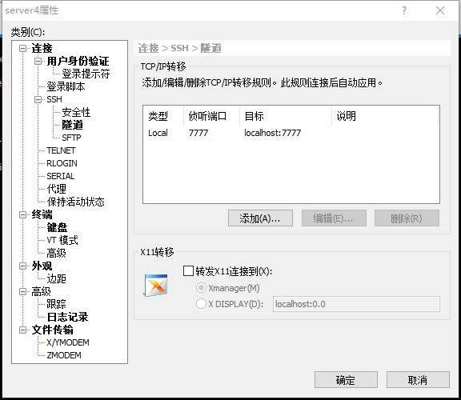

# 作为服务供单人使用

作为服务供单人使用本身是件挺2的事,但保不齐有些特殊场景需要用到.

公开notebook作为服务器最轻量级的方案就是直接让jupyter lab的服务暴露给外网.jupyter lab本来就是一个基于浏览器的服务,它默认在`localhost:8888`启动.我们可以通过修改一些启动参数来将它对外.jupyter提供了一个命令为我们生成一份配置文件`jupyter_lab_config.py`放在`~/.jupyter`目录下.

```shell
jupyter lab --generate-config 
```

我们可以修改其中的
```python
c.ServerApp.ip = '*' #或者'0.0.0.0'
c.ServerApp.open_browser = False # 服务启动不打开浏览器
c.ServerApp.port = <你指定的端口>
```
就可以使用了

# 安全措施

jupyter notebook直接暴露在外显然是不安全的,解决安全问题有两个思路:

1. 加密

2. 使用私有通道

## 加密

加密方式可以让jupyter lab服务暴露在公网上,这样只要有这台机器的ip地址或者域名,就可以在任意有网的地方直接访问它.

### 访问密码

要使用密码访问我们需要先创建密码,使用命令`jupyter server password`,根据提示输入密码就可以创建出配置文件`~/.jupyter/jupyter_server_config.json`,在其中`IdentityProvider->hashed_password`字段保存的就是密码的hash值了.

还是在配置文件`jupyter_lab_config.py`中,我们可以设置如下部分启用密码:

```python
c.ServerApp.password_required = True
c.ServerApp.allow_password_change=False
c.ServerApp.password = u'你的密码hash值'
```

下次启动jupyter lab时就会提示你输入密码了.

### ssl密文通信

启动的时候加上参数`jupyter notebook --certfile=mycert.pem --keyfile mykey.key`就可以使用ssl加密通信了(https).当然更好的方式是修改配置文件

```python
c.ServerApp.certfile = u'/absolute/path/to/your/certificate/mycert.pem'
c.ServerApp.keyfile = u'/absolute/path/to/your/certificate/mykey.key'
```

## 使用ssh私有通道

ssh隧道技术简单说就是将一个远端端口映射到本地一个端口,这样信息就都是通过ssh来传递了.优点是相对更安全,ssh方式连接可以用公私钥对进行加密.缺点是需要访问端有ssh工具.

在linux或者mac中这样启动:

```bash
ssh -N -f -L [remote port]:localhost:[local port] -p [ssh port] -l [username] [公网IP]

```

在windows中ssh工具使用很作孽,我们可以使用xshell来代替:



我们假设要将7777端口映射到本地7777端口,那么在yu远端启动的时候配置文件中这样写
```python
c.ServerApp.ip = 'localhost'
c.ServerApp.open_browser = False# 服务启动不打开浏览器
c.ServerApp.port = 7777

```

然后使用`jupyter lab`启动服务即可.我们就可以使用本地的浏览器访问本地的7777端口来访问远端的notebook了

后台启动可以使用nohup 或者使用supervisor统一管理都可以.


```python

```
