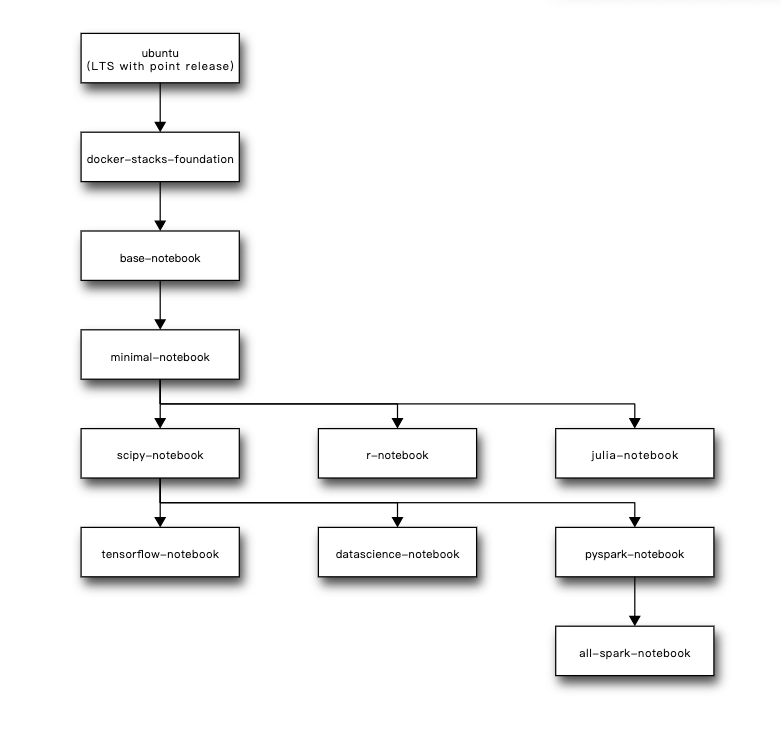

# 作为服务供小型团队使用

小型团队指那种使用人数不高于20人且规模基本固定的团队.这种团队一般是小公司研发团队.架设jupyterhub一般是为了共享工作站的算力资源,同时可以比较轻易的分享成果.

这种规模的小团队通常共享一台工作站,因此也就不需要什么集群化,docker单机模式就可以搞定.docker部署的最大优势就是可以在提供统一环境的同事隔离每个用户的私人环境.

部署的例子我放在[项目](https://github.com/hsz1273327/TutorialForPython/tree/master/%E5%B7%A5%E5%85%B7%E9%93%BE%E7%AF%87/%E4%BA%A4%E4%BA%92%E7%8E%AF%E5%A2%83jupyter/%E5%A4%9A%E7%94%A8%E6%88%B7%E6%9C%8D%E5%8A%A1/examples/smallteam)下

小型团队的特点是人少,并发小而稳定,工作场所固定通常只需要内网部署且希望尽可能的减少对外部的依赖.这边提供的部署方案是:

+ 使用docker部署单机hub
+ 使用sqlite作为数据库
+ 使用docker部署SPAWNER单用户服务
+ 使用账户密码注册登录服务


这里用到了三样组件

+ [hub服务](https://jupyterhub.readthedocs.io/en/latest/reference/api/app.html)
+ [dockerspawner](https://jupyterhub-dockerspawner.readthedocs.io/en/latest/index.html)
+ [jupyterhub-nativeauthenticator](https://native-authenticator.readthedocs.io/en/latest/index.html)

## 使用docker镜像部署单机hub服务


jupyter官方提供了镜像[jupyterhub/jupyterhub](https://hub.docker.com/r/jupyterhub/jupyterhub)([Dockerfile](https://github.com/jupyterhub/jupyterhub/blob/main/Dockerfile))用于使用容器技术部署hub.

我们要实现上面的部署方案需要额外安装对应的依赖.

这里我已经基于官方镜像构造了镜像[hsz1273327/jupyterhub-for-standalone](https://hub.docker.com/repository/docker/hsz1273327/jupyterhub-for-standalone/general).其构造dockerfile如下:


```dockerfile
FROM --platform=$TARGETPLATFORM jupyterhub/jupyterhub:4.0.1 as base
RUN pip install jupyterhub-nativeauthenticator
RUN pip install dockerspawner
COPY jupyterhub_config.py /srv/jupyterhub/jupyterhub_config.py
CMD ["jupyterhub", "-f", "/srv/jupyterhub/jupyterhub_config.py"]
```

其中最关键的就是`jupyterhub_config.py`文件,如果要自行设置建议充分参考[api文档](https://jupyterhub-dockerspawner.readthedocs.io/en/latest/api/index.html),[源码](https://github.com/jupyterhub/dockerspawner/blob/main/dockerspawner/dockerspawner.py)以及[docker-py源码](https://github.com/docker/docker-py).

我这边直接使用[hsz1273327/jupyterhub-for-standalone](https://hub.docker.com/r/hsz1273327/jupyterhub-for-standalone)项目.它完全通过环境变量进行设置,功能覆盖了大多数使用场景,一般来说相当够用.

### 原生的用户管理

小团队内部使用自然没道理用外部的账号进行验证,因此我们安装`jupyterhub-nativeauthenticator`模块.这个模块的作用是提供一个本地的账户系统.

这部分的设置可以查看上面以`AUTH`开头的环境变量说明

#### 账户系统的工作流

`jupyterhub-nativeauthenticator`模块提供的账户系统注册流程包含两步:

1. 注册账号,这一步仅是创建一个用户,这个用户如果不是管理员用户默认并不能进入系统中使用jupyterhub提供的服务.
2. 验证账户,这一步需要有一个管理员账户来执行,在jupyterhub的`/hub/authorize`页面中验证已经注册的用户.非管理员用户只有被验证过才可以进入jupyterhub使用它提供的服务.


`jupyterhub-nativeauthenticator`模块提供的账户系统区分一般用户和管理员,管理员名字需要在配置文件中设置.如果你使用我提供的镜像,可以设置环境变量`AUTH_ADMIN_USER`来进行设置.

管理员账户天然是已经通过验证的账号了,因此可以直接使用jupyterhub提供的服务,同时管理员账户有验证注册账号的功能.


如果你的团队太小觉得多一道管理员验证账户的步骤太麻烦,在使用我提供的镜像的前提下可以使用`AUTH_OPEN_SIGNUP: "True"`来关闭这一设置.


#### 账户系统的登录流程

`jupyterhub-nativeauthenticator`模块提供的账户系统对登录流程也有设置,默认会有3次尝试登录机会,当三次都登录失败后需要默认等待1200秒冷却,之后才能继续尝试


## 使用容器隔离环境

在jupyterhub中每个用户实际使用的环境是一个单独的jupyterlab服务,而spawner提供了针对这个jupyterlab服务的注册和生命周期管理工作,官方提供的spawner有几个种类供选择,我们希望每个用户都在一个沙盒中运行自己的notebook,因此使用docker是一个相对比较靠谱的方案.我们只需要一个docker hub实例来进行分发,后面的每个spawner则管理一个单独的docker容器即可,每个用户一个容器,做到充分隔离.我们可以通过挂载`volume`的方式保存用户的notebook.这样即便容器崩了删了,只要用户名不变就还可以找回来.


需要注意spawner通过docker方式部署notebook服务会直接从镜像拉起运行容器,容器会根据设置的构造创建命令.需要注意如下几点:

+ 网络不好的留足初始化时间,如果使用我构造的镜像可以通过适当调大环境变量`HUB_INIT_SPAWNERS_TIMEOUT`和`SPAWNER_START_TIMEOUT`来实现.更加建议预先将要使用的镜像拉取到机器上,尤其是使用gpu的情况下,避免拉取耗时过长
+ 每个用户都会创建一个命名形式为`jupyterhub-user-{username}`的volume来保存各自的notebook.
+ 使用我构造的镜像可以通过设置`SPAWNER_USE_GPUS`来让容器使用gpu.当然这需要配合支持gpu的镜像使用,
+ 一个jupyter hub系统只能指定特定的一个镜像.

### 选择单用户镜像

jupyter官方提供了许多选择,不过都是cpu版本的.下面是他们的关系图,我们可以在根据这张图选择需要的镜像名,然后去[dockerhub](https://hub.docker.com/u/jupyter)上确定合适的版本.



如果希望容器可以使用gpu,则可以使用项目[GPU-Jupyter](https://github.com/iot-salzburg/gpu-jupyter)下的镜像,要注意gpu镜像会比较大(超过5g)且该项目只支持x86_64.它提供三种镜像:

+ 无后缀镜像,表示全功能,包含Julia和R支持.
+ `python-only`后缀镜像,表示只支持python核心
+ `slim`后缀镜像,也就是最小化镜像,只有python核心且无各种python库

推荐镜像[cschranz/gpu-jupyter:v1.5_cuda-11.6_ubuntu-20.04_python-only](https://hub.docker.com/r/cschranz/gpu-jupyter/tags),需要注意这个项目目前的cuda版本为11.6,目前pytorch最低要求cuda11.7,因此如果你希望用最新的torch建议自己构建.

我本人当然更推荐项目[Basic-Components/base-image-for-jupyterhub](https://github.com/Basic-Components/base-image-for-jupyterhub)中我构建了几个notebook镜像.至少覆盖了我本人常用的几个场景,在我看来也是相当够用的.

### 自定义单用户镜像

如果以上镜像都无法满足我们的需求,比如我们希望默认带一些示例notebook,或者我们常用的库以上镜像中都没有,我们一样可以基于一个基镜像自己构造镜像.

推荐不需要gpu的可以[基于官方镜像构建](https://github.com/jupyter/docker-stacks)或者我的项目[Basic-Components/base-image-for-jupyterhub](https://github.com/Basic-Components/base-image-for-jupyterhub)中的`cpubase-notebook`文件夹下的镜像.官方镜像和我的镜像都基于`ubuntu`,使用`mamba`管理依赖,当然也都有python和pip,可以很容易的进行定制,我们可以根据对应镜像的dockerfile来选择合适的基镜像进行进一步开发.比如我们希望修改pip和conda的,并提供一个默认的例子notebook,我们可以使用`jupyter/base-notebook`作为基镜像,安装对应工具并将例子文件复制进镜像

```dockerfile
FROM --platform=$TARGETPLATFORM hsz1273327/small-dataset-notebook:notebook-6.5.4 as base
# 更换Ubuntu的源
USER root
RUN sed -i "s@http://.*archive.ubuntu.com@https://mirrors.tuna.tsinghua.edu.cn@g" /etc/apt/sources.list
RUN sed -i "s@http://.*security.ubuntu.com@https://mirrors.tuna.tsinghua.edu.cn@g" /etc/apt/sources.list

USER ${NB_UID}
# 更换conda的源
COPY --chown="${NB_UID}:${NB_GID}" initial-condarc "${CONDA_DIR}/.condarc"
# 更换pip源
COPY --chown="${NB_UID}:${NB_GID}" pip.conf "${HOME}/.pip/pip.conf"
# 安装需要的库

# 复制例子
COPY conntodata.ipynb /home/jovyan/work/examples/conntodata.ipynb
```

需要gpu的情况则推荐基于英伟达的[官方基镜像](https://hub.docker.com/r/nvidia/cuda)构建.注意英伟达的官方镜像有三种标签:

+ 命名含有`base`的镜像,基础镜像,只包含cuda.
+ 命名含有`runtime`的镜像,适合作为运行时使用的镜像,除了cuda外还有nccl,cudnn等其他数学包.
+ 命名含有`devel`的镜像,适合作为多步构造中中间步骤使用的镜像,包含cuda相关的工具.

我们通常基于命名含有`runtime`的镜像来自定义镜像.这会相对复杂一些,我们需要参考jupyter官方的镜像构建过程.下面是两个基于官方镜像构造的镜像的dockerfile,可以拿去作为基镜像使用

+ [hsz1273327/gpu-docker-stacks-foundation](https://hub.docker.com/r/hsz1273327/gpu-docker-stacks-foundation),`docker-stacks-foundation`的gpu版本
+ [hsz1273327/gpu-base-notebook](https://hub.docker.com/r/hsz1273327/gpu-base-notebook),`gpu-base-notebook`的gpu版本
+ [hsz1273327/gpu-tf-notebook](https://hub.docker.com/r/hsz1273327/gpu-tf-notebook),安装了tensorflow的notebook
+ [hsz1273327/gpu-torch-notebook](https://hub.docker.com/r/hsz1273327/gpu-torch-notebook),安装了pytorch的notebook

推荐按自己需求在`hsz1273327/gpu-tf-notebook`和`hsz1273327/gpu-torch-notebook`之间挑一个,然后安装需要的包.

```dockerfile
FROM --platform=$TARGETPLATFORM hsz1273327/gpu-torch-notebook:pytorch2.0.1-cuda11.8.0-notebook6.5.4
# 更换Ubuntu的源
USER root
RUN sed -i "s@http://.*archive.ubuntu.com@https://mirrors.tuna.tsinghua.edu.cn@g" /etc/apt/sources.list
RUN sed -i "s@http://.*security.ubuntu.com@https://mirrors.tuna.tsinghua.edu.cn@g" /etc/apt/sources.list

USER ${NB_UID}
# 更换conda的源
COPY --chown="${NB_UID}:${NB_GID}" initial-condarc "${CONDA_DIR}/.condarc"
# 更换pip源
COPY --chown="${NB_UID}:${NB_GID}" pip.conf "${HOME}/.pip/pip.conf"

# 安装需要的库
RUN conda install --channel conda-forge pygraphviz pydot lxml cython

RUN pip --no-cache-dir install --upgrade pip
RUN pip --no-cache-dir install ipywidgets
RUN pip --no-cache-dir install widgetsnbextension
RUN pip --no-cache-dir install boto3
RUN pip --no-cache-dir install psycopg2-binary
RUN pip --no-cache-dir install peewee
RUN pip --no-cache-dir install SQLAlchemy
RUN pip --no-cache-dir install matplotlib
RUN pip --no-cache-dir install seaborn

RUN pip --no-cache-dir install pandas
RUN pip --no-cache-dir install pyarrow
RUN pip --no-cache-dir install thefuzz
RUN pip --no-cache-dir install pyod
RUN pip --no-cache-dir install scipy
RUN pip --no-cache-dir install scikit-learn
RUN pip --no-cache-dir install scikit-image
RUN pip --no-cache-dir install skforecast
RUN pip --no-cache-dir install sympy
RUN pip --no-cache-dir install statsmodels
RUN pip --no-cache-dir install pingouin
RUN pip --no-cache-dir install mpmath
RUN pip --no-cache-dir install networkx
# 复制例子
COPY torch.ipynb /home/jovyan/work/examples/torch.ipynb
```

## 部署jupyterhub

部署的时候推荐使用`docker-compose`方式部署.

在部署前我们需要先构造一个可以让新建的容器可以挂在的网络,假定命名为`jupyterhub_network`,其创建命令如下:

```bash
docker network create --driver bridge --attachable jupyterhub_network
```

+ 不需要gpu的情况

如果不需要用到gpu可以创建`docker-compose.yml`如下:

```docker-compose
version: "2.4"
services:
    jupyterhub:
        image: hsz1273327/jupyterhub-for-standalone
        # This is necessary to prevent the singleton hub from using its service number as its hostname
        hostname: jupyterhub
        container_name: jupyterhub
        # Permit communication with the host's docker server
        networks:
            - jupyterhub_network
        ports:
            - 8001:8000
        volumes:
            - "/var/run/docker.sock:/var/run/docker.sock"
            - "jupyterhub-data:/data"
        # Ensure Hub and Notebook servers are on the same network
        environment:
            HUB_PORT: 8000
            SPAWNER_NETWORK_NAME: jupyterhub_network
            SPAWNER_NOTEBOOK_IMAGE: hhsz1273327/data-analyse-notebook:notebook-6.5.4

volumes:
    jupyterhub-data:

networks:
    jupyterhub_network:
        external: true
```

+ 需要gpu的情况

如果需要用到gpu可以创建`docker-compose.yml`如下:

```docker-compose
version: "2.4"
services:
    jupyterhub:
        image: hsz1273327/jupyterhub-for-standalone
        # This is necessary to prevent the singleton hub from using its service number as its hostname
        hostname: jupyterhub
        container_name: jupyterhub
        # Permit communication with the host's docker server
        networks:
            - jupyterhub_network
        ports:
            - 8001:8000
        volumes:
            - "/var/run/docker.sock:/var/run/docker.sock"
            - "jupyterhub-data:/data"
        # Ensure Hub and Notebook servers are on the same network
        environment:
            HUB_PORT: 8000
            SPAWNER_NETWORK_NAME: jupyterhub_network
            SPAWNER_NOTEBOOK_IMAGE: hsz1273327/gpu-torch-notebook:pytorch2.0.1-cuda11.8.0-notebook6.5.4
            SPAWNER_USE_GPUS: 1

volumes:
    jupyterhub-data:

networks:
    jupyterhub_network:
        external: true
```

在使用`docker-compose up`启动后,当我们登录成功进入系统后会自动创建一个以`SPAWNER_NOTEBOOK_IMAGE`指定的镜像为镜像的名为`jupyter-{用户名}`的容器.我们就可以正常使用它了.

## 扩展

通常我们的团队很难一直保持稳定规模,默认的单机部署基本已经是小团队的最低配置了.如果团队有扩张意图,可以使用如下几个方式以方便后面迁移到使用swarm部署的中型团队配置.

1. 使用外部关系数据库替代原本的sqlite.
    数据库迁移向来伴随着风险,建议有条件的话尽量早迁移.如果使用我的镜像则是修改环境变量`HUB_DB_URL`,如果自己配置则需要在镜像中先安装对应的驱动,然后修改配置`c.JupyterHub.db_url`.
2. 使用外部nfs保存用户的notebook.
     这个并不太着急,docker并不会自己把volume删除,我们可以在确定会迁移到swarm部署后再进行迁移,先把nfs启动起来,然后将volume中的文件下载下来后放入对应用户的文件夹.最后修改配置让我们的hub可以让notebook容器挂载nfs即可.
     需要注意挂载nfs的设置比较复杂,涉及到`c.Spawner.pre_spawn_hook`对应的钩子函数,`c.DockerSpawner.volumes`以及`c.DockerSpawner.mounts `,不建议自己配置.如果使用我的镜像,则只需要设置如下几个环境变量:
    + SPAWNER_PERSISTENCE_VOLUME_TYPE: 默认`local`,notebook服务保存的文件存放的位置类型,支持"local", "nfs3", "nfs4", "cifs"四种类型
    + SPAWNER_PERSISTENCE_VOLUME_SOURCE_NAME: 默认`jupyterhub-user-{username}`,挂载的volume名字,也就是source名
    + SPAWNER_PERSISTENCE_VOLUME_TARGET_SUBPATH: 默认`/persistence`,挂载的volume在容器中的路径,完整路径为`{SPAWNER_NOTEBOOK_DIR}{SPAWNER_PERSISTENCE_VOLUME_TARGET_SUBPATH}`
    + SPAWNER_PERSISTENCE_VOLUME_MKDIRPATH: 当SPAWNER_PERSISTENCE_VOLUME_TYPE不为`local`时生效, 默认`/jupyterhub_data`,本地挂载的nfs或cifs在容器中的路径,在部署用户镜像前会先在对应路径中创建用户同名文件夹

    + SPAWNER_PERSISTENCE_NFS_HOST: 如果`SPAWNER_PERSISTENCE_VOLUME_TYPE`为"nfs3"或"nfs4则必填,指定nfs服务器的地址,比如`10.0.0.10`
    + SPAWNER_PERSISTENCE_NFS_DEVICE: 如果`SPAWNER_PERSISTENCE_VOLUME_TYPE`为"nfs3"或"nfs4则必填,指定nfs服务器上的路径,比如`:/var/docker-nfs`,真正存放的位置为`SPAWNER_PERSISTENCE_NFS_DEVICE/{username}`
    + SPAWNER_PERSISTENCE_NFS_OPTS: 选填,如果`SPAWNER_PERSISTENCE_VOLUME_TYPE`为"nfs3"或"nfs4则生效,nfs3时默认值为`,rw,vers=3,nolock,soft`;nfs4时默认值为`,rw,nfsvers=4,async`,指定nfs连接的配置项
