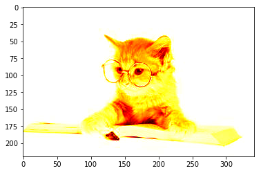

# 图片加载

`matplotlib.image`模块提供了读取图片和进行简单处理的能力,他的底层是pillow


```python
import numpy as np
import matplotlib.pyplot as plt
import matplotlib.image as mpimg
```


```python
img=mpimg.imread('./source/cat.jpg')
```

通过`imread()`方法读取的图片会被转换成像素矩阵(numpy的narray对象),其shape与图像分辨率有关,比如:

上图是342x220的图片,那么


```python
img.shape
```


    (220, 342, 3)


其中的3为每个像素表现为一个RGB的三位数组


```python
img
```


    array([[[254, 254, 254],
            [254, 254, 254],
            [254, 254, 254],
            ..., 
            [255, 255, 255],
            [255, 255, 255],
            [255, 255, 255]],
    
           [[254, 254, 254],
            [254, 254, 254],
            [254, 254, 254],
            ..., 
            [255, 255, 255],
            [255, 255, 255],
            [255, 255, 255]],
    
           [[254, 254, 254],
            [254, 254, 254],
            [255, 255, 255],
            ..., 
            [255, 255, 255],
            [255, 255, 255],
            [255, 255, 255]],
    
           ..., 
           [[255, 255, 255],
            [255, 255, 255],
            [255, 255, 255],
            ..., 
            [255, 255, 255],
            [255, 255, 255],
            [255, 255, 255]],
    
           [[255, 255, 255],
            [255, 255, 255],
            [255, 255, 255],
            ..., 
            [255, 255, 255],
            [255, 255, 255],
            [255, 255, 255]],
    
           [[255, 255, 255],
            [255, 255, 255],
            [255, 255, 255],
            ..., 
            [255, 255, 255],
            [255, 255, 255],
            [255, 255, 255]]], dtype=uint8)


我们可以通过plt.imshow(img)将这个数组初始化为一个plot对象


```python
imgplot = plt.imshow(img)
```


```python
plt.show()
```


当然了只要是相同格式的数组都可以通过这个方式初始化为一个plot对象

## 将假彩色方案应用于图像绘图

伪彩色可以是一个有用的工具，用于增强对比度和更容易地可视化数据。这在使用投影仪对数据进行演示时尤其有用(它们的对比度通常很差)。假彩色仅与单通道，灰度，光度图像相关。我们目前有一个RGB图像。由于R，G和B都是相似的（见上面或在你的数据中的自己），我们可以只选择一个通道的数据：


```python
lum_img_r = img[:,:,0]
```


```python
lum_img_r
```


    array([[254, 254, 254, ..., 255, 255, 255],
           [254, 254, 254, ..., 255, 255, 255],
           [254, 254, 255, ..., 255, 255, 255],
           ..., 
           [255, 255, 255, ..., 255, 255, 255],
           [255, 255, 255, ..., 255, 255, 255],
           [255, 255, 255, ..., 255, 255, 255]], dtype=uint8)


```python
lum_img_r.shape
```


    (220, 342)


```python
plt.imshow(lum_img_r)
plt.show()
```


```python
lum_img_g = img[:,:,1]
plt.imshow(lum_img_g)
plt.show()
```


```python
lum_img_g = img[:,:,2]
plt.imshow(lum_img_g)
plt.show()
```


现在我们以使用R为通道的图片,使用亮度（2D，无颜色）图像，应用默认色彩映射（也称为查找表，LUT）。默认值称为jet。有很多其他的也可以选择。


```python
plt.imshow(lum_img_r, cmap="hot")
plt.show()
```





也还可以使用set_cmap()方法更改现有绘图对象上的颜色


```python
imgplot = plt.imshow(lum_img_r)
imgplot.set_cmap('spectral')
plt.show()
```

    /Users/huangsizhe/LIB/CONDA/anaconda/lib/python3.6/site-packages/matplotlib/cbook.py:136: MatplotlibDeprecationWarning: The spectral and spectral_r colormap was deprecated in version 2.0. Use nipy_spectral and nipy_spectral_r instead.
      warnings.warn(message, mplDeprecation, stacklevel=1)


### 色标参考

它有助于了解颜色代表什么值。我们可以通过添加颜色条来做到这一点。


```python
imgplot = plt.imshow(lum_img_r)
plt.colorbar()
plt.show()
```


### 检查特定数据范围

有时，您想要增强图像的对比度，或者在特定区域中扩大对比度，同时牺牲不会变化很大的颜色的细节，或者无关紧要。找到感兴趣区域的好工具是直方图。要创建我们的图像数据的直方图，我们使用hist（）函数。


```python
plt.hist(lum_img_r.ravel(), bins=256,fc='k', ec='k')
plt.show()
```


下图就显示出了各个色值的分布状态,看打出来25x为值的是大多数中的大多数

通常，图像的“有趣”部分在峰值附近，您可以通过剪切峰值上方和/或下方的区域获得额外的对比度。在我们的直方图中，看起来在高端没有太多有用的信息（图像中不是很多白色的东西）。让我们调整上限，以便我们有效地“放大”直方图的一部分。我们通过将clim参数传递给imshow来实现。你也可以通过调用图像绘图对象的set_clim（）方法来做到这一点，但是要确保你在使用IPython Notebook时在plot命令的同一个单元格中这样做 - 它不会改变以前单元格的绘图。


```python
imgplot = plt.imshow(lum_img_r, clim=(0, 200))
plt.show()
```


## 阵列插值方案

插值根据不同的数学方案计算像素的“应该”的颜色或值。这种情况发生的一个常见的地方是当你调整图像的大小。像素的数量变化，但你想要相同的信息。由于像素是离散的，因此缺少空间。插值是如何填补这个空间。这就是为什么你的图像有时拉伸会出来看起来像素化。当原始图像和扩展图像之间的差异较大时，效果更加明显。比如windows显示像素如果过分低于你的屏幕像素,那么你拉伸到屏幕那么大,看起来就都是马赛克,就是这个效果.

而插值算法就是拉伸时如何模拟的去显示出缺失信息的技术


```python
from PIL import Image
img = Image.open('./source/cat.jpg')

img.thumbnail((64, 64), Image.ANTIALIAS) # 将图片压缩到64x64像素
```


```python
img.height,img.width#41是因为图片比例
```


    (41, 64)


```python
imgplot = plt.imshow(img)
plt.show()
```


内置的插值算法有

+ 'nearest', 最近值,也就是马赛克块
+ 'bilinear', [双线性插值](https://en.wikipedia.org/wiki/Bilinear_interpolation)
+ 'bicubic',[双三次插值](https://en.wikipedia.org/wiki/Bicubic_interpolation)
+ 'spline16'/'spline36', [样条插值](https://en.wikipedia.org/wiki/Spline_interpolation)
+ 'hanning'/'hamming'/'gaussian'/'kaiser'/'bessel'/'sinc'
    [窗插值算法](https://en.wikipedia.org/wiki/Window_function)
+ 'hermite',[埃尔米特插值](https://en.wikipedia.org/wiki/Hermite_interpolation)
+ 'quadric',[二次曲面插值](https://en.wikipedia.org/wiki/Quadric)
+ 'catrom',[Catmull-Rom插值算法]https://en.wikipedia.org/wiki/Centripetal_Catmull%E2%80%93Rom_spline

+ 'mitchell'

+ 'lanczos'[Lanczos算法](http://baike.baidu.com/link?url=GIZkv1i2pTaJNhQEKqNS3ScaPuVFVJNsZ3lm8_-jMzEVqRqO0EQqN4IQlMcM6r5XxpES-D226PHQs4s7yJNK6uf7R_IHqXJAyVVu4sekM9_tzFEhBmXNvfJ9nXfB-sQb)
    


```python
imgplot = plt.imshow(img, interpolation="nearest")
plt.show()
```


使用双三次插值(bicubic)模糊处理


```python
imgplot = plt.imshow(img, interpolation="bicubic")
plt.show()
```


### 图片修改分辨率

img模块还提供了一个缩略图的工具
`matplotlib.image.thumbnail(infile, thumbfile, scale=0.1, interpolation='bilinear', preview=False)`
它可以直接修改文件并保存为另一文件,只是类型限制在png,svg和pdf三种


```python
mpimg.thumbnail("./source/cat.jpg", "./source/cat_min.png", scale=0.15, interpolation='bicubic')
```


