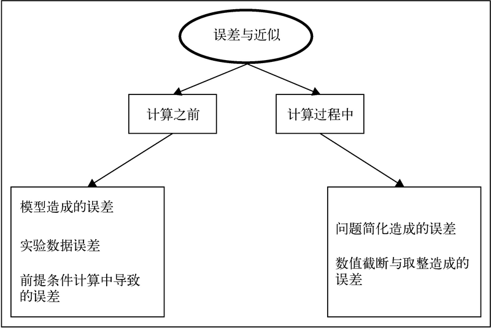

# 误差(errors)

> 一个量的观测值或计算值与其真实值或约定值之差;特指统计误差,即一个量在测量,计算或观察过程中由于某些错误或通常由于某些不可控制的因素的影响而造成的变化偏离标准值或规定值的数量,误差是不可避免的.

## 误差的成因

科学计算的答案通常都是近似解,近似解虽然不是我们真正想要的精确解,但是可以非常接近精确解."非常接近"的意思是这个解十分接近实际或仿真成功获得的结果,因为它们实现了目标.这类近似解或相似解会受到许多因素的影响.影响因素按照产生阶段可以分成两类:

+ 一类是在计算开始之前就有的
+ 另一类是在计算过程中出现的。

### 在计算开始之前就出现近似值,主要由以下因素造成.

+ 建模假设或无知:建模过程中可能使用了一些假设条件,没注意或者忽略了一些概念和现象的影响,最终导致了近似或可接受的误差.
+ 观测或实验数据:从一些低精度的设备中获取的数据可能会不准确.计算过程中使用一些常量,比如π,这些常量的取值都是近似值,这也是造成计算结果与真实值有差距的重要原因.
+ 计算的先决条件:输入数据是从前一个实验或仿真中获取的值,可能有点误差,而经过计算误差被进一步放大了.前一步的处理可能会成为之后实验的先决条件.

### 计算过程中导致近似值的主要因素如下.

+ 简化问题:为了解决大而复杂的问题需要使用分治法,并不断将小难题转换成简单问题.这可能会产生近似值.而且将无限序列替换成有限序列也可能会产生近似值.

+ 截断和舍入:许多仿真都会对中间结果进行截断和舍入操作.类似地,计算机内部表示浮点数的方法和算术运算过程也会导致些许不准确.

## 误差分析

误差分析(error analysis)是评估近似解对算法或计算过程准确性的影响程度的过程.

通过前面对误差成因的介绍我们可知--误差既可能出现在输入数据中,也可能在对输入数据的计算过程中产生.

如果进一步细分,计算误差还可以分为两类:

+ `截断误差(truncation error)` 截断误差是将复杂问题简化成简单问题时造成的.例如在机器学习算法中在得到需要的准确率之前粗略地中断算法迭代
+ `舍入误差(rounding error)`舍入误差是使用计算机计算时数字系统表示数字精度的规则造成的,也是在对数字进行算术运算时造成的

最终误差究竟是十分显著还是可以忽略不计,由最终数值的规模决定.例如误差10对数值15来说是十分显著的,但对785来说就不算大了,对17 685来说甚至可以忽略不计.通常误差值的影响程度与结果数值具有相关性.如果知道结果数值的量级,那么看看误差值的量级,就可以判断误差究竟是可以忽略不计还是十分显著.如果误差十分显著就要考虑引入改进手段了.

## 敏感度

`敏感度(sensitivity或conditioning)`是问题/算法的一种属性,在某些条件下,问题可以被称为敏感的或不敏感的,或者是良态的或病态的.如果输入值发生相对变化时,输出结果也会发生等比例的相对变化,就说问题是不敏感的或良态的.另一方面，如果输出结果发生的变化比输入值的变化幅度大,那么就认为问题是敏感的或病态的.

## 后向与前向误差估计

假设我们通过映射函数`f`对`x`进行计算获得了`y*`,即`y*=f(x)`.现在真实值是`y`，那么微量`y'=y*-y`被称为`前向误差(forward error)`,对应的估计方法称为前向误差分析.通常很难获取该估计值.另一种方法是认为`y*`就是同样问题带有修正 `x`的精确值,即`y*=f (x')`.现在`x*=x'-x`就被称为`y*`的`后向误差(backward error)`.后向误差分析就是对`x*`的参数估计过程.
