# 数据可视化

pandas针对表格数据有对matplotlib的封装,通过`polt()`方法可以方便的绘制图形


```python
import pandas as pd
import numpy as np
import matplotlib
import matplotlib.pyplot as plt
matplotlib.style.use('ggplot')
```


```python
%matplotlib inline
```

## 基本绘图

最基础的绘图就是为序列绘图`polt()`了

我们以随机游走模拟股市行情

如果索引由日期组成，它将调用`gcf().autofmt_xdate()`来尝试按索引(index)的格式格式化x轴。

ps:累积和(cumsum)

$$
S_0=0 \\
S_{n+1}=\max(0, S_n+x_n-\omega_n)
$$

用以在某个相对稳定的数据序列中，检测出开始发生异常的数据点。所谓异常的数据点，比如说，从这点开始，整个数列的平均值或者均方差开始发生改变，进而影响到整组数据的稳定。所以累积和最典型的应用是在“改变检测”（Change Detection）中对参量变化的检测。由于累积和管制法能充分利用数据变化之顺序与大小,故相当适合用于侦测制程的微量变化(small shifts)

这边使用累积和用来获得当天的值


```python
ts_o = pd.Series(np.random.randn(1000), index=pd.date_range('1/1/2016', periods=1000))
ts = ts_o.cumsum()# 累积和
ts[:5]
```


    2016-01-01   -0.943073
    2016-01-02    0.645978
    2016-01-03   -0.162719
    2016-01-04   -0.593420
    2016-01-05   -1.552354
    Freq: D, dtype: float64


```python
ts.plot()
```


    <matplotlib.axes._subplots.AxesSubplot at 0x1c9b2cbd438>


如果是针对的df,那么它会按列分别绘制图形.它会自动用不同颜色来区分


```python
df = pd.DataFrame(np.random.randn(1000, 4), index=ts.index, columns=list('ABCD'))
df = df.cumsum()
```


```python
df[:5]
```


<div>
<table border="1" class="dataframe">
  <thead>
    <tr style="text-align: right;">
      <th></th>
      <th>A</th>
      <th>B</th>
      <th>C</th>
      <th>D</th>
    </tr>
  </thead>
  <tbody>
    <tr>
      <th>2016-01-01</th>
      <td>1.768804</td>
      <td>-1.509527</td>
      <td>-1.630513</td>
      <td>-0.407891</td>
    </tr>
    <tr>
      <th>2016-01-02</th>
      <td>1.631288</td>
      <td>0.145392</td>
      <td>-1.067315</td>
      <td>-1.405604</td>
    </tr>
    <tr>
      <th>2016-01-03</th>
      <td>1.153486</td>
      <td>-0.335480</td>
      <td>-1.320116</td>
      <td>-2.216602</td>
    </tr>
    <tr>
      <th>2016-01-04</th>
      <td>0.916897</td>
      <td>-1.356709</td>
      <td>-1.410290</td>
      <td>-1.637204</td>
    </tr>
    <tr>
      <th>2016-01-05</th>
      <td>1.472524</td>
      <td>-1.381097</td>
      <td>-2.646981</td>
      <td>-1.246137</td>
    </tr>
  </tbody>
</table>
</div>


```python
df.plot()
```


    <matplotlib.axes._subplots.AxesSubplot at 0x1c9b316a0f0>


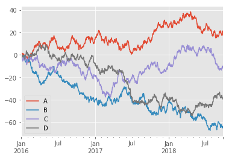


### 指定x轴y轴


```python
df3 = pd.DataFrame(np.random.randn(1000, 2), columns=['B', 'C']).cumsum()

df3['A'] = pd.Series(list(range(len(df))))

df3[:5]
```


<div>
<table border="1" class="dataframe">
  <thead>
    <tr style="text-align: right;">
      <th></th>
      <th>B</th>
      <th>C</th>
      <th>A</th>
    </tr>
  </thead>
  <tbody>
    <tr>
      <th>0</th>
      <td>-0.487310</td>
      <td>1.489582</td>
      <td>0</td>
    </tr>
    <tr>
      <th>1</th>
      <td>0.018866</td>
      <td>2.249854</td>
      <td>1</td>
    </tr>
    <tr>
      <th>2</th>
      <td>1.536721</td>
      <td>0.929395</td>
      <td>2</td>
    </tr>
    <tr>
      <th>3</th>
      <td>2.390767</td>
      <td>-0.671159</td>
      <td>3</td>
    </tr>
    <tr>
      <th>4</th>
      <td>4.575829</td>
      <td>-2.713449</td>
      <td>4</td>
    </tr>
  </tbody>
</table>
</div>


```python
df3.plot(x='A', y='B')
```


    <matplotlib.axes._subplots.AxesSubplot at 0x1c9b3344f60>


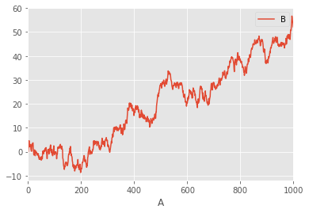


### 图形设置

和在matplotlib中一样,我们可以设置style,label,color等,如
style='k--', label='Series','legend=False'

plot的完整接口如下:

`.plot(x=None, y=None, kind='line', ax=None, subplots=False, sharex=None, sharey=False, layout=None, figsize=None, use_index=True, title=None, grid=None, legend=True, style=None, logx=False, logy=False, loglog=False, xticks=None, yticks=None, xlim=None, ylim=None, rot=None, fontsize=None, colormap=None, table=False, yerr=None, xerr=None, secondary_y=False, sort_columns=False,`

其中
+ legend表示用户不用图例

+ logy 表示是否使用对数标度Y轴

+ secondary_y表示是否使用第二根y轴,这常在有两个图形在同一张图中时用

+ `subplots=True和figsize=(x,x)`配合用于绘制子图
    子图的布局可以通过layout关键字指定。它可以接受（行，列）。 layout关键字也可以在hist和boxplot中使用。如果输入无效，将引发ValueError。由布局指定的行x列可包含的轴数必须大于所需子图的数量。如果布局可以包含比所需更多的轴，则不绘制空白轴。与numpy数组的重塑方法类似，对于一个维度，您可以使用-1自动计算所需的行数或列数，而另一个维度。比如`plot(subplots=True, layout=(2, 3), figsize=(6, 6), sharex=False)`
    
+ 使用`table=True`绘制表格


```python
df3.plot(x='A', y='B',style='k--', label='Series')
```


    <matplotlib.axes._subplots.AxesSubplot at 0x1c9b2e70390>


### Colormaps

绘制大量列时的潜在问题是，由于默认颜色的重复，可能难以区分某些系列。为了解决这个问题，DataFrame绘图支持使用`colormap =参数`，它接受一个Matplotlib色彩映射或一个字符串，它是用Matplotlib注册的色彩映射的名称。默认的matplotlib色彩图可以在matplotlib的cm模块中找到,同时cm模块中的对象也可以作为输入参数


```python
 from matplotlib import cm
```


```python
df_color = pd.DataFrame(np.random.randn(1000, 10), index=ts.index)
df_color = df_color.cumsum()
df_color.plot(colormap='cubehelix')
```


    <matplotlib.axes._subplots.AxesSubplot at 0x1c9b32eff60>


+ accent


```python
df_color.plot(colormap=cm.cubehelix)
```


    <matplotlib.axes._subplots.AxesSubplot at 0x1c9b3625e48>


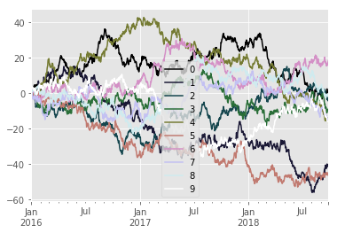


### 绘制带errorbar的图形


```python
ix_err = pd.MultiIndex.from_arrays([['a', 'a', 'a', 'a', 'b', 'b', 'b', 'b'], 
                                 ['foo', 'foo', 'bar', 'bar', 'foo', 'foo', 'bar', 'bar']],
                                names=['letter', 'word'])
```


```python
df_err = pd.DataFrame({'data1': [3, 2, 4, 3, 2, 4, 3, 2], 'data2': [6, 5, 7, 5, 4, 5, 6, 5]}, index=ix_err)
```


```python
gp_err = df_err.groupby(level=('letter', 'word'))
```


```python
means = gp_err.mean()
```


```python
errors = gp_err.std()
```


```python
means
```


<div>
<table border="1" class="dataframe">
  <thead>
    <tr style="text-align: right;">
      <th></th>
      <th></th>
      <th>data1</th>
      <th>data2</th>
    </tr>
    <tr>
      <th>letter</th>
      <th>word</th>
      <th></th>
      <th></th>
    </tr>
  </thead>
  <tbody>
    <tr>
      <th rowspan="2" valign="top">a</th>
      <th>bar</th>
      <td>3.5</td>
      <td>6.0</td>
    </tr>
    <tr>
      <th>foo</th>
      <td>2.5</td>
      <td>5.5</td>
    </tr>
    <tr>
      <th rowspan="2" valign="top">b</th>
      <th>bar</th>
      <td>2.5</td>
      <td>5.5</td>
    </tr>
    <tr>
      <th>foo</th>
      <td>3.0</td>
      <td>4.5</td>
    </tr>
  </tbody>
</table>
</div>


```python
errors
```


<div>
<table border="1" class="dataframe">
  <thead>
    <tr style="text-align: right;">
      <th></th>
      <th></th>
      <th>data1</th>
      <th>data2</th>
    </tr>
    <tr>
      <th>letter</th>
      <th>word</th>
      <th></th>
      <th></th>
    </tr>
  </thead>
  <tbody>
    <tr>
      <th rowspan="2" valign="top">a</th>
      <th>bar</th>
      <td>0.707107</td>
      <td>1.414214</td>
    </tr>
    <tr>
      <th>foo</th>
      <td>0.707107</td>
      <td>0.707107</td>
    </tr>
    <tr>
      <th rowspan="2" valign="top">b</th>
      <th>bar</th>
      <td>0.707107</td>
      <td>0.707107</td>
    </tr>
    <tr>
      <th>foo</th>
      <td>1.414214</td>
      <td>0.707107</td>
    </tr>
  </tbody>
</table>
</div>


```python
fig, ax = plt.subplots()
means.plot.bar(yerr=errors, ax=ax)
```


    <matplotlib.axes._subplots.AxesSubplot at 0x1c9b482e2b0>


## 额外的绘图工具

`pandas.tools.plotting`模块中还提供了另外几个绘图工具

### 散点矩阵图scatter_matrix


```python
from pandas.tools.plotting import scatter_matrix
```


```python
df1 = pd.DataFrame(np.random.randn(1000, 4), columns=['a', 'b', 'c', 'd'])
```


```python
scatter_matrix(df1, alpha=0.2, figsize=(6, 6), diagonal='kde')
```


    array([[<matplotlib.axes._subplots.AxesSubplot object at 0x000001C9B491F2B0>,
            <matplotlib.axes._subplots.AxesSubplot object at 0x000001C9B49C3C88>,
            <matplotlib.axes._subplots.AxesSubplot object at 0x000001C9B4A352B0>,
            <matplotlib.axes._subplots.AxesSubplot object at 0x000001C9B4A80470>],
           [<matplotlib.axes._subplots.AxesSubplot object at 0x000001C9B4AE8E48>,
            <matplotlib.axes._subplots.AxesSubplot object at 0x000001C9B4AE8E80>,
            <matplotlib.axes._subplots.AxesSubplot object at 0x000001C9B4BB4048>,
            <matplotlib.axes._subplots.AxesSubplot object at 0x000001C9B4C0D3C8>],
           [<matplotlib.axes._subplots.AxesSubplot object at 0x000001C9B4C76AC8>,
            <matplotlib.axes._subplots.AxesSubplot object at 0x000001C9B4CD53C8>,
            <matplotlib.axes._subplots.AxesSubplot object at 0x000001C9B4D39898>,
            <matplotlib.axes._subplots.AxesSubplot object at 0x000001C9B4D973C8>],
           [<matplotlib.axes._subplots.AxesSubplot object at 0x000001C9B4DFB898>,
            <matplotlib.axes._subplots.AxesSubplot object at 0x000001C9B4E14080>,
            <matplotlib.axes._subplots.AxesSubplot object at 0x000001C9B4EC2898>,
            <matplotlib.axes._subplots.AxesSubplot object at 0x000001C9B4F29C88>]], dtype=object)


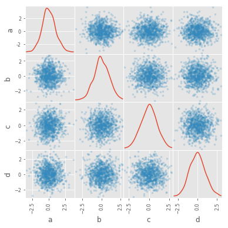


### 安德鲁斯曲线

安德鲁斯曲线允许将多变量数据绘制为使用样本的属性创建的大量曲线作为傅里叶级数的系数。通过为每个类不同地着色这些曲线，可以可视化数据聚类。属于相同类别的样品的曲线通常更靠近在一起并形成更大的结构。

以iris为例


```python
from pandas.tools.plotting import andrews_curves
```


```python
iris = pd.read_csv('source/iris.csv')
```


```python
iris[:5]
```


<div>
<table border="1" class="dataframe">
  <thead>
    <tr style="text-align: right;">
      <th></th>
      <th>sepal_length</th>
      <th>sepal_width</th>
      <th>petal_length</th>
      <th>petal_width</th>
      <th>class</th>
    </tr>
  </thead>
  <tbody>
    <tr>
      <th>0</th>
      <td>5.1</td>
      <td>3.5</td>
      <td>1.4</td>
      <td>0.2</td>
      <td>Iris-setosa</td>
    </tr>
    <tr>
      <th>1</th>
      <td>4.9</td>
      <td>3.0</td>
      <td>1.4</td>
      <td>0.2</td>
      <td>Iris-setosa</td>
    </tr>
    <tr>
      <th>2</th>
      <td>4.7</td>
      <td>3.2</td>
      <td>1.3</td>
      <td>0.2</td>
      <td>Iris-setosa</td>
    </tr>
    <tr>
      <th>3</th>
      <td>4.6</td>
      <td>3.1</td>
      <td>1.5</td>
      <td>0.2</td>
      <td>Iris-setosa</td>
    </tr>
    <tr>
      <th>4</th>
      <td>5.0</td>
      <td>3.6</td>
      <td>1.4</td>
      <td>0.2</td>
      <td>Iris-setosa</td>
    </tr>
  </tbody>
</table>
</div>


```python
andrews_curves(iris, 'class')
```


    <matplotlib.axes._subplots.AxesSubplot at 0x1c9b4a4a208>


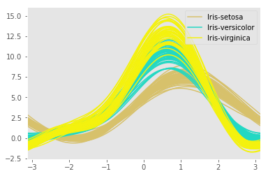


### 平行坐标parallel_coordinates

平行坐标是绘制多变量数据的绘图技术。它允许人们看到数据中的簇，并可视地估计其他统计量。使用平行坐标点表示为连接的线段。每个垂直线表示一个属性。一组连接的线段表示一个数据点。倾向于聚类的点将更靠近在一起。


```python
from pandas.tools.plotting import parallel_coordinates
```


```python
parallel_coordinates(iris, 'class')
```


    <matplotlib.axes._subplots.AxesSubplot at 0x1c9b5bdaf28>


### RadViz图 

RadViz是一种可视化多变量数据的方法。它基于简单的弹簧张力最小化算法(spring tension minimization algorithm)。基本上你在画板上设置了一堆点。在我们的例子中，它们在单位圆上等间隔。每个点表示单个属性。然后假设数据集中的每个样本都通过弹簧附加到这些点中的每一个上，其刚度与该属性的数值成比例（它们被归一化为单位间隔）。在平面中我们的样本沉降的点（其中作用在我们的样本上的力处于平衡）是表示我们的样本的点将被绘制的点。根据样本属于哪个类别，它将有不同的颜色。


```python
from pandas.tools.plotting import radviz
```


```python
radviz(iris, 'class')
```


    <matplotlib.axes._subplots.AxesSubplot at 0x1c9b5f3ff28>


### 滞后图

滞后图用于检查数据集或时间序列是否是随机的。随机数据在滞后图中不应显示任何结构。非随机结构意味着底层数据不是随机的。


```python
from pandas.tools.plotting import lag_plot
```


```python
unr = pd.Series(0.1 * np.random.rand(1000) +
     0.9 * np.sin(np.linspace(-99 * np.pi, 99 * np.pi, num=1000)))
```


```python
lag_plot(unr)
```


    <matplotlib.axes._subplots.AxesSubplot at 0x1c9b5f65390>


```python
lag_plot(ts)
```


    <matplotlib.axes._subplots.AxesSubplot at 0x1c9b608d710>


```python
lag_plot(ts_o)#随机
```


    <matplotlib.axes._subplots.AxesSubplot at 0x1c9b5c09978>


### 自相关图autocorrelation_plot

自相关图通常用于检查时间序列中的随机性。这是通过计算在不同时间滞后的数据值的自相关来完成的。如果时间序列是随机的，对于任何和时间滞后分离，这种自相关应该接近零。如果时间序列是非随机的，则一个或多个自相关将显着地非零。图中显示的水平线对应于95％和99％置信带。虚线是99％置信带。


```python
from pandas.tools.plotting import autocorrelation_plot
```


```python
data_autocorrelation = pd.Series(0.7 * np.random.rand(1000) + 0.3 * np.sin(np.linspace(-9 * np.pi, 9 * np.pi, num=1000)))
```


```python
autocorrelation_plot(data_autocorrelation)
```


    <matplotlib.axes._subplots.AxesSubplot at 0x1c9b61abc50>


### 引导图bootstrap_plot

引导图用于视觉评估统计量的不确定性，例如平均值，中值，中等范围等。从数据集中选择指定大小的随机子集，针对该子集计算所讨论的统计量，并且该过程是根据指定次数重复的。图形和直方图的结果构成了引导图。


```python
from pandas.tools.plotting import bootstrap_plot
```


```python
data_bootstrap = pd.Series(np.random.rand(1000))
```


```python
bootstrap_plot(data_bootstrap, size=50, samples=500, color='grey')
```


## 常见统计图

除了折线图,当然还有常见统计图形比如栅栏图,直方图,饼图,箱图了

绘制这些图形最简单的方式就是使用`plot.<style>()`方法了,他可以在一副图中绘制出想要的内容

### 使用缺失数据绘制

Pandas试图做实用的可以绘制包含缺失数据的DataFrames或Series的图形。它会默认的根据绘图类型，丢弃，舍弃或填充缺失值。当然更好的方式是先处理缺失值再绘图


Plot Type|	NaN Handling
---|---
Line|在NaNs处留下空隙
Line (stacked)|用0填充
Bar	|用0填充
Scatter|删除Nan
Histogram|删除Nan
Box|删除Nan
Area|用0填充
KDE|删除Nan
Hexbin|删除Nan
Pie|用0填充

### 绘制图表table


```python
from pandas.tools.plotting import table
df_table = pd.DataFrame(np.random.rand(5, 3), columns=['a', 'b', 'c'])
df_table 
```


<div>
<table border="1" class="dataframe">
  <thead>
    <tr style="text-align: right;">
      <th></th>
      <th>a</th>
      <th>b</th>
      <th>c</th>
    </tr>
  </thead>
  <tbody>
    <tr>
      <th>0</th>
      <td>0.907814</td>
      <td>0.577342</td>
      <td>0.972353</td>
    </tr>
    <tr>
      <th>1</th>
      <td>0.040087</td>
      <td>0.499157</td>
      <td>0.191772</td>
    </tr>
    <tr>
      <th>2</th>
      <td>0.474351</td>
      <td>0.452796</td>
      <td>0.955516</td>
    </tr>
    <tr>
      <th>3</th>
      <td>0.872288</td>
      <td>0.324289</td>
      <td>0.467717</td>
    </tr>
    <tr>
      <th>4</th>
      <td>0.045308</td>
      <td>0.264322</td>
      <td>0.081304</td>
    </tr>
  </tbody>
</table>
</div>


```python
fig, ax = plt.subplots(1, 1)
table(ax, np.round(df_table.describe(), 2),
       loc='upper right', colWidths=[0.2, 0.2, 0.2])
df_table.plot(ax=ax, ylim=(0, 2), legend=None)
```


    <matplotlib.axes._subplots.AxesSubplot at 0x1c9b6274d68>


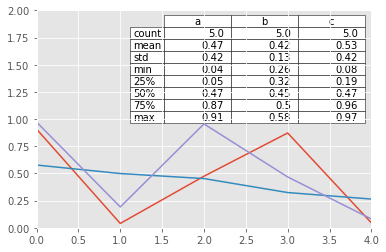


### 散点图scatter

观察两组数据的特点最好的方法就是使用散点图


```python
df_scatter = pd.DataFrame(np.random.rand(50, 4), columns=['a', 'b', 'c', 'd'])
```


```python
df_scatter.plot.scatter(x='a', y='b');
```


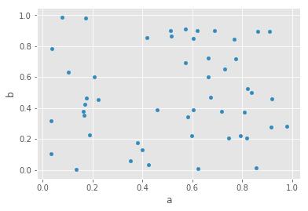


#### 散点分组


```python
ax = df_scatter.plot.scatter(x='a', y='b', color='DarkBlue', label='Group 1')
df_scatter.plot.scatter(x='c', y='d', color='DarkGreen', label='Group 2', ax=ax)
```


    <matplotlib.axes._subplots.AxesSubplot at 0x1c9b76ec080>


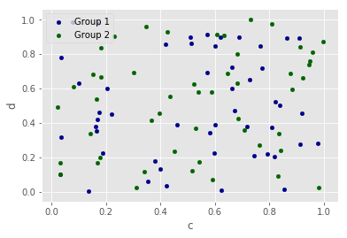


#### 使用灰度区分组


```python
df_scatter.plot.scatter(x='a', y='b', c='c', s=50)
```


    <matplotlib.axes._subplots.AxesSubplot at 0x1c9b77db860>


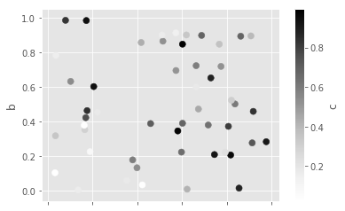


#### 使用点的大小来区分组别


```python
df_scatter.plot.scatter(x='a', y='b', s=df_scatter['c']*200)
```


    <matplotlib.axes._subplots.AxesSubplot at 0x1c9b78f6860>


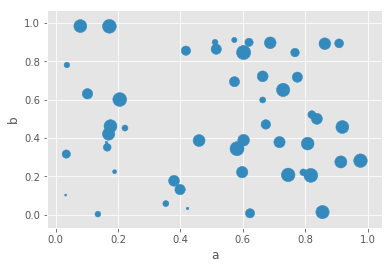


### 散点密度图kde


```python
ser = pd.Series(np.random.randn(1000))

ser.plot.kde()
```


    <matplotlib.axes._subplots.AxesSubplot at 0x1c9b7380dd8>


### 六边形图hexbin

如果您的数据太密集，则Hexbin图可能是散点图的有用替代方法，无法单独绘制每个点。


```python
df_hexbin = pd.DataFrame(np.random.randn(1000, 2), columns=['a', 'b'])
df_hexbin['b'] = df_hexbin['b'] + np.arange(1000)
df_hexbin[:5]
```


<div>
<table border="1" class="dataframe">
  <thead>
    <tr style="text-align: right;">
      <th></th>
      <th>a</th>
      <th>b</th>
    </tr>
  </thead>
  <tbody>
    <tr>
      <th>0</th>
      <td>0.408026</td>
      <td>-0.811502</td>
    </tr>
    <tr>
      <th>1</th>
      <td>-0.587273</td>
      <td>0.383572</td>
    </tr>
    <tr>
      <th>2</th>
      <td>2.415451</td>
      <td>3.996042</td>
    </tr>
    <tr>
      <th>3</th>
      <td>1.264680</td>
      <td>2.171141</td>
    </tr>
    <tr>
      <th>4</th>
      <td>2.843472</td>
      <td>3.536401</td>
    </tr>
  </tbody>
</table>
</div>


```python
df_hexbin.plot.hexbin(x='a', y='b', gridsize=25)
```


    <matplotlib.axes._subplots.AxesSubplot at 0x1c9b7992630>


一个有用的关键字参数是gridsize;它控制x方向上的六边形数量，默认为100.较大的网格尺寸意味着更多，更小的箱柜(bin).

默认情况下，计算每个（x，y）点周围的计数的直方图。您可以通过将值传递给C和reduce_C_function参数来指定备用聚合。 C指定每个（x，y）点的值，reduce_C_function是一个参数的函数，将bin中的所有值减少为单个数字(例如mean，max，sum，std).在该示例中，位置由列a和b给出，而值由列z给出.bin是用numpy的max函数聚合的.


```python
df_hexbin = pd.DataFrame(np.random.randn(1000, 2), columns=['a', 'b'])
df_hexbin['b'] = df_hexbin['b'] = df_hexbin['b'] + np.arange(1000)
df_hexbin['z'] = np.random.uniform(0, 3, 1000)
df_hexbin.plot.hexbin(x='a', y='b', C='z', reduce_C_function=np.max,gridsize=25)
```


    <matplotlib.axes._subplots.AxesSubplot at 0x1c9b7aa3fd0>


### 栅栏图bar


```python
df.ix[5].plot.bar()
```


    <matplotlib.axes._subplots.AxesSubplot at 0x1c9b7b284a8>


```python
plt.figure()
df.ix[5].plot(kind='bar')
plt.axhline(0, color='k')
plt.show()
```


```python
df2 = pd.DataFrame(np.random.rand(10, 4), columns=['a', 'b', 'c', 'd'])
df2.plot.bar();
```


```python
df2.plot.bar(stacked=True)
```


    <matplotlib.axes._subplots.AxesSubplot at 0x1c9b7e97668>


#### 橫置的栅栏图barh


```python
df2.plot.barh(stacked=True)
```


    <matplotlib.axes._subplots.AxesSubplot at 0x1c9b7ff1160>


### 直方图hist

直方图常用来体现不同区间的分布情况


```python
df4 = pd.DataFrame({'a': np.random.randn(1000) + 1, 
                    'b': np.random.randn(1000),
                    'c': np.random.randn(1000) - 1}, 
                     columns=['a', 'b', 'c'])
```


```python
df4[:5]
```


<div>
<table border="1" class="dataframe">
  <thead>
    <tr style="text-align: right;">
      <th></th>
      <th>a</th>
      <th>b</th>
      <th>c</th>
    </tr>
  </thead>
  <tbody>
    <tr>
      <th>0</th>
      <td>2.098046</td>
      <td>0.700889</td>
      <td>-1.788784</td>
    </tr>
    <tr>
      <th>1</th>
      <td>2.478216</td>
      <td>-1.295595</td>
      <td>-2.413717</td>
    </tr>
    <tr>
      <th>2</th>
      <td>0.309454</td>
      <td>0.795296</td>
      <td>-1.801240</td>
    </tr>
    <tr>
      <th>3</th>
      <td>0.186927</td>
      <td>-1.212297</td>
      <td>-0.716213</td>
    </tr>
    <tr>
      <th>4</th>
      <td>-0.196420</td>
      <td>-0.072681</td>
      <td>-1.323029</td>
    </tr>
  </tbody>
</table>
</div>


```python
df4.plot.hist(alpha=0.5)
```


    <matplotlib.axes._subplots.AxesSubplot at 0x1c9b80a5da0>


```python
df4.plot.hist(stacked=True, bins=20)
```


    <matplotlib.axes._subplots.AxesSubplot at 0x1c9b82b7518>


您可以传递由matplotlib hist支持的其他关键字。例如，水平和累积的histgram可以通过orientation ='horizontal'和cumulative ='True'绘制。


```python
df4['a'].plot.hist(orientation='horizontal', cumulative=True)
```


    <matplotlib.axes._subplots.AxesSubplot at 0x1c9b7e120b8>


```python
df.diff().hist(color='k', alpha=0.5, bins=50)
```


    array([[<matplotlib.axes._subplots.AxesSubplot object at 0x000001C9B7CC44E0>,
            <matplotlib.axes._subplots.AxesSubplot object at 0x000001C9B83967F0>],
           [<matplotlib.axes._subplots.AxesSubplot object at 0x000001C9B8400CC0>,
            <matplotlib.axes._subplots.AxesSubplot object at 0x000001C9B845C3C8>]], dtype=object)


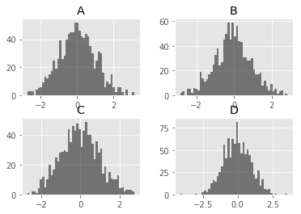


```python
data = pd.Series(np.random.randn(1000))
data.hist(by=np.random.randint(0, 4, 1000), figsize=(6, 4))
```


    array([[<matplotlib.axes._subplots.AxesSubplot object at 0x000001C9B832FBE0>,
            <matplotlib.axes._subplots.AxesSubplot object at 0x000001C9B8925748>],
           [<matplotlib.axes._subplots.AxesSubplot object at 0x000001C9B8985278>,
            <matplotlib.axes._subplots.AxesSubplot object at 0x000001C9B89D54E0>]], dtype=object)


### 箱图

箱图是直方图的进化,可以更好的观察不同组别的统计学分布情况


```python
df = pd.DataFrame(np.random.rand(10, 5), columns=['A', 'B', 'C', 'D', 'E'])
df
```


<div>
<table border="1" class="dataframe">
  <thead>
    <tr style="text-align: right;">
      <th></th>
      <th>A</th>
      <th>B</th>
      <th>C</th>
      <th>D</th>
      <th>E</th>
    </tr>
  </thead>
  <tbody>
    <tr>
      <th>0</th>
      <td>0.530801</td>
      <td>0.879414</td>
      <td>0.746797</td>
      <td>0.769493</td>
      <td>0.268179</td>
    </tr>
    <tr>
      <th>1</th>
      <td>0.879360</td>
      <td>0.067813</td>
      <td>0.834677</td>
      <td>0.123594</td>
      <td>0.004283</td>
    </tr>
    <tr>
      <th>2</th>
      <td>0.746788</td>
      <td>0.239194</td>
      <td>0.459012</td>
      <td>0.197933</td>
      <td>0.022791</td>
    </tr>
    <tr>
      <th>3</th>
      <td>0.673286</td>
      <td>0.937733</td>
      <td>0.746696</td>
      <td>0.128579</td>
      <td>0.905100</td>
    </tr>
    <tr>
      <th>4</th>
      <td>0.424843</td>
      <td>0.606296</td>
      <td>0.218359</td>
      <td>0.800959</td>
      <td>0.175384</td>
    </tr>
    <tr>
      <th>5</th>
      <td>0.121017</td>
      <td>0.558144</td>
      <td>0.954226</td>
      <td>0.585608</td>
      <td>0.772449</td>
    </tr>
    <tr>
      <th>6</th>
      <td>0.281973</td>
      <td>0.599172</td>
      <td>0.485583</td>
      <td>0.793592</td>
      <td>0.833444</td>
    </tr>
    <tr>
      <th>7</th>
      <td>0.696017</td>
      <td>0.876120</td>
      <td>0.009563</td>
      <td>0.142212</td>
      <td>0.747473</td>
    </tr>
    <tr>
      <th>8</th>
      <td>0.777619</td>
      <td>0.834691</td>
      <td>0.816196</td>
      <td>0.038078</td>
      <td>0.518234</td>
    </tr>
    <tr>
      <th>9</th>
      <td>0.252343</td>
      <td>0.666446</td>
      <td>0.248015</td>
      <td>0.023385</td>
      <td>0.592396</td>
    </tr>
  </tbody>
</table>
</div>


```python
df.plot.box()
```


    <matplotlib.axes._subplots.AxesSubplot at 0x1c9b8993198>


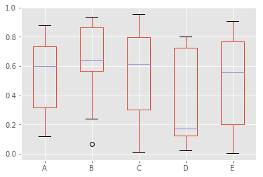


Boxplot可以通过传递color关键字来着色。你可以传递一个dict，它的键是box，whiskers，medians和caps。如果dict中缺少某些键，则默认颜色用于相应的艺术家。此外，boxplot有sym关键字来指定传单风格。当你通过color关键字传递其他类型的参数时，它将直接传递给matplotlib用于所有框，whiskers，medians和caps的着色。颜色应用于每个要绘制的框。如果你想要更复杂的着色，你可以通过传递return_type来获得每个绘制的艺术家。


```python
color = dict(boxes='DarkGreen', whiskers='DarkOrange',
             medians='DarkBlue', caps='Gray')
```


```python
df.plot.box(color=color, sym='r+')
```


    <matplotlib.axes._subplots.AxesSubplot at 0x1c9b9c25a90>


```python
df.plot.box(vert=False, positions=[1, 4, 5, 6, 8])
```


    <matplotlib.axes._subplots.AxesSubplot at 0x1c9b9d4a898>


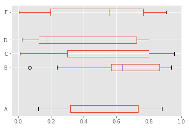


```python
df = pd.DataFrame(np.random.rand(10,5))
bp = df.boxplot()
```


您可以使用by关键字参数创建分层箱形图以创建分组。


```python
df = pd.DataFrame(np.random.rand(10,2), columns=['Col1', 'Col2'] )
df['X'] = pd.Series(['A','A','A','A','A','B','B','B','B','B'])
bp = df.boxplot(by='X')
```


您还可以传递要绘制的列的子集，以及按多个列分组


```python
df = pd.DataFrame(np.random.rand(10,3), columns=['Col1', 'Col2', 'Col3'])
df['X'] = pd.Series(['A','A','A','A','A','B','B','B','B','B'])
df['Y'] = pd.Series(['A','B','A','B','A','B','A','B','A','B'])
bp = df.boxplot(column=['Col1','Col2'], by=['X','Y'])
```


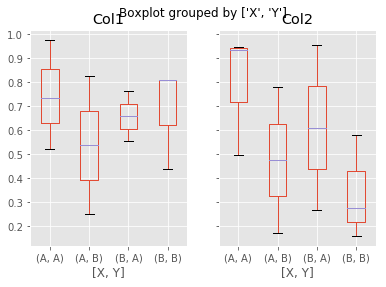


Groupby.boxplot总是返回一系列return_type。


```python
np.random.seed(1234)
df_box = pd.DataFrame(np.random.randn(50, 2))
df_box['g'] = np.random.choice(['A', 'B'], size=50)
df_box.loc[df_box['g'] == 'B', 1] += 3
bp = df_box.boxplot(by='g')
```


```python
bp = df_box.groupby('g').boxplot()
```


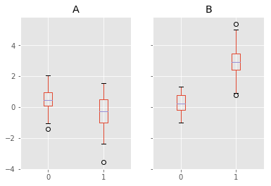


### 面积图area

面积图强调数量随时间而变化的程度，也可用于引起人们对总值趋势的注意。例如，表示随时间而变化的利润的数据可以绘制在面积图中以强调总利润


```python
df = pd.DataFrame(np.random.rand(10, 4), columns=['a', 'b', 'c', 'd'])

df.plot.area()
```


    <matplotlib.axes._subplots.AxesSubplot at 0x1c9ba6c25f8>


```python
df.plot.area(stacked=False);
```


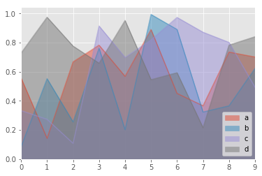


### 饼图Pie
饼图常用在直观的观察比例


```python
series = pd.Series(3 * np.random.rand(4), index=['a', 'b', 'c', 'd'], name='series')

series.plot.pie(figsize=(6, 6))
```


    <matplotlib.axes._subplots.AxesSubplot at 0x1c9ba8822b0>


对于饼图，最好使用正方形的数字，一个具有相等的宽高比。您可以创建具有相等宽度和高度的图形，或者在绘制后通过在返回的轴对象上调用ax.set_aspect（'equal'）来强制长宽比相等。请注意，使用DataFrame的饼图需要您通过y参数指定目标列，或者subplots = True。指定y时，将绘制所选列的饼图。如果指定了subplots = True，则每个列的饼图将绘制为子图。默认情况下，每个饼图中将绘制一个图例;指定legend = False以隐藏它。


```python
df = pd.DataFrame(3 * np.random.rand(4, 2), index=['a', 'b', 'c', 'd'], columns=['x', 'y'])

df.plot.pie(subplots=True, figsize=(8, 4))

```


    array([<matplotlib.axes._subplots.AxesSubplot object at 0x000001C9BA7B6438>,
           <matplotlib.axes._subplots.AxesSubplot object at 0x000001C9BA958898>], dtype=object)


如果要隐藏楔形标签，请指定labels = None。
如果指定fontsize，该值将应用于楔形标签。
此外，可以使用由matplotlib.pyplot.pie（）支持的其他关键字。


```python
series.plot.pie(labels=['AA', 'BB', 'CC', 'DD'], colors=['r', 'g', 'b', 'c'],autopct='%.2f', fontsize=20, figsize=(6, 6))
```


    <matplotlib.axes._subplots.AxesSubplot at 0x1c9ba814588>


如果传递总和小于1.0的值，则matplotlib绘制一个半圆


```python
series = pd.Series([0.1] * 4, index=['a', 'b', 'c', 'd'], name='series2')

series.plot.pie(figsize=(6, 6))
```


    <matplotlib.axes._subplots.AxesSubplot at 0x1c9ba7d1da0>


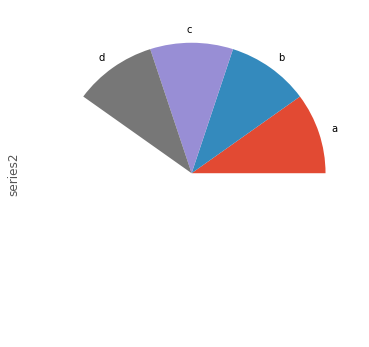

