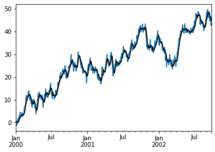
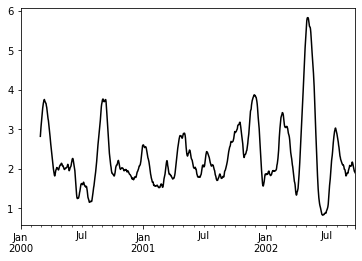

# 时间序列

pandas的一个特色就是时间序列操作.所谓时间序列可以理解为index为时间信息的序列对象(有时是数据框).


```python
import pandas as pd
import numpy as np
import matplotlib.pyplot as plt
%matplotlib inline
```

## 生成时间序列

pandas提供了时间序列的生成函数`pd.date_range(start=None, end=None, periods=None, freq=None, tz=None, normalize=False, name=None, closed=None, **kwargs)[source])`可以像python使用range生成整数序列一样生成时间序列(DatetimeIndex类型),

其中

+ `end`/`start`和`periods`不共存,`start`,`end`标明起止日期,`periods`标明延续时常.用`periods`的话`end`/`start`必须只存在一个
+ `freq`定义间隔,参数为字符串形式,可以指定单位,比如`5H`,`3D`,具体由哪些单位可以看[这里](https://pandas.pydata.org/pandas-docs/stable/user_guide/timeseries.html#timeseries-offset-aliases)


```python
pd.date_range(start='1/1/2018', end='1/08/2018')
```


    DatetimeIndex(['2018-01-01', '2018-01-02', '2018-01-03', '2018-01-04',
                   '2018-01-05', '2018-01-06', '2018-01-07', '2018-01-08'],
                  dtype='datetime64[ns]', freq='D')


```python
pd.date_range(start='1/1/2018', periods=5, freq='3M')
```


    DatetimeIndex(['2018-01-31', '2018-04-30', '2018-07-31', '2018-10-31',
                   '2019-01-31'],
                  dtype='datetime64[ns]', freq='3M')


通常生成的时间序列都是给Series或者Dataframe做index的,


```python
index = pd.date_range(start='1/1/2018', end='1/08/2018')
```


```python
pd.Series(5,index=index)
```


    2018-01-01    5
    2018-01-02    5
    2018-01-03    5
    2018-01-04    5
    2018-01-05    5
    2018-01-06    5
    2018-01-07    5
    2018-01-08    5
    Freq: D, dtype: int64


## 转化时间序列

pandas提供了函数`.to_datetime()`可以将由各种时间信息组成的序列转化成时间序列


```python
import datetime
import time
```


```python
pd.to_datetime([np.datetime64('2018-01-01'),datetime.datetime(2018, 1, 1)]) # 处理datetime类型
```


    DatetimeIndex(['2018-01-01', '2018-01-01'], dtype='datetime64[ns]', freq=None)


```python
pd.to_datetime(['1/1/2018','1/2/2018','1/3/2018'],format='%m/%d/%Y') # 处理字符串
```


    DatetimeIndex(['2018-01-01', '2018-01-02', '2018-01-03'], dtype='datetime64[ns]', freq=None)


```python
pd.to_datetime([1349720105, 1349806505, 1349892905,1349979305, 1350065705], unit='s') # 处理时间戳
```


    DatetimeIndex(['2012-10-08 18:15:05', '2012-10-09 18:15:05',
                   '2012-10-10 18:15:05', '2012-10-11 18:15:05',
                   '2012-10-12 18:15:05'],
                  dtype='datetime64[ns]', freq=None)


## 提取指定时间段内的数据


```python
s = pd.Series(np.random.randn(1000), index=pd.date_range('1/1/2000', periods=1000))
s[:10]
```


    2000-01-01   -0.995419
    2000-01-02    0.299803
    2000-01-03   -0.688532
    2000-01-04    1.019509
    2000-01-05    1.080041
    2000-01-06    0.949750
    2000-01-07   -0.049066
    2000-01-08   -0.704941
    2000-01-09    1.324811
    2000-01-10    0.036751
    Freq: D, dtype: float64


```python
s["2000"][:10] #取同一年
```


    2000-01-01   -0.995419
    2000-01-02    0.299803
    2000-01-03   -0.688532
    2000-01-04    1.019509
    2000-01-05    1.080041
    2000-01-06    0.949750
    2000-01-07   -0.049066
    2000-01-08   -0.704941
    2000-01-09    1.324811
    2000-01-10    0.036751
    Freq: D, dtype: float64


```python
s["2000-01"][:40] # 取某年某月
```


    2000-01-01   -0.995419
    2000-01-02    0.299803
    2000-01-03   -0.688532
    2000-01-04    1.019509
    2000-01-05    1.080041
    2000-01-06    0.949750
    2000-01-07   -0.049066
    2000-01-08   -0.704941
    2000-01-09    1.324811
    2000-01-10    0.036751
    2000-01-11   -1.154498
    2000-01-12   -0.079264
    2000-01-13    0.160674
    2000-01-14    0.049950
    2000-01-15   -0.901635
    2000-01-16    1.255930
    2000-01-17   -0.608129
    2000-01-18    0.208124
    2000-01-19    0.585852
    2000-01-20   -0.304601
    2000-01-21   -0.376128
    2000-01-22    0.564078
    2000-01-23   -0.703543
    2000-01-24    1.595288
    2000-01-25   -0.360244
    2000-01-26    0.442470
    2000-01-27    0.532481
    2000-01-28    0.319283
    2000-01-29   -1.402987
    2000-01-30    0.716361
    2000-01-31   -1.190318
    Freq: D, dtype: float64


```python
s['2000-1-28':'2000-2-3'] #一段日期
```


    2000-01-28    0.319283
    2000-01-29   -1.402987
    2000-01-30    0.716361
    2000-01-31   -1.190318
    2000-02-01   -1.807341
    2000-02-02   -0.954533
    2000-02-03   -0.188877
    Freq: D, dtype: float64


```python
s['2000-1-28'] # 某一天
```


    0.31928275714561777


## 窗口函数

对于处理时间序列数据,pandas提供了许多窗口函数用于计算公共窗口或滚动统计.其中包括计数,总和,平均值,中值,相关性,方差,协方差,标准偏差,偏度和峰度.

我们使用`rolling`,`.expanding `,`ewm` 对数据进行相应的处理

这三个函数的用法和groupby很像,他们的构造函数通常这些方法都有相同的接口.
他们都接受以下参数:

+ window:移动窗口的大小
+ min_periods:要求非空数据点的阈值（否则结果为NA）
+ center:boolean，是否在中间设置标签（默认为False）
+ axis

### rolling函数

`rolling(window,min_periods,center,axis)`


```python
s = pd.Series(np.random.randn(1000), index=pd.date_range('1/1/2000', periods=1000))
s = s.cumsum()
s[:5]
```


    2000-01-01    1.061108
    2000-01-02    1.143829
    2000-01-03    0.042465
    2000-01-04   -1.061528
    2000-01-05   -1.251423
    Freq: D, dtype: float64


```python
r = s.rolling(window=10)
r
```


    Rolling [window=10,center=False,axis=0]


```python
r.mean()[:20]
```


    2000-01-01         NaN
    2000-01-02         NaN
    2000-01-03         NaN
    2000-01-04         NaN
    2000-01-05         NaN
    2000-01-06         NaN
    2000-01-07         NaN
    2000-01-08         NaN
    2000-01-09         NaN
    2000-01-10    0.012929
    2000-01-11    0.016536
    2000-01-12    0.089529
    2000-01-13    0.187641
    2000-01-14    0.418945
    2000-01-15    0.637028
    2000-01-16    0.568675
    2000-01-17    0.767808
    2000-01-18    0.934924
    2000-01-19    1.320222
    2000-01-20    1.503517
    Freq: D, dtype: float64


```python
s.plot()
r.mean().plot(style='k')
```


    <matplotlib.axes._subplots.AxesSubplot at 0x115034978>





```python
df = pd.DataFrame(np.random.randn(1000, 4),
                  index=pd.date_range('1/1/2000', periods=1000),
                  columns=['A', 'B', 'C', 'D'])

df = df.cumsum()
df.rolling(window=60).sum().plot(subplots=True)
df.plot(subplots=True)
```


    array([<matplotlib.axes._subplots.AxesSubplot object at 0x1156770f0>,
           <matplotlib.axes._subplots.AxesSubplot object at 0x1157c3390>,
           <matplotlib.axes._subplots.AxesSubplot object at 0x115770a90>,
           <matplotlib.axes._subplots.AxesSubplot object at 0x1158286a0>],
          dtype=object)


### 使用自定义的方法 


```python
s.rolling(window=60).apply(lambda x: np.fabs(x - x.mean()).mean(),raw=True).plot(style='k')
```


    <matplotlib.axes._subplots.AxesSubplot at 0x1159dbb38>





rolling有一个特有关键字win_type,它表示窗口的类型,公认类型有:
+ boxcar
+ triang
+ blackman
+ hamming
+ bartlett
+ parzen
+ bohman
+ blackmanharris
+ nuttall
+ barthann
+ kaiser (需要beta参数)
+ gaussian (需要std参数)
+ general_gaussian (需要 power, width参数)
+ slepian (需要width参数).


```python
ser = pd.Series(np.random.randn(10), index=pd.date_range('1/1/2000', periods=10))
ser.rolling(window=5, win_type='triang').mean()
```


    2000-01-01         NaN
    2000-01-02         NaN
    2000-01-03         NaN
    2000-01-04         NaN
    2000-01-05   -1.049692
    2000-01-06   -1.115787
    2000-01-07   -0.666003
    2000-01-08   -0.149324
    2000-01-09   -0.064220
    2000-01-10   -0.378598
    Freq: D, dtype: float64


```python
ser.rolling(window=5, win_type='boxcar').mean()
```


    2000-01-01         NaN
    2000-01-02         NaN
    2000-01-03         NaN
    2000-01-04         NaN
    2000-01-05   -0.898436
    2000-01-06   -0.869136
    2000-01-07   -0.524903
    2000-01-08   -0.427698
    2000-01-09   -0.414232
    2000-01-10   -0.242575
    Freq: D, dtype: float64


```python
ser.rolling(window=5, win_type='gaussian').mean(std=0.1)
```


    2000-01-01         NaN
    2000-01-02         NaN
    2000-01-03         NaN
    2000-01-04         NaN
    2000-01-05   -1.169154
    2000-01-06   -1.717525
    2000-01-07   -1.092201
    2000-01-08    0.532417
    2000-01-09    0.821946
    2000-01-10   -0.683129
    Freq: D, dtype: float64


#### 时间感知滚动

这对于非规则的时间频率指数特别有用。第一个参数使用字符串表示时间间隔即可


```python
dft = pd.DataFrame({'B': [0, 1, 2, np.nan, 4]},
                   index=pd.date_range('20130101 09:00:00', periods=5, freq='s'))
dft
```


<div>
<style scoped>
    .dataframe tbody tr th:only-of-type {
        vertical-align: middle;
    }

    .dataframe tbody tr th {
        vertical-align: top;
    }

    .dataframe thead th {
        text-align: right;
    }
</style>
<table border="1" class="dataframe">
  <thead>
    <tr style="text-align: right;">
      <th></th>
      <th>B</th>
    </tr>
  </thead>
  <tbody>
    <tr>
      <th>2013-01-01 09:00:00</th>
      <td>0.0</td>
    </tr>
    <tr>
      <th>2013-01-01 09:00:01</th>
      <td>1.0</td>
    </tr>
    <tr>
      <th>2013-01-01 09:00:02</th>
      <td>2.0</td>
    </tr>
    <tr>
      <th>2013-01-01 09:00:03</th>
      <td>NaN</td>
    </tr>
    <tr>
      <th>2013-01-01 09:00:04</th>
      <td>4.0</td>
    </tr>
  </tbody>
</table>
</div>


```python
dft.rolling('2s').sum()
```


<div>
<style scoped>
    .dataframe tbody tr th:only-of-type {
        vertical-align: middle;
    }

    .dataframe tbody tr th {
        vertical-align: top;
    }

    .dataframe thead th {
        text-align: right;
    }
</style>
<table border="1" class="dataframe">
  <thead>
    <tr style="text-align: right;">
      <th></th>
      <th>B</th>
    </tr>
  </thead>
  <tbody>
    <tr>
      <th>2013-01-01 09:00:00</th>
      <td>0.0</td>
    </tr>
    <tr>
      <th>2013-01-01 09:00:01</th>
      <td>1.0</td>
    </tr>
    <tr>
      <th>2013-01-01 09:00:02</th>
      <td>3.0</td>
    </tr>
    <tr>
      <th>2013-01-01 09:00:03</th>
      <td>2.0</td>
    </tr>
    <tr>
      <th>2013-01-01 09:00:04</th>
      <td>4.0</td>
    </tr>
  </tbody>
</table>
</div>


#### 计算窗口的cov() 和 corr() 

在金融数据分析和其他领域中,通常对于时间序列的集合计算协方差和相关矩阵.通常人们也对移动窗协方差和相关矩阵感兴趣.这可以通过传递`pairwise`关键字参数来实现,在DataFrame输入的情况下,将产生一个Panel,其中的items是有问题的日期.在单个DataFrame参数的情况下,成对参数甚至可以省略


```python
df2 = df[:20]
df2.rolling(window=5).corr(df2['B'])
```


<div>
<style scoped>
    .dataframe tbody tr th:only-of-type {
        vertical-align: middle;
    }

    .dataframe tbody tr th {
        vertical-align: top;
    }

    .dataframe thead th {
        text-align: right;
    }
</style>
<table border="1" class="dataframe">
  <thead>
    <tr style="text-align: right;">
      <th></th>
      <th>A</th>
      <th>B</th>
      <th>C</th>
      <th>D</th>
    </tr>
  </thead>
  <tbody>
    <tr>
      <th>2000-01-01</th>
      <td>NaN</td>
      <td>NaN</td>
      <td>NaN</td>
      <td>NaN</td>
    </tr>
    <tr>
      <th>2000-01-02</th>
      <td>NaN</td>
      <td>NaN</td>
      <td>NaN</td>
      <td>NaN</td>
    </tr>
    <tr>
      <th>2000-01-03</th>
      <td>NaN</td>
      <td>NaN</td>
      <td>NaN</td>
      <td>NaN</td>
    </tr>
    <tr>
      <th>2000-01-04</th>
      <td>NaN</td>
      <td>NaN</td>
      <td>NaN</td>
      <td>NaN</td>
    </tr>
    <tr>
      <th>2000-01-05</th>
      <td>-0.013771</td>
      <td>1.0</td>
      <td>0.051814</td>
      <td>0.294500</td>
    </tr>
    <tr>
      <th>2000-01-06</th>
      <td>-0.153475</td>
      <td>1.0</td>
      <td>0.209701</td>
      <td>0.729156</td>
    </tr>
    <tr>
      <th>2000-01-07</th>
      <td>-0.378544</td>
      <td>1.0</td>
      <td>0.497041</td>
      <td>0.714231</td>
    </tr>
    <tr>
      <th>2000-01-08</th>
      <td>-0.226850</td>
      <td>1.0</td>
      <td>0.581944</td>
      <td>0.435943</td>
    </tr>
    <tr>
      <th>2000-01-09</th>
      <td>-0.068159</td>
      <td>1.0</td>
      <td>0.529225</td>
      <td>0.394325</td>
    </tr>
    <tr>
      <th>2000-01-10</th>
      <td>-0.547704</td>
      <td>1.0</td>
      <td>-0.079096</td>
      <td>-0.071999</td>
    </tr>
    <tr>
      <th>2000-01-11</th>
      <td>-0.664832</td>
      <td>1.0</td>
      <td>0.187738</td>
      <td>-0.463042</td>
    </tr>
    <tr>
      <th>2000-01-12</th>
      <td>-0.829057</td>
      <td>1.0</td>
      <td>0.425534</td>
      <td>-0.610106</td>
    </tr>
    <tr>
      <th>2000-01-13</th>
      <td>-0.837847</td>
      <td>1.0</td>
      <td>0.581573</td>
      <td>0.119215</td>
    </tr>
    <tr>
      <th>2000-01-14</th>
      <td>-0.812830</td>
      <td>1.0</td>
      <td>0.323542</td>
      <td>0.736338</td>
    </tr>
    <tr>
      <th>2000-01-15</th>
      <td>-0.931585</td>
      <td>1.0</td>
      <td>-0.032185</td>
      <td>0.627065</td>
    </tr>
    <tr>
      <th>2000-01-16</th>
      <td>-0.740344</td>
      <td>1.0</td>
      <td>-0.074195</td>
      <td>0.523123</td>
    </tr>
    <tr>
      <th>2000-01-17</th>
      <td>-0.303898</td>
      <td>1.0</td>
      <td>-0.688740</td>
      <td>0.268439</td>
    </tr>
    <tr>
      <th>2000-01-18</th>
      <td>-0.111382</td>
      <td>1.0</td>
      <td>-0.268512</td>
      <td>0.694223</td>
    </tr>
    <tr>
      <th>2000-01-19</th>
      <td>0.133870</td>
      <td>1.0</td>
      <td>-0.276746</td>
      <td>0.469622</td>
    </tr>
    <tr>
      <th>2000-01-20</th>
      <td>0.116302</td>
      <td>1.0</td>
      <td>0.805018</td>
      <td>0.616604</td>
    </tr>
  </tbody>
</table>
</div>


```python
covs = df[['B','C','D']].rolling(window=50).cov(df[['A','B','C']], pairwise=True)
```


```python
covs.loc[df.index[-50]]
```


<div>
<style scoped>
    .dataframe tbody tr th:only-of-type {
        vertical-align: middle;
    }

    .dataframe tbody tr th {
        vertical-align: top;
    }

    .dataframe thead th {
        text-align: right;
    }
</style>
<table border="1" class="dataframe">
  <thead>
    <tr style="text-align: right;">
      <th></th>
      <th>B</th>
      <th>C</th>
      <th>D</th>
    </tr>
  </thead>
  <tbody>
    <tr>
      <th>A</th>
      <td>-3.366503</td>
      <td>-1.697049</td>
      <td>2.308745</td>
    </tr>
    <tr>
      <th>B</th>
      <td>4.988816</td>
      <td>2.207432</td>
      <td>-0.370125</td>
    </tr>
    <tr>
      <th>C</th>
      <td>2.207432</td>
      <td>3.962947</td>
      <td>-0.601842</td>
    </tr>
  </tbody>
</table>
</div>


```python
correls = df.rolling(window=50).corr()
correls.loc[df.index[-50]]
```


<div>
<style scoped>
    .dataframe tbody tr th:only-of-type {
        vertical-align: middle;
    }

    .dataframe tbody tr th {
        vertical-align: top;
    }

    .dataframe thead th {
        text-align: right;
    }
</style>
<table border="1" class="dataframe">
  <thead>
    <tr style="text-align: right;">
      <th></th>
      <th>A</th>
      <th>B</th>
      <th>C</th>
      <th>D</th>
    </tr>
  </thead>
  <tbody>
    <tr>
      <th>A</th>
      <td>1.000000</td>
      <td>-0.604904</td>
      <td>-0.342130</td>
      <td>0.421968</td>
    </tr>
    <tr>
      <th>B</th>
      <td>-0.604904</td>
      <td>1.000000</td>
      <td>0.496454</td>
      <td>-0.075465</td>
    </tr>
    <tr>
      <th>C</th>
      <td>-0.342130</td>
      <td>0.496454</td>
      <td>1.000000</td>
      <td>-0.137680</td>
    </tr>
    <tr>
      <th>D</th>
      <td>0.421968</td>
      <td>-0.075465</td>
      <td>-0.137680</td>
      <td>1.000000</td>
    </tr>
  </tbody>
</table>
</div>


```python
correls.reorder_levels([1,0], axis=0).loc["A",:]["C"]
```


    2000-01-01         NaN
    2000-01-02         NaN
    2000-01-03         NaN
    2000-01-04         NaN
    2000-01-05         NaN
    2000-01-06         NaN
    2000-01-07         NaN
    2000-01-08         NaN
    2000-01-09         NaN
    2000-01-10         NaN
    2000-01-11         NaN
    2000-01-12         NaN
    2000-01-13         NaN
    2000-01-14         NaN
    2000-01-15         NaN
    2000-01-16         NaN
    2000-01-17         NaN
    2000-01-18         NaN
    2000-01-19         NaN
    2000-01-20         NaN
    2000-01-21         NaN
    2000-01-22         NaN
    2000-01-23         NaN
    2000-01-24         NaN
    2000-01-25         NaN
    2000-01-26         NaN
    2000-01-27         NaN
    2000-01-28         NaN
    2000-01-29         NaN
    2000-01-30         NaN
                    ...   
    2002-08-28   -0.429215
    2002-08-29   -0.463922
    2002-08-30   -0.521507
    2002-08-31   -0.557186
    2002-09-01   -0.596870
    2002-09-02   -0.630756
    2002-09-03   -0.654455
    2002-09-04   -0.695831
    2002-09-05   -0.702939
    2002-09-06   -0.716429
    2002-09-07   -0.724767
    2002-09-08   -0.742225
    2002-09-09   -0.732229
    2002-09-10   -0.743287
    2002-09-11   -0.747569
    2002-09-12   -0.703009
    2002-09-13   -0.619047
    2002-09-14   -0.528259
    2002-09-15   -0.427015
    2002-09-16   -0.322860
    2002-09-17   -0.205540
    2002-09-18   -0.133395
    2002-09-19   -0.061589
    2002-09-20   -0.017721
    2002-09-21    0.047676
    2002-09-22    0.088563
    2002-09-23    0.131738
    2002-09-24    0.133835
    2002-09-25    0.112635
    2002-09-26    0.063967
    Freq: D, Name: C, Length: 1000, dtype: float64


```python
correls.reorder_levels([1,0], axis=0).loc["A",:]["C"].plot()
```


    <matplotlib.axes._subplots.AxesSubplot at 0x11576a7b8>


### 使用`aggregate`聚合

这个操作和groupby那个聚合非常类似,构建窗口后通过一系列算法获得了各窗口的值,我们可以通过传递一个函数到整个DataFrame

也可以用`agg()`一次应用多个function


```python
dfa = pd.DataFrame(np.random.randn(1000, 3),
                    index=pd.date_range('1/1/2000', periods=1000),
                    columns=['A', 'B', 'C'])
```


```python
r = dfa.rolling(window=60,min_periods=1)
r.aggregate(np.sum)[:10]
```


<div>
<style scoped>
    .dataframe tbody tr th:only-of-type {
        vertical-align: middle;
    }

    .dataframe tbody tr th {
        vertical-align: top;
    }

    .dataframe thead th {
        text-align: right;
    }
</style>
<table border="1" class="dataframe">
  <thead>
    <tr style="text-align: right;">
      <th></th>
      <th>A</th>
      <th>B</th>
      <th>C</th>
    </tr>
  </thead>
  <tbody>
    <tr>
      <th>2000-01-01</th>
      <td>0.069055</td>
      <td>-0.431206</td>
      <td>-0.250284</td>
    </tr>
    <tr>
      <th>2000-01-02</th>
      <td>1.541963</td>
      <td>-0.869075</td>
      <td>-0.478704</td>
    </tr>
    <tr>
      <th>2000-01-03</th>
      <td>4.381829</td>
      <td>-2.640809</td>
      <td>0.837516</td>
    </tr>
    <tr>
      <th>2000-01-04</th>
      <td>4.824145</td>
      <td>-2.998398</td>
      <td>0.660984</td>
    </tr>
    <tr>
      <th>2000-01-05</th>
      <td>5.388716</td>
      <td>-3.750861</td>
      <td>1.237194</td>
    </tr>
    <tr>
      <th>2000-01-06</th>
      <td>4.671739</td>
      <td>-2.204327</td>
      <td>0.628633</td>
    </tr>
    <tr>
      <th>2000-01-07</th>
      <td>5.248314</td>
      <td>-2.217534</td>
      <td>1.141510</td>
    </tr>
    <tr>
      <th>2000-01-08</th>
      <td>5.711637</td>
      <td>-2.554723</td>
      <td>0.104990</td>
    </tr>
    <tr>
      <th>2000-01-09</th>
      <td>6.032947</td>
      <td>-2.689234</td>
      <td>-1.642611</td>
    </tr>
    <tr>
      <th>2000-01-10</th>
      <td>5.765271</td>
      <td>-2.938515</td>
      <td>-2.359754</td>
    </tr>
  </tbody>
</table>
</div>


```python
r['A'].agg([np.sum, np.mean, np.std])[:10]
```


<div>
<style scoped>
    .dataframe tbody tr th:only-of-type {
        vertical-align: middle;
    }

    .dataframe tbody tr th {
        vertical-align: top;
    }

    .dataframe thead th {
        text-align: right;
    }
</style>
<table border="1" class="dataframe">
  <thead>
    <tr style="text-align: right;">
      <th></th>
      <th>sum</th>
      <th>mean</th>
      <th>std</th>
    </tr>
  </thead>
  <tbody>
    <tr>
      <th>2000-01-01</th>
      <td>0.069055</td>
      <td>0.069055</td>
      <td>NaN</td>
    </tr>
    <tr>
      <th>2000-01-02</th>
      <td>1.541963</td>
      <td>0.770981</td>
      <td>0.992674</td>
    </tr>
    <tr>
      <th>2000-01-03</th>
      <td>4.381829</td>
      <td>1.460610</td>
      <td>1.385446</td>
    </tr>
    <tr>
      <th>2000-01-04</th>
      <td>4.824145</td>
      <td>1.206036</td>
      <td>1.240513</td>
    </tr>
    <tr>
      <th>2000-01-05</th>
      <td>5.388716</td>
      <td>1.077743</td>
      <td>1.111957</td>
    </tr>
    <tr>
      <th>2000-01-06</th>
      <td>4.671739</td>
      <td>0.778623</td>
      <td>1.235312</td>
    </tr>
    <tr>
      <th>2000-01-07</th>
      <td>5.248314</td>
      <td>0.749759</td>
      <td>1.130263</td>
    </tr>
    <tr>
      <th>2000-01-08</th>
      <td>5.711637</td>
      <td>0.713955</td>
      <td>1.051310</td>
    </tr>
    <tr>
      <th>2000-01-09</th>
      <td>6.032947</td>
      <td>0.670327</td>
      <td>0.992081</td>
    </tr>
    <tr>
      <th>2000-01-10</th>
      <td>5.765271</td>
      <td>0.576527</td>
      <td>0.981250</td>
    </tr>
  </tbody>
</table>
</div>


```python
r['A'].agg({'result1' : np.sum,'result2' : np.mean})[:10]
```


<div>
<style scoped>
    .dataframe tbody tr th:only-of-type {
        vertical-align: middle;
    }

    .dataframe tbody tr th {
        vertical-align: top;
    }

    .dataframe thead th {
        text-align: right;
    }
</style>
<table border="1" class="dataframe">
  <thead>
    <tr style="text-align: right;">
      <th></th>
      <th>result1</th>
      <th>result2</th>
    </tr>
  </thead>
  <tbody>
    <tr>
      <th>2000-01-01</th>
      <td>0.069055</td>
      <td>0.069055</td>
    </tr>
    <tr>
      <th>2000-01-02</th>
      <td>1.541963</td>
      <td>0.770981</td>
    </tr>
    <tr>
      <th>2000-01-03</th>
      <td>4.381829</td>
      <td>1.460610</td>
    </tr>
    <tr>
      <th>2000-01-04</th>
      <td>4.824145</td>
      <td>1.206036</td>
    </tr>
    <tr>
      <th>2000-01-05</th>
      <td>5.388716</td>
      <td>1.077743</td>
    </tr>
    <tr>
      <th>2000-01-06</th>
      <td>4.671739</td>
      <td>0.778623</td>
    </tr>
    <tr>
      <th>2000-01-07</th>
      <td>5.248314</td>
      <td>0.749759</td>
    </tr>
    <tr>
      <th>2000-01-08</th>
      <td>5.711637</td>
      <td>0.713955</td>
    </tr>
    <tr>
      <th>2000-01-09</th>
      <td>6.032947</td>
      <td>0.670327</td>
    </tr>
    <tr>
      <th>2000-01-10</th>
      <td>5.765271</td>
      <td>0.576527</td>
    </tr>
  </tbody>
</table>
</div>


```python
r.agg([np.sum, np.mean])[:10]
```


<div>
<style scoped>
    .dataframe tbody tr th:only-of-type {
        vertical-align: middle;
    }

    .dataframe tbody tr th {
        vertical-align: top;
    }

    .dataframe thead tr th {
        text-align: left;
    }
</style>
<table border="1" class="dataframe">
  <thead>
    <tr>
      <th></th>
      <th colspan="2" halign="left">A</th>
      <th colspan="2" halign="left">B</th>
      <th colspan="2" halign="left">C</th>
    </tr>
    <tr>
      <th></th>
      <th>sum</th>
      <th>mean</th>
      <th>sum</th>
      <th>mean</th>
      <th>sum</th>
      <th>mean</th>
    </tr>
  </thead>
  <tbody>
    <tr>
      <th>2000-01-01</th>
      <td>0.069055</td>
      <td>0.069055</td>
      <td>-0.431206</td>
      <td>-0.431206</td>
      <td>-0.250284</td>
      <td>-0.250284</td>
    </tr>
    <tr>
      <th>2000-01-02</th>
      <td>1.541963</td>
      <td>0.770981</td>
      <td>-0.869075</td>
      <td>-0.434537</td>
      <td>-0.478704</td>
      <td>-0.239352</td>
    </tr>
    <tr>
      <th>2000-01-03</th>
      <td>4.381829</td>
      <td>1.460610</td>
      <td>-2.640809</td>
      <td>-0.880270</td>
      <td>0.837516</td>
      <td>0.279172</td>
    </tr>
    <tr>
      <th>2000-01-04</th>
      <td>4.824145</td>
      <td>1.206036</td>
      <td>-2.998398</td>
      <td>-0.749599</td>
      <td>0.660984</td>
      <td>0.165246</td>
    </tr>
    <tr>
      <th>2000-01-05</th>
      <td>5.388716</td>
      <td>1.077743</td>
      <td>-3.750861</td>
      <td>-0.750172</td>
      <td>1.237194</td>
      <td>0.247439</td>
    </tr>
    <tr>
      <th>2000-01-06</th>
      <td>4.671739</td>
      <td>0.778623</td>
      <td>-2.204327</td>
      <td>-0.367388</td>
      <td>0.628633</td>
      <td>0.104772</td>
    </tr>
    <tr>
      <th>2000-01-07</th>
      <td>5.248314</td>
      <td>0.749759</td>
      <td>-2.217534</td>
      <td>-0.316791</td>
      <td>1.141510</td>
      <td>0.163073</td>
    </tr>
    <tr>
      <th>2000-01-08</th>
      <td>5.711637</td>
      <td>0.713955</td>
      <td>-2.554723</td>
      <td>-0.319340</td>
      <td>0.104990</td>
      <td>0.013124</td>
    </tr>
    <tr>
      <th>2000-01-09</th>
      <td>6.032947</td>
      <td>0.670327</td>
      <td>-2.689234</td>
      <td>-0.298804</td>
      <td>-1.642611</td>
      <td>-0.182512</td>
    </tr>
    <tr>
      <th>2000-01-10</th>
      <td>5.765271</td>
      <td>0.576527</td>
      <td>-2.938515</td>
      <td>-0.293852</td>
      <td>-2.359754</td>
      <td>-0.235975</td>
    </tr>
  </tbody>
</table>
</div>


### expanding函数

`expanding(window,min_periods,center,axis)`

滚动统计的一个常见替代方法是使用扩展窗口,该窗口产生具有到达该时间点之前可用的所有数据的统计的值.

他的接口接近`.rolling`的接口`.expanding`方法返回一个`Expanding`对象.我们可以对比下一下两个函数,他们是等效的


```python
df.rolling(window=len(df), min_periods=1).mean()[:5]
```


<div>
<style scoped>
    .dataframe tbody tr th:only-of-type {
        vertical-align: middle;
    }

    .dataframe tbody tr th {
        vertical-align: top;
    }

    .dataframe thead th {
        text-align: right;
    }
</style>
<table border="1" class="dataframe">
  <thead>
    <tr style="text-align: right;">
      <th></th>
      <th>A</th>
      <th>B</th>
      <th>C</th>
      <th>D</th>
    </tr>
  </thead>
  <tbody>
    <tr>
      <th>2000-01-01</th>
      <td>-1.037228</td>
      <td>0.559174</td>
      <td>-1.177712</td>
      <td>0.076422</td>
    </tr>
    <tr>
      <th>2000-01-02</th>
      <td>-0.571626</td>
      <td>0.326794</td>
      <td>-1.091479</td>
      <td>0.327348</td>
    </tr>
    <tr>
      <th>2000-01-03</th>
      <td>-0.862770</td>
      <td>0.214503</td>
      <td>-0.535658</td>
      <td>0.471560</td>
    </tr>
    <tr>
      <th>2000-01-04</th>
      <td>-0.855107</td>
      <td>0.560978</td>
      <td>-0.370145</td>
      <td>0.613405</td>
    </tr>
    <tr>
      <th>2000-01-05</th>
      <td>-0.806280</td>
      <td>0.531091</td>
      <td>-0.118997</td>
      <td>0.714881</td>
    </tr>
  </tbody>
</table>
</div>


```python
df.expanding(min_periods=1).mean()[:5]
```


<div>
<style scoped>
    .dataframe tbody tr th:only-of-type {
        vertical-align: middle;
    }

    .dataframe tbody tr th {
        vertical-align: top;
    }

    .dataframe thead th {
        text-align: right;
    }
</style>
<table border="1" class="dataframe">
  <thead>
    <tr style="text-align: right;">
      <th></th>
      <th>A</th>
      <th>B</th>
      <th>C</th>
      <th>D</th>
    </tr>
  </thead>
  <tbody>
    <tr>
      <th>2000-01-01</th>
      <td>-1.037228</td>
      <td>0.559174</td>
      <td>-1.177712</td>
      <td>0.076422</td>
    </tr>
    <tr>
      <th>2000-01-02</th>
      <td>-0.571626</td>
      <td>0.326794</td>
      <td>-1.091479</td>
      <td>0.327348</td>
    </tr>
    <tr>
      <th>2000-01-03</th>
      <td>-0.862770</td>
      <td>0.214503</td>
      <td>-0.535658</td>
      <td>0.471560</td>
    </tr>
    <tr>
      <th>2000-01-04</th>
      <td>-0.855107</td>
      <td>0.560978</td>
      <td>-0.370145</td>
      <td>0.613405</td>
    </tr>
    <tr>
      <th>2000-01-05</th>
      <td>-0.806280</td>
      <td>0.531091</td>
      <td>-0.118997</td>
      <td>0.714881</td>
    </tr>
  </tbody>
</table>
</div>


```python
s.plot(style='k--')
s.expanding().mean().plot(style='k')
```


    <matplotlib.axes._subplots.AxesSubplot at 0x115686940>


### 指数加权窗口ewm

ewm是几个上述统计量的指数加权版本。
他支持的默认方法比较少

Function|Description
---|---
mean()|EW moving average
var()|EW moving variance
std()|EW moving standard deviation
corr()|EW moving correlation
cov()|EW moving covariance


```python
s.plot(style='k--')
s.ewm(span=20).mean().plot(style='k')
```


    <matplotlib.axes._subplots.AxesSubplot at 0x115703128>


